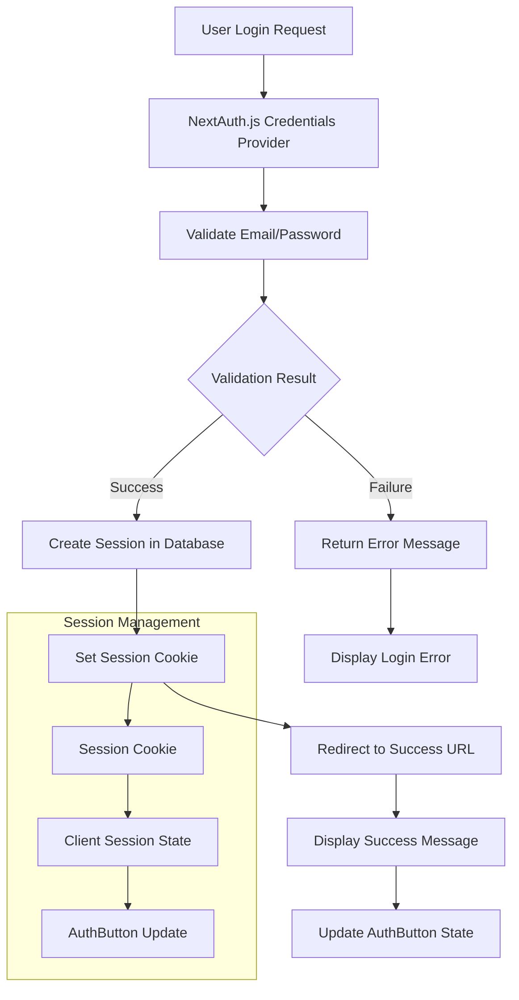
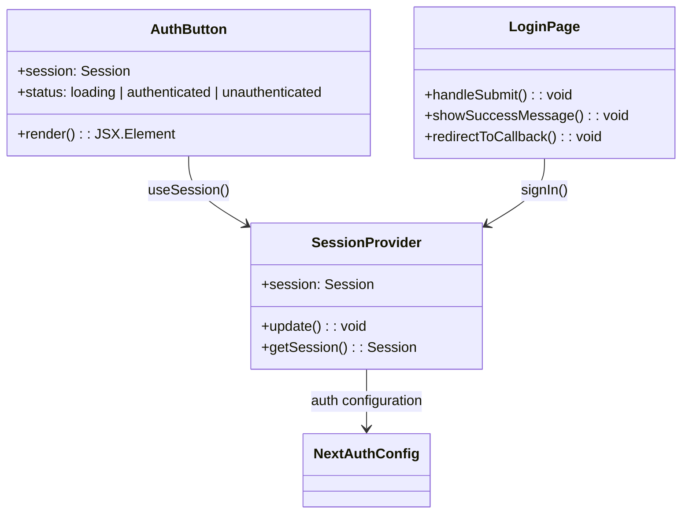
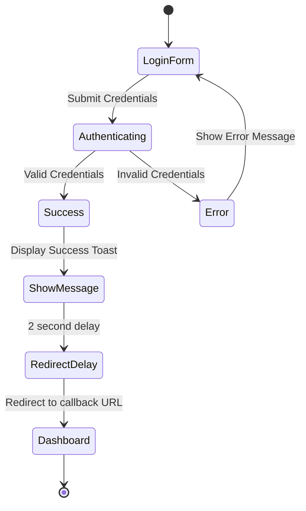
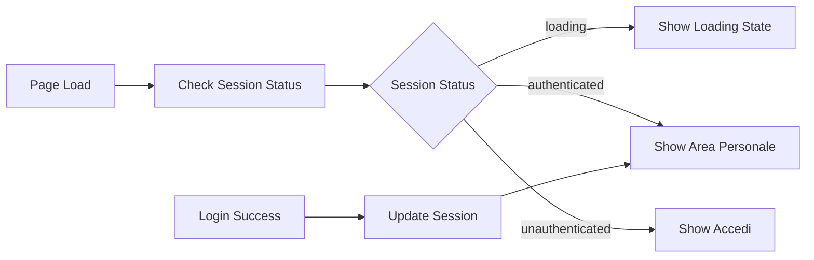
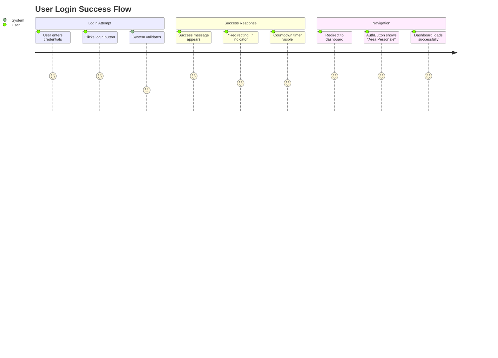
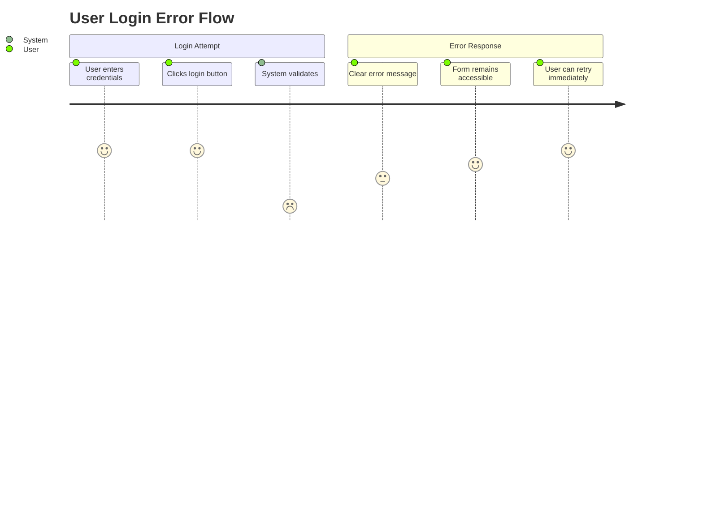

# Add Success Message After Login Design

## Overview

This design addresses the implementation of a success message system after login and resolves session persistence issues that prevent the AuthButton from properly reflecting the authenticated state. The system currently has authentication configured with NextAuth.js v5, but the session is not being properly maintained on the client side, causing the button to always show "Accedi" instead of "Area Personale".

## Architecture

### Authentication Flow Architecture



### Component State Management



## Current Issues Analysis

### Session Persistence Problem

| Issue | Current State | Expected State |
|-------|---------------|----------------|
| Session Cookie | Not being set properly | HttpOnly secure cookie with session token |
| Client Session | Always undefined/null | Valid session object with user data |
| AuthButton State | Always shows "Accedi" | Shows "Area Personale" when authenticated |
| Redirect Flow | Direct navigation without feedback | Success message then redirect |

### Authentication Configuration Issues

The current authentication setup has several potential issues:

1. **Session Strategy**: Using database sessions but potential cookie configuration issues
2. **Callback URLs**: May not be properly configured for post-login flow
3. **Client-Server Session Sync**: Session not being properly hydrated on client side
4. **Error Handling**: No visual feedback for successful authentication

## Enhanced Login Flow Design

### Success Message Implementation



### Message Display Strategy

```typescript
interface SuccessMessage {
  type: 'success' | 'error' | 'info'
  title: string
  message: string
  duration: number
  autoClose: boolean
}
```

## Technical Implementation

### Session Configuration Enhancement

```typescript
// Enhanced auth configuration
session: {
  strategy: "database",
  maxAge: 30 * 24 * 60 * 60, // 30 days
  updateAge: 24 * 60 * 60,   // 24 hours
},
cookies: {
  sessionToken: {
    name: `__Secure-next-auth.session-token`,
    options: {
      httpOnly: true,
      sameSite: 'lax',
      path: '/',
      secure: process.env.NODE_ENV === 'production'
    }
  }
}
```

### Login Page Enhancements

| Component | Enhancement | Purpose |
|-----------|-------------|---------|
| Form Handler | Add success message display | User feedback |
| Redirect Logic | Delay with loading state | Smooth UX transition |
| Error Handling | Distinguish auth vs network errors | Clear error messaging |
| Loading States | Loading spinner during auth | Visual feedback |

### AuthButton State Management



## Component Modifications

### AuthButton Component Enhancement

```typescript
interface AuthButtonState {
  session: Session | null
  status: 'loading' | 'authenticated' | 'unauthenticated'
  isTransitioning: boolean
}
```

### Login Page State Management

```typescript
interface LoginPageState {
  // Existing form state
  email: string
  password: string
  isLoading: boolean
  
  // New success handling
  showSuccessMessage: boolean
  successMessage: string
  redirectCountdown: number
  isRedirecting: boolean
}
```

### Message Toast Component

```typescript
interface ToastMessage {
  id: string
  type: 'success' | 'error' | 'info' | 'warning'
  title: string
  message: string
  duration?: number
  actions?: ToastAction[]
}
```

## Session Debugging Strategy

### Diagnostic Steps

1. **Cookie Inspection**: Verify session cookie is being set
2. **Database Verification**: Check session records in database
3. **Client State Debug**: Log session state changes
4. **Network Analysis**: Monitor auth API calls

### Common Session Issues

| Problem | Symptom | Solution |
|---------|---------|----------|
| Missing Cookie | No session token in browser | Fix cookie configuration |
| Expired Session | Session exists but invalid | Adjust session maxAge |
| CSRF Issues | Authentication fails silently | Configure CSRF properly |
| Client Hydration | Session null on client | Fix SessionProvider setup |

## User Experience Flow

### Successful Login Journey



### Error Handling Flow



## Testing Strategy

### Authentication Testing

| Test Case | Verification | Expected Result |
|-----------|--------------|-----------------|
| Valid Login | Session cookie created | Success message + redirect |
| Invalid Login | No session created | Clear error message |
| Session Persistence | Page refresh | Session maintained |
| AuthButton State | After login | Shows "Area Personale" |
| Logout Flow | Session cleared | AuthButton shows "Accedi" |

### Message System Testing

| Scenario | Input | Expected Output |
|----------|-------|-----------------|
| Successful Auth | Valid credentials | Green success toast |
| Failed Auth | Invalid credentials | Red error message |
| Network Error | Connection failure | Yellow warning message |
| Redirect Flow | Post-success | Smooth transition with countdown |

## Security Considerations

### Session Security

- **HttpOnly Cookies**: Prevent XSS attacks on session tokens
- **Secure Flag**: HTTPS-only transmission in production
- **SameSite Policy**: Protection against CSRF attacks
- **Token Rotation**: Regular session token renewal

### Message Security

- **Content Sanitization**: Prevent XSS in success messages
- **Rate Limiting**: Prevent message spam
- **Sensitive Data**: No sensitive information in client messages

## Performance Optimization

### Session Management

- **Session Caching**: Reduce database queries for session validation
- **Client-Side Caching**: Cache session state in memory
- **Lazy Loading**: Load session data only when needed

### Message Display

- **Toast Queuing**: Manage multiple messages efficiently
- **Animation Performance**: Use CSS transforms for smooth transitions
- **Memory Management**: Clean up message timers properly