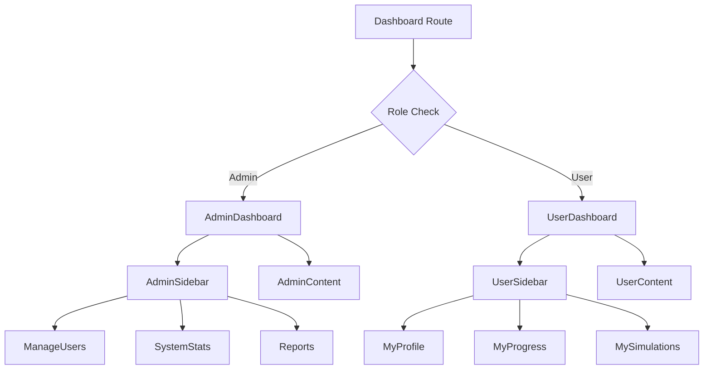
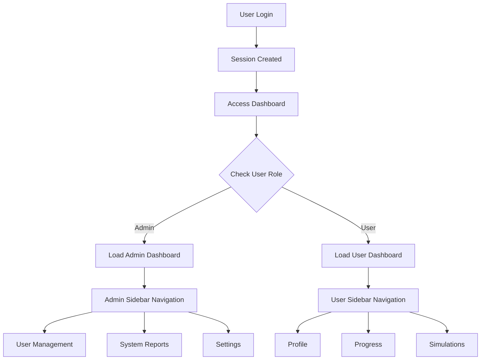

# Admin and User Dashboards Design

## Overview
This design document outlines the implementation of role-based dashboards for the ePatient application. The system will provide differentiated dashboard experiences for administrators and regular users, accessible through the "Area Personale" link in the navigation bar after authentication.

## Technology Stack & Dependencies
- **Next.js 15**: App Router with React 19 for server and client components
- **tRPC 11**: Type-safe API layer for dashboard data fetching
- **NextAuth.js 5**: Authentication and session management
- **Drizzle ORM**: Database operations for user role management
- **Tailwind CSS**: Consistent styling matching existing design system
- **TypeScript**: End-to-end type safety

## Component Architecture

### Component Definition


### Component Hierarchy
1. **Dashboard Layout Component**
   - Shared layout wrapper for both dashboard types
   - Contains header, sidebar, and main content areas
   - Responsive design following PNG specifications

2. **Admin Dashboard Components**
   - `AdminDashboard`: Main container component
   - `AdminSidebar`: Navigation with admin-specific links
   - `UserManagement`: CRUD operations for user accounts
   - `SystemOverview`: Statistics and monitoring widgets
   - `ReportsSection`: Analytics and reporting tools

3. **User Dashboard Components**
   - `UserDashboard`: Main container component
   - `UserSidebar`: Navigation with user-specific links
   - `ProfileSection`: Personal information management
   - `ProgressTracking`: Learning progress visualization
   - `SimulationHistory`: Past simulation results

### Props/State Management
```typescript
// Dashboard props interface
interface DashboardProps {
  user: {
    id: string;
    name: string;
    email: string;
    role: 'admin' | 'user';
    image?: string;
  };
  session: Session;
}

// Dashboard state management
interface DashboardState {
  activeTab: string;
  sidebarCollapsed: boolean;
  notifications: Notification[];
}
```

## Data Models & ORM Mapping

### User Role Enhancement
```sql
-- Add role column to existing users table
ALTER TABLE epatient_user ADD COLUMN role TEXT DEFAULT 'user' CHECK (role IN ('admin', 'user'));

-- Create default admin user
INSERT INTO epatient_user (id, name, email, password, role) 
VALUES (
  'admin-001',
  'Administrator',
  'admin',
  -- bcrypt hash for 'Qwerty123!'
  '$2b$10$encrypted_password_hash',
  'admin'
);

-- Create default user
INSERT INTO epatient_user (id, name, email, password, role) 
VALUES (
  'user-001',
  'Test User',
  'user@example.com',
  -- bcrypt hash for 'Qwerty123!'
  '$2b$10$encrypted_password_hash',
  'user'
);
```

### Schema Updates
```typescript
// Enhanced user schema with role field
export const users = createTable("user", (d) => ({
  id: d.text({ length: 255 }).notNull().primaryKey().$defaultFn(() => crypto.randomUUID()),
  name: d.text({ length: 255 }),
  email: d.text({ length: 255 }).notNull(),
  password: d.text({ length: 255 }),
  role: d.text({ length: 20 }).default('user').notNull(), // 'admin' | 'user'
  emailVerified: d.integer({ mode: "timestamp" }).default(sql`(unixepoch())`),
  image: d.text({ length: 255 }),
}));

// Dashboard activity tracking
export const userActivities = createTable("user_activity", (d) => ({
  id: d.integer({ mode: "number" }).primaryKey({ autoIncrement: true }),
  userId: d.text({ length: 255 }).notNull().references(() => users.id),
  activityType: d.text({ length: 50 }).notNull(), // 'login', 'simulation', 'profile_update'
  metadata: d.text(), // JSON string for additional data
  createdAt: d.integer({ mode: "timestamp" }).default(sql`(unixepoch())`).notNull(),
}));
```

## Routing & Navigation

### Route Structure
```
/dashboard
├── page.tsx                 # Main dashboard router (role-based redirect)
├── admin/
│   ├── page.tsx            # Admin dashboard home
│   ├── users/
│   │   ├── page.tsx        # User management
│   │   └── [id]/page.tsx   # Individual user details
│   ├── reports/page.tsx    # System reports
│   └── settings/page.tsx   # Admin settings
└── user/
    ├── page.tsx            # User dashboard home
    ├── profile/page.tsx    # User profile management
    ├── progress/page.tsx   # Learning progress
    └── simulations/page.tsx # Simulation history
```

### Navigation Integration
```typescript
// Updated navbar component with Area Personale link
const DashboardLink = ({ session }: { session: Session | null }) => {
  if (!session) return null;
  
  return (
    <Link 
      href="/dashboard" 
      className="link-secondary hover:text-gray-700"
    >
      Area Personale
    </Link>
  );
};
```

## API Endpoints Reference

### tRPC Router Structure
```typescript
// Dashboard router
export const dashboardRouter = createTRPCRouter({
  // Admin procedures
  getAllUsers: adminProcedure
    .query(async ({ ctx }) => {
      return await ctx.db.query.users.findMany({
        columns: { password: false }, // Exclude password
      });
    }),

  updateUserRole: adminProcedure
    .input(z.object({
      userId: z.string(),
      role: z.enum(['admin', 'user']),
    }))
    .mutation(async ({ ctx, input }) => {
      return await ctx.db
        .update(users)
        .set({ role: input.role })
        .where(eq(users.id, input.userId));
    }),

  getSystemStats: adminProcedure
    .query(async ({ ctx }) => {
      const totalUsers = await ctx.db.select({ count: count() }).from(users);
      const activeUsers = await ctx.db
        .select({ count: count() })
        .from(userActivities)
        .where(
          and(
            eq(userActivities.activityType, 'login'),
            gte(userActivities.createdAt, new Date(Date.now() - 30 * 24 * 60 * 60 * 1000))
          )
        );
      
      return {
        totalUsers: totalUsers[0].count,
        activeUsers: activeUsers[0].count,
      };
    }),

  // User procedures
  getUserProfile: protectedProcedure
    .query(async ({ ctx }) => {
      return await ctx.db.query.users.findFirst({
        where: eq(users.id, ctx.session.user.id),
        columns: { password: false },
      });
    }),

  updateProfile: protectedProcedure
    .input(z.object({
      name: z.string().min(1),
      email: z.string().email(),
    }))
    .mutation(async ({ ctx, input }) => {
      return await ctx.db
        .update(users)
        .set(input)
        .where(eq(users.id, ctx.session.user.id));
    }),

  getUserActivity: protectedProcedure
    .query(async ({ ctx }) => {
      return await ctx.db.query.userActivities.findMany({
        where: eq(userActivities.userId, ctx.session.user.id),
        orderBy: desc(userActivities.createdAt),
        limit: 10,
      });
    }),
});
```

### Authentication Requirements
```typescript
// Admin-only procedure
const adminProcedure = protectedProcedure.use(({ ctx, next }) => {
  if (ctx.session.user.role !== 'admin') {
    throw new TRPCError({ 
      code: "FORBIDDEN", 
      message: "Admin access required" 
    });
  }
  return next({ ctx });
});
```

## Business Logic Layer

### Role-Based Access Control


### Dashboard Content Logic
1. **Admin Dashboard Features**:
   - User management with role assignment
   - System statistics and monitoring
   - Activity logs and reporting
   - Settings and configuration

2. **User Dashboard Features**:
   - Personal profile management
   - Learning progress tracking
   - Simulation history and results
   - Personal settings

## Styling Strategy

### Dashboard Layout Specifications
Following PNG design specifications:
- **Header**: Fixed height with user avatar and navigation
- **Sidebar**: Collapsible navigation with role-specific menu items
- **Main Content**: Responsive grid layout for dashboard widgets
- **Color Scheme**: Consistent with existing ePatient branding

### CSS Component Classes
```css
/* Dashboard-specific components */
.dashboard-container {
  @apply min-h-screen bg-gray-50;
}

.dashboard-sidebar {
  @apply w-64 bg-white shadow-sm border-r border-gray-200;
}

.dashboard-sidebar.collapsed {
  @apply w-16;
}

.dashboard-main {
  @apply flex-1 p-6;
}

.dashboard-card {
  @apply bg-white rounded-lg shadow-sm border border-gray-200 p-6;
}

.admin-nav-item {
  @apply flex items-center px-4 py-2 text-gray-700 hover:bg-green-50 hover:text-green-700;
}

.user-nav-item {
  @apply flex items-center px-4 py-2 text-gray-700 hover:bg-blue-50 hover:text-blue-700;
}
```

## Testing Strategy

### Unit Tests
```typescript
// Dashboard component tests
describe('AdminDashboard', () => {
  it('should render admin navigation items', () => {
    render(<AdminDashboard user={mockAdminUser} />);
    expect(screen.getByText('User Management')).toBeInTheDocument();
    expect(screen.getByText('System Reports')).toBeInTheDocument();
  });

  it('should restrict access to non-admin users', () => {
    render(<AdminDashboard user={mockRegularUser} />);
    expect(screen.getByText('Access Denied')).toBeInTheDocument();
  });
});

describe('UserDashboard', () => {
  it('should render user navigation items', () => {
    render(<UserDashboard user={mockUser} />);
    expect(screen.getByText('My Profile')).toBeInTheDocument();
    expect(screen.getByText('Progress')).toBeInTheDocument();
  });
});
```

### Integration Tests
```typescript
// tRPC procedure tests
describe('Dashboard API', () => {
  it('should return user stats for admin', async () => {
    const caller = createCaller({ session: mockAdminSession });
    const stats = await caller.dashboard.getSystemStats();
    expect(stats.totalUsers).toBeGreaterThan(0);
  });

  it('should reject non-admin access to admin procedures', async () => {
    const caller = createCaller({ session: mockUserSession });
    await expect(caller.dashboard.getAllUsers()).rejects.toThrow('FORBIDDEN');
  });
});
```

## Implementation Phases

### Phase 1: Foundation Setup
1. **Database Schema Updates**
   - Add role column to users table
   - Create user activities tracking table
   - Seed default admin and user accounts

2. **Authentication Enhancement**
   - Update auth configuration to include role
   - Modify session callback to include user role
   - Create role-based middleware for tRPC

### Phase 2: Dashboard Structure
1. **Route Implementation**
   - Create dashboard route structure
   - Implement role-based routing logic
   - Add dashboard link to main navigation

2. **Layout Components**
   - Create shared dashboard layout
   - Implement responsive sidebar component
   - Build role-specific navigation menus

### Phase 3: Dashboard Content
1. **Admin Dashboard Features**
   - User management interface
   - System statistics dashboard
   - Activity monitoring and reports

2. **User Dashboard Features**
   - Profile management interface
   - Progress tracking visualization
   - Simulation history display

### Phase 4: Integration & Testing
1. **API Integration**
   - Connect dashboard components to tRPC procedures
   - Implement real-time data updates
   - Add error handling and loading states

2. **Testing & Validation**
   - Unit tests for components and procedures
   - Integration tests for role-based access
   - Visual regression testing against PNG specifications