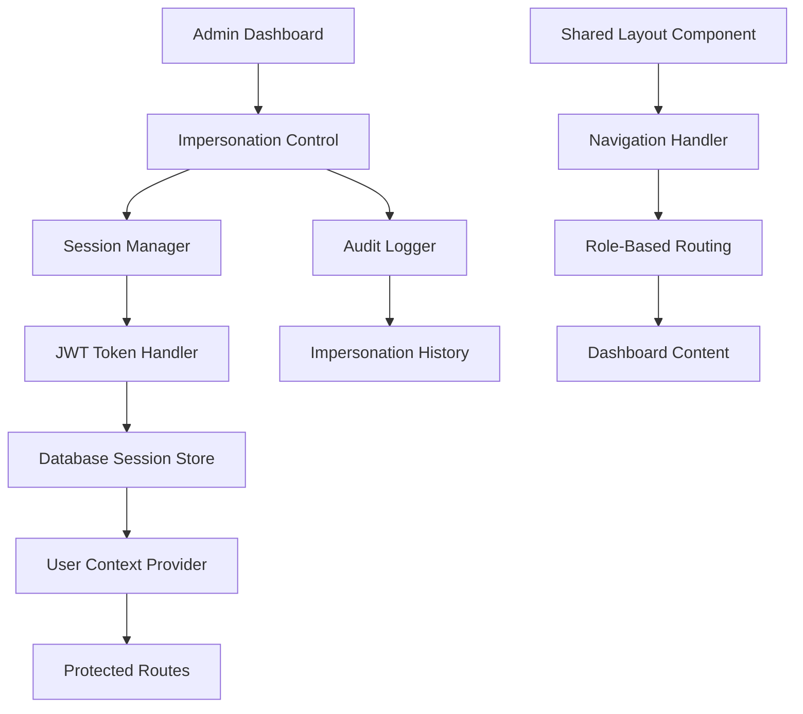
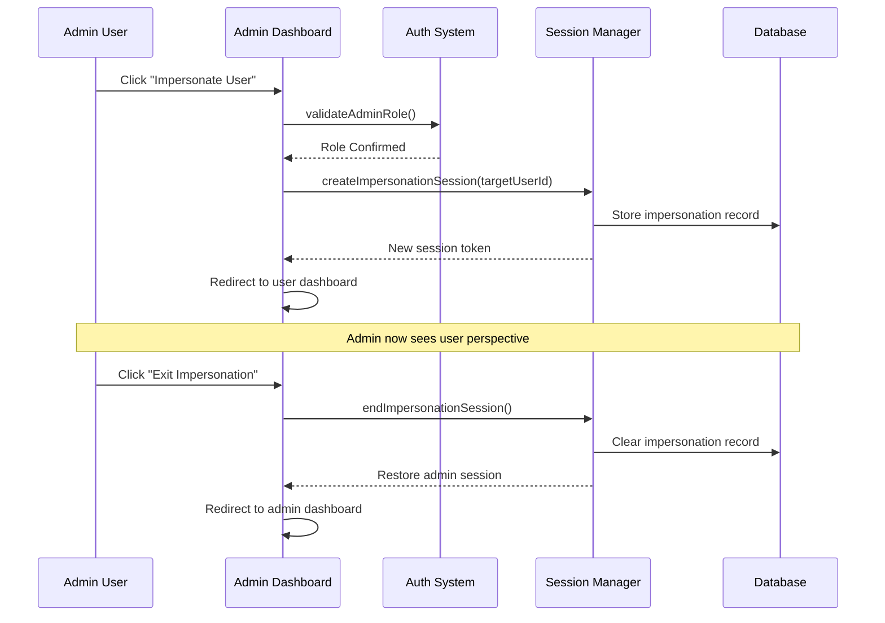
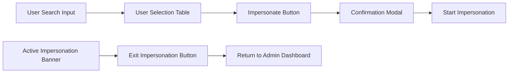
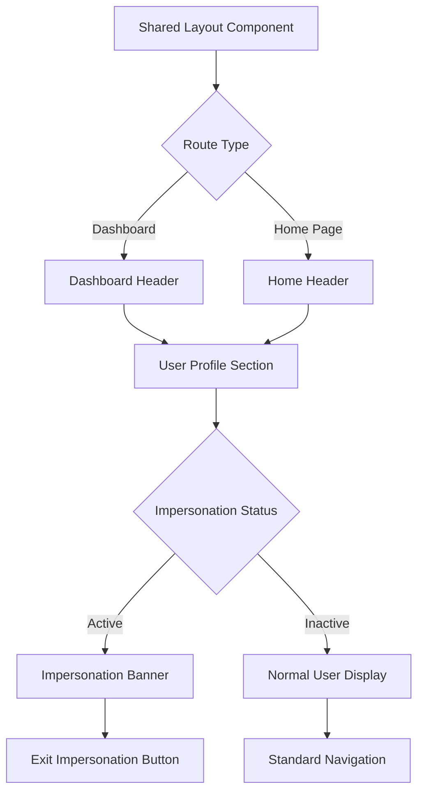
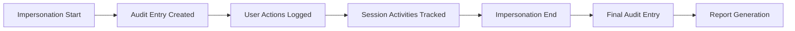
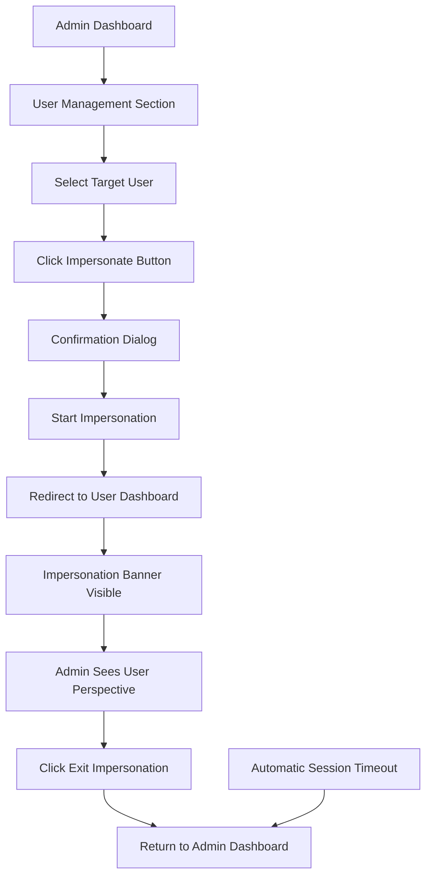
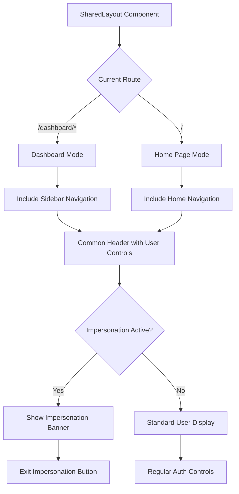

# Admin User Impersonation Feature Design

## Overview

This design document outlines the implementation of an admin user impersonation feature for the ePatient application. The feature allows administrators to temporarily assume the role and perspective of regular users for testing, support, and training purposes while maintaining audit trails and security controls.

## Architecture

### System Components

The impersonation feature integrates with the existing authentication and session management system, extending the current JWT-based NextAuth.js configuration:



### Enhanced Authentication Flow

The impersonation system extends the existing session management with an overlay mechanism:



## Enhanced Session Management

### Impersonation Session Structure

The session object will be extended to support impersonation context:

```typescript
interface ExtendedSession {
  user: {
    id: string;
    email: string;
    name: string | null;
    role: "admin" | "user";
    image?: string | null;
  };
  impersonation?: {
    isImpersonating: boolean;
    originalAdminId: string;
    targetUserId: string;
    targetUserEmail: string;
    targetUserName: string | null;
    startedAt: Date;
  };
}
```

### JWT Token Enhancement

The JWT token structure will include impersonation metadata:

```typescript
interface ExtendedJWT {
  // Existing fields
  sub: string;
  email: string;
  role: "admin" | "user";
  
  // Impersonation fields
  impersonation?: {
    originalAdminId: string;
    targetUserId: string;
    isActive: boolean;
  };
}
```

## User Interface Components

### Admin Impersonation Control Panel

A dedicated component within the admin dashboard for user selection and impersonation management:



#### Component Hierarchy

```
AdminContent.tsx
├── UserManagementTable
│   ├── UserSearchFilter
│   ├── UserListTable
│   │   ├── UserRow
│   │   │   ├── UserInfo
│   │   │   ├── RoleDisplay
│   │   │   └── ImpersonateButton
│   │   └── PaginationControls
│   └── ImpersonationModal
│       ├── UserConfirmationDetails
│       ├── SecurityWarning
│       └── ActionButtons
└── ImpersonationStatusBanner
    ├── CurrentUserDisplay
    ├── ImpersonationTimer
    └── ExitImpersonationButton
```

### Shared Layout Enhancement

The DashboardLayout component will be enhanced to support both dashboard and home page usage while maintaining impersonation state visibility:



#### Layout Component Structure

```
SharedLayout.tsx
├── Header
│   ├── LogoSection
│   ├── NavigationMenu (conditional)
│   │   ├── HomeNavigation (for home page)
│   │   └── DashboardNavigation (for dashboard)
│   └── UserSection
│       ├── ImpersonationBanner (conditional)
│       │   ├── ImpersonationIndicator
│       │   ├── TargetUserDisplay
│       │   └── ExitButton
│       ├── UserProfile
│       └── AuthButton
├── Sidebar (dashboard only)
│   ├── RoleBasedNavigation
│   └── ImpersonationStatus (conditional)
└── MainContent
    └── children
```

## Backend API Enhancements

### tRPC Router Extensions

New procedures will be added to handle impersonation operations:

```typescript
// src/server/api/routers/impersonation.ts
export const impersonationRouter = createTRPCRouter({
  // Start impersonation session
  startImpersonation: adminProcedure
    .input(z.object({ targetUserId: z.string() }))
    .mutation(async ({ ctx, input }) => {
      // Validate target user exists
      // Create impersonation session
      // Log impersonation start
      // Return new session token
    }),
    
  // End impersonation session
  endImpersonation: protectedProcedure
    .mutation(async ({ ctx }) => {
      // Validate active impersonation
      // Clear impersonation session
      // Log impersonation end
      // Return original admin session
    }),
    
  // Get impersonation history
  getImpersonationHistory: adminProcedure
    .input(z.object({
      page: z.number().default(1),
      limit: z.number().default(10)
    }))
    .query(async ({ ctx, input }) => {
      // Return paginated impersonation audit log
    }),
    
  // Get current impersonation status
  getCurrentImpersonation: protectedProcedure
    .query(async ({ ctx }) => {
      // Return current impersonation details if active
    })
});
```

### Database Schema Extensions

New tables to support impersonation tracking:

```sql
-- Impersonation session tracking
CREATE TABLE impersonation_sessions (
  id TEXT PRIMARY KEY,
  admin_user_id TEXT NOT NULL,
  target_user_id TEXT NOT NULL,
  started_at DATETIME NOT NULL,
  ended_at DATETIME,
  is_active BOOLEAN DEFAULT TRUE,
  session_token TEXT,
  ip_address TEXT,
  user_agent TEXT,
  FOREIGN KEY (admin_user_id) REFERENCES users(id),
  FOREIGN KEY (target_user_id) REFERENCES users(id)
);

-- Audit log for impersonation events
CREATE TABLE impersonation_audit_log (
  id TEXT PRIMARY KEY,
  impersonation_session_id TEXT NOT NULL,
  action_type TEXT NOT NULL, -- 'START', 'END', 'ACTION_PERFORMED'
  action_details TEXT,
  performed_at DATETIME NOT NULL,
  ip_address TEXT,
  user_agent TEXT,
  FOREIGN KEY (impersonation_session_id) REFERENCES impersonation_sessions(id)
);
```

## Security and Audit

### Security Measures

1. **Role Validation**: Strict validation that only users with "admin" role can initiate impersonation
2. **Session Isolation**: Impersonation sessions are isolated from original admin sessions
3. **Time Limits**: Impersonation sessions have automatic expiration (configurable, default 2 hours)
4. **IP Tracking**: All impersonation activities are logged with IP addresses
5. **Action Logging**: All actions performed during impersonation are audited

### Audit Trail



#### Audit Information Captured

- Admin user initiating impersonation
- Target user being impersonated
- Start and end timestamps
- All actions performed during impersonation
- IP addresses and user agents
- Session duration
- Reason for impersonation (optional input)

## Implementation Flow

### Phase 1: Backend Infrastructure
1. Extend JWT configuration for impersonation support
2. Create impersonation session management
3. Implement database schema changes
4. Add tRPC router procedures
5. Implement audit logging

### Phase 2: Admin Interface
1. Create user selection and impersonation controls
2. Add impersonation status indicators
3. Implement session switching functionality
4. Add confirmation and security dialogs

### Phase 3: Shared Layout Integration
1. Enhance DashboardLayout for home page compatibility
2. Add impersonation status banner
3. Implement exit impersonation controls
4. Ensure responsive design across both contexts

### Phase 4: Security and Testing
1. Implement comprehensive security validations
2. Add automated session cleanup
3. Create audit report interfaces
4. Perform security testing and validation

## User Experience Flow

### Admin Impersonation Workflow



### Layout Sharing Between Dashboard and Home



## Technical Considerations

### Session Management Strategy

The impersonation feature uses a session overlay approach rather than session replacement:

1. **Original Session Preservation**: Admin's original session remains intact
2. **Context Switching**: UI and permissions switch to target user context
3. **Dual Token System**: Separate tokens for admin and impersonated user contexts
4. **Seamless Recovery**: Easy return to original admin session

### Performance Considerations

1. **Efficient Session Lookup**: Optimized database queries for session validation
2. **Cache Management**: Proper cache invalidation during role switches
3. **Minimal Overhead**: Impersonation adds minimal performance impact
4. **Session Cleanup**: Automatic cleanup of expired impersonation sessions

### Error Handling

1. **Invalid User Targets**: Graceful handling of non-existent users
2. **Permission Failures**: Clear error messages for unauthorized attempts
3. **Session Conflicts**: Resolution of conflicting session states
4. **Network Failures**: Robust handling of connectivity issues

This design ensures secure, auditable, and user-friendly admin impersonation functionality while maintaining the existing application architecture and extending the shared layout approach across dashboard and home page contexts.