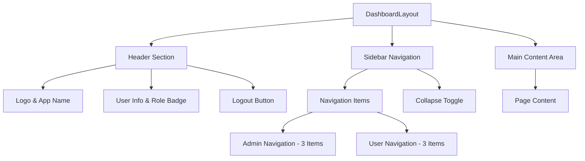
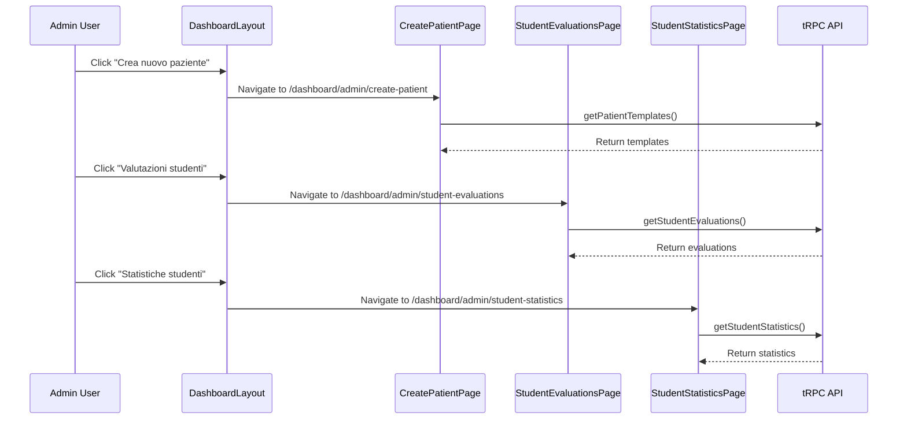
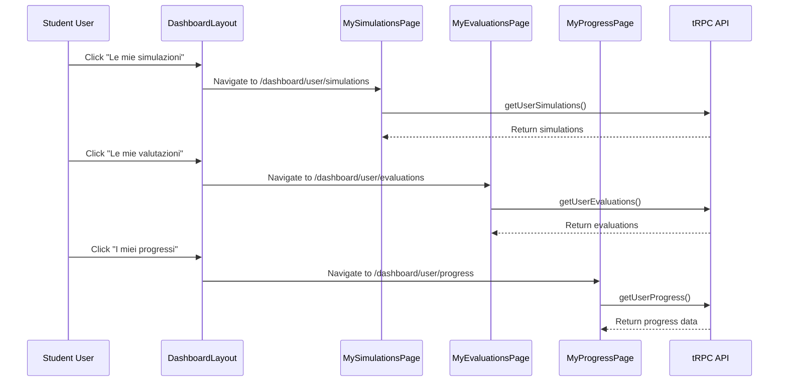

# Dashboard Layout Fix - Design Document

## Overview

This design addresses the dashboard layout issue where both admin and user pages currently display 4 navigation buttons, but need to be reduced to only 3 buttons as specified in the provided PNG references. The solution involves updating the `DashboardLayout` component to streamline navigation and improve user experience.

## Current State Analysis

### Existing Navigation Structure

**Admin Dashboard (4 buttons - Current):**
- Dashboard (🏠) → `/dashboard/admin`
- Gestione Utenti (👥) → `/dashboard/admin/users`
- Statistiche (📊) → `/dashboard/admin/stats`
- Impostazioni (⚙️) → `/dashboard/admin/settings`

**User Dashboard (4 buttons - Current):**
- Dashboard (🏠) → `/dashboard/user`
- Il Mio Profilo (👤) → `/dashboard/user/profile`
- Progresso (📈) → `/dashboard/user/progress`
- Simulazioni (🎯) → `/dashboard/user/simulations`

### Issues Identified
1. Navigation contains 4 buttons per role, exceeding the required 3 buttons
2. Some functionality may be redundant or can be consolidated
3. Layout needs optimization for better user experience

## Architecture

### Component Structure


### Updated Navigation Structure

**Admin Dashboard (3 buttons - Target):**
- Crea nuovo paziente (👤) → `/dashboard/admin/create-patient` - Create new patient cases
- Valutazioni studenti (📝) → `/dashboard/admin/student-evaluations` - View and manage student evaluations
- Statistiche studenti (📊) → `/dashboard/admin/student-statistics` - Student performance statistics

**User Dashboard (3 buttons - Target):**
- Le mie simulazioni (🎯) → `/dashboard/user/simulations` - Personal clinical simulations
- Le mie valutazioni (📝) → `/dashboard/user/evaluations` - Personal evaluation results
- I miei progressi (📈) → `/dashboard/user/progress` - Personal progress tracking

### Navigation Restructuring Strategy

**Admin Changes:**
- Replace "Dashboard" with "Crea nuovo paziente" - Focus on patient case creation
- Replace "Gestione Utenti" with "Valutazioni studenti" - Focus on student evaluation management
- Replace "Impostazioni" with "Statistiche studenti" - Focus on student performance analytics
- Remove general dashboard overview in favor of task-specific interfaces

**User Changes:**
- Rename "Simulazioni" to "Le mie simulazioni" - Maintain simulation access
- Replace "Il Mio Profilo" with "Le mie valutazioni" - Focus on evaluation results
- Rename "Progresso" to "I miei progressi" - Maintain progress tracking
- Remove general dashboard overview in favor of learning-focused interfaces

## Implementation Details

### DashboardLayout Component Updates

#### Navigation Items Modification
```typescript
const getNavItems = (): NavItem[] => {
  if (user.role === "admin") {
    return [
      { label: "Crea nuovo paziente", href: "/dashboard/admin/create-patient", icon: "🩺" },
      { label: "Valutazioni studenti", href: "/dashboard/admin/student-evaluations", icon: "📝" },
      { label: "Statistiche studenti", href: "/dashboard/admin/student-statistics", icon: "📊" },
    ];
  } else {
    return [
      { label: "Le mie simulazioni", href: "/dashboard/user/simulations", icon: "🎯" },
      { label: "Le mie valutazioni", href: "/dashboard/user/evaluations", icon: "📝" },
      { label: "I miei progressi", href: "/dashboard/user/progress", icon: "📈" },
    ];
  }
};
```

### Content Integration Strategy

#### Admin Dashboard Pages
1. **Create Patient Page** (`/dashboard/admin/create-patient`)
   - Patient case creation interface
   - Medical scenario setup forms
   - Case configuration and parameters
   - Save and manage patient templates

2. **Student Evaluations Page** (`/dashboard/admin/student-evaluations`)
   - View all student evaluation results
   - Filter and search evaluation data
   - Individual student performance analysis
   - Evaluation criteria management

3. **Student Statistics Page** (`/dashboard/admin/student-statistics`)
   - Aggregate student performance metrics
   - Class and cohort analysis
   - Performance trends and analytics
   - Export and reporting functionality

#### User Dashboard Pages
1. **My Simulations Page** (`/dashboard/user/simulations`)
   - Available clinical simulations
   - Simulation history and status
   - Start new simulations
   - Resume incomplete simulations

2. **My Evaluations Page** (`/dashboard/user/evaluations`)
   - Personal evaluation results
   - Feedback and scoring details
   - Performance analysis
   - Historical evaluation data

3. **My Progress Page** (`/dashboard/user/progress`)
   - Learning progress tracking
   - Skill development metrics
   - Achievement badges and milestones
   - Progress visualization charts

### Component Content Updates

#### New Admin Components
- **CreatePatientContent** - Patient case creation interface
- **StudentEvaluationsContent** - Student evaluation management
- **StudentStatisticsContent** - Student performance analytics
- Update routing to support new admin pages

#### New User Components
- **MySimulationsContent** - Personal simulation interface (existing, update routing)
- **MyEvaluationsContent** - Personal evaluation results interface
- **MyProgressContent** - Personal progress tracking interface (existing, update routing)
- Update routing to support new user pages

### Responsive Design Considerations

#### Sidebar Behavior
- Maintain collapsible sidebar functionality
- Ensure 3-button layout works on mobile devices
- Preserve existing responsive breakpoints

#### Content Layout
- Optimize content areas for consolidated functionality
- Ensure statistics and progress data display effectively
- Maintain readability and usability standards

### Visual Design Updates

#### Navigation Styling
- Maintain existing design language
- Ensure consistent spacing with 3 buttons
- Preserve role-based color schemes (admin: red, user: blue)

#### Content Cards
- Enhance main dashboard cards to accommodate additional data
- Implement grid layouts for consolidated information
- Maintain visual hierarchy and user experience

## Data Flow Integration

### Admin Navigation Flow


### User Navigation Flow


## Testing Strategy

### Component Testing
1. **Navigation Rendering Tests**
   - Verify 3 buttons render for admin role
   - Verify 3 buttons render for user role
   - Test responsive behavior

2. **Content Integration Tests**
   - Ensure statistics display in admin dashboard
   - Ensure progress displays in user dashboard
   - Verify data loading and error states

3. **Routing Tests**
   - Test navigation between 3 main sections
   - Verify URL routing functionality
   - Test active state highlighting

### User Experience Testing
1. **Usability Testing**
   - Verify ease of navigation with 3 buttons
   - Test content accessibility and organization
   - Validate mobile experience

2. **Performance Testing**
   - Monitor page load times with consolidated content
   - Test API call efficiency
   - Verify responsive rendering performance

## Implementation Steps

### Phase 1: Navigation Structure Update
1. Update `getNavItems()` function in DashboardLayout
2. Remove 4th navigation item for both roles
3. Test navigation rendering and routing

### Phase 2: Content Consolidation
1. Enhance AdminContent overview section
2. Enhance UserContent overview section
3. Integrate removed functionality into main pages

### Phase 3: Layout Optimization
1. Adjust sidebar spacing for 3 buttons
2. Optimize content layout for integrated functionality
3. Test responsive behavior

### Phase 4: Validation and Testing
1. Conduct component testing
2. Perform user experience validation
3. Verify design consistency with PNG references

## Risk Mitigation

### Potential Issues
1. **Information Overload**: Consolidating content may create crowded interfaces
   - Solution: Use collapsible sections and progressive disclosure

2. **Navigation Confusion**: Users accustomed to 4-button layout
   - Solution: Maintain logical grouping and clear labeling

3. **Performance Impact**: Loading more data on single pages
   - Solution: Implement efficient data loading and caching

### Rollback Strategy
- Maintain current component structure during transition
- Use feature flags for gradual rollout
- Keep original navigation structure as backup configuration