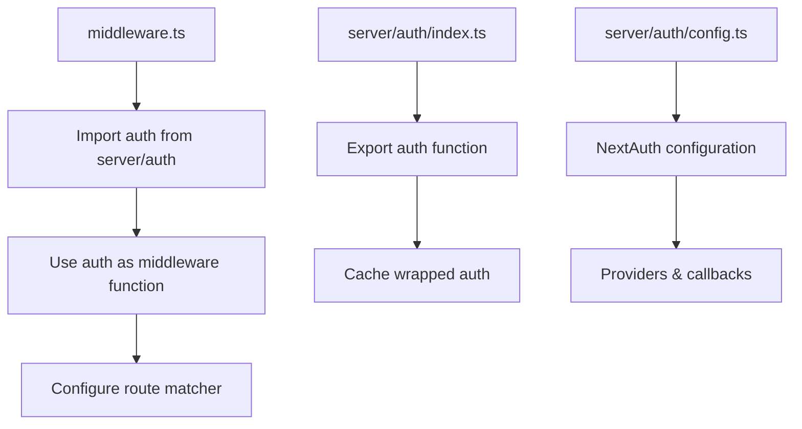
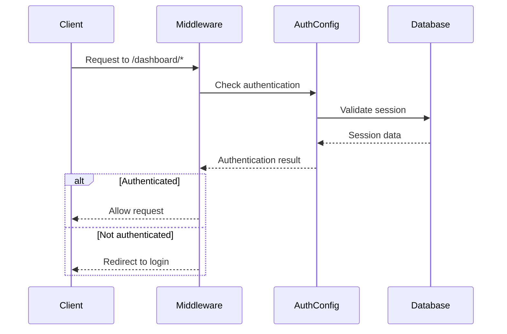

# Fix NextAuth Middleware Export Default Error

## Overview

The application is experiencing a build error with the NextAuth.js middleware configuration. The error "Export default doesn't exist in target module" occurs because NextAuth.js v5 beta has a different middleware export pattern compared to v4. The current middleware implementation attempts to re-export a default export that doesn't exist in the NextAuth v5 middleware module.

## Architecture

### Current Problem

The existing `middleware.ts` file uses the v4 export pattern:

```typescript
export { default } from "next-auth/middleware"
```

However, NextAuth.js v5 beta (version 5.0.0-beta.25) doesn't export a default middleware function. Instead, it requires explicit configuration using the `auth` function exported from the authentication configuration.

### Required Changes

The middleware needs to be updated to use the NextAuth v5 pattern where the `auth` function from the authentication configuration is used as middleware directly.

## Component Architecture

### Middleware Implementation Strategy



### File Dependencies

1. **middleware.ts** (root level)
   - Imports `auth` function from `~/server/auth`
   - Configures route matching for protected paths
   - Uses `auth` as the middleware function

2. **src/server/auth/index.ts**
   - Exports cached `auth` function
   - Provides middleware-compatible authentication handler

3. **src/server/auth/config.ts**
   - Contains NextAuth configuration
   - Defines providers and callbacks

## Implementation Details

### Updated Middleware Structure

The new middleware will follow this pattern:

```typescript
import { auth } from "~/server/auth"

export default auth((req) => {
  // Optional: Add custom middleware logic here
  // The auth function handles authentication automatically
})

export const config = {
  matcher: ["/dashboard/:path*"]
}
```

### Authentication Flow



### Configuration Compatibility

The solution maintains compatibility with:
- NextAuth.js v5 beta authentication patterns
- Existing tRPC integration
- Current route protection requirements
- Session management via Drizzle adapter

## Route Protection Strategy

### Protected Route Patterns

The middleware will protect the following route patterns:
- `/dashboard/*` - All dashboard routes (admin and user)
- Additional routes can be added to the matcher array as needed

### Authentication Logic

1. **Session Validation**: Check for valid session using NextAuth v5 auth function
2. **Route Matching**: Apply protection only to specified routes
3. **Redirect Handling**: Automatically redirect unauthenticated users to login page

## Testing Strategy

### Validation Steps

1. **Build Verification**: Ensure the application builds without middleware export errors
2. **Route Protection**: Verify protected routes redirect unauthenticated users
3. **Authenticated Access**: Confirm authenticated users can access protected routes
4. **Session Persistence**: Test that sessions work correctly across page refreshes

### Test Cases

| Test Case | Expected Behavior |
|-----------|------------------|
| Access `/dashboard` without session | Redirect to login page |
| Access `/dashboard` with valid session | Allow access to dashboard |
| Access public routes | No authentication required |
| Session expiry | Redirect to login on next protected route access |

## Error Resolution

### Root Cause Analysis

The error occurs because:
1. NextAuth.js v5 beta changed the middleware export pattern
2. The default export no longer exists in the middleware module
3. The v4 re-export syntax is incompatible with v5

### Solution Benefits

1. **Compatibility**: Aligns with NextAuth.js v5 beta requirements
2. **Maintainability**: Uses the recommended approach for v5
3. **Functionality**: Preserves all existing authentication behavior
4. **Extensibility**: Allows for custom middleware logic if needed

## Dependencies

### Required Imports

- `auth` function from `~/server/auth`
- Next.js middleware configuration pattern
- TypeScript support for NextAuth v5 types

### No Additional Dependencies

The solution uses existing dependencies and doesn't require additional packages or version changes.