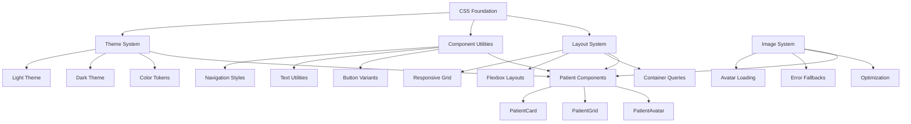
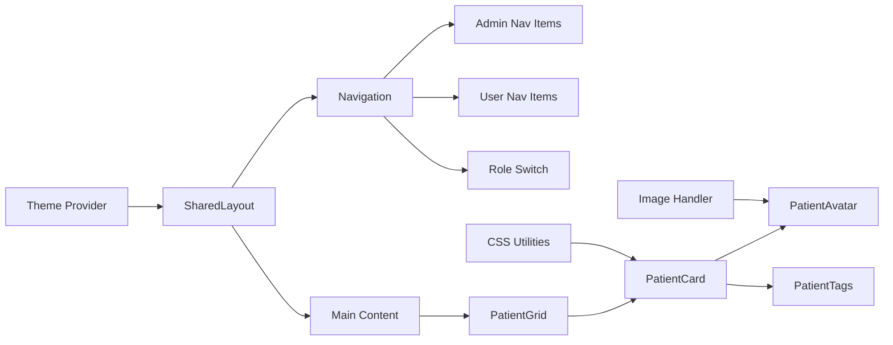
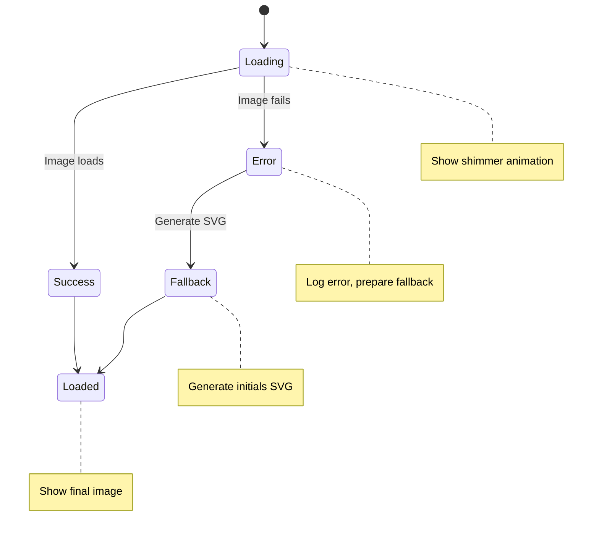
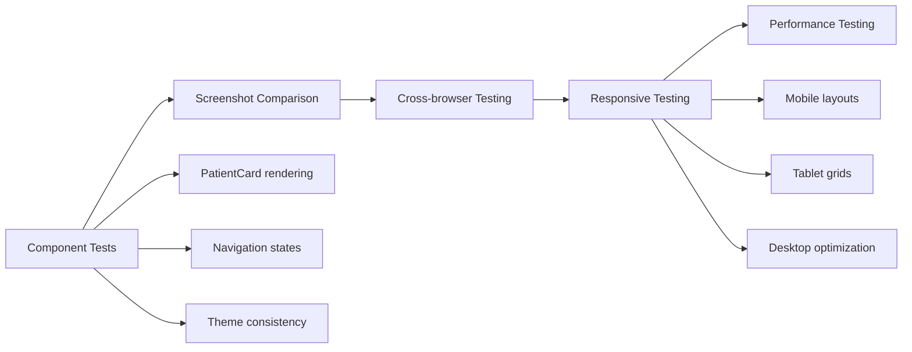

# Fix Graphics System - Design Document

## Overview

This document outlines a comprehensive solution to resolve graphics-related issues in the ePatients application. The system addresses broken navigation styles, inconsistent theming, missing CSS utilities, responsive layout problems, and image handling improvements.

## Architecture

### Graphics System Components



### Component Hierarchy



## Detailed Component Analysis

### Navigation System Issues

**Problem**: Missing CSS classes referenced in SharedLayout.tsx:
- `admin-nav-item` and `admin-nav-item active`
- `user-nav-item` and `user-nav-item active`

**Impact**: Navigation links appear unstyled or with incorrect styling

### Theme Consistency Issues

**Problem**: Mixed light/dark theme implementations across components:
- PatientCard uses dark theme (`bg-gray-800`)
- SharedLayout header uses gradient backgrounds
- Form components use light theme styles

**Impact**: Inconsistent visual experience

### CSS Utility Gaps

**Problem**: Missing responsive utilities and component-specific classes:
- Navigation animation states
- Loading skeleton improvements
- Better text truncation handling

**Impact**: Poor user experience on different devices

### Image Loading System Issues

**Problem**: PatientAvatar component has basic error handling:
- Simple SVG fallback generation
- No loading states
- Limited optimization

**Impact**: Poor performance and user experience

## Technical Specifications

### CSS Class Definitions

#### Navigation Classes
```css
.admin-nav-item {
  display: flex;
  align-items: center;
  padding: 0.75rem 1rem;
  font-size: 0.875rem;
  font-weight: 500;
  color: #dc2626;
  border-radius: 0.5rem;
  transition: all 0.2s ease;
  background: linear-gradient(135deg, transparent 0%, rgba(220, 38, 38, 0.05) 100%);
}

.admin-nav-item:hover {
  background: linear-gradient(135deg, rgba(220, 38, 38, 0.1) 0%, rgba(220, 38, 38, 0.15) 100%);
  transform: translateX(4px);
}

.admin-nav-item.active {
  background: linear-gradient(135deg, #dc2626 0%, #b91c1c 100%);
  color: white;
  box-shadow: 0 4px 12px rgba(220, 38, 38, 0.4);
}

.user-nav-item {
  display: flex;
  align-items: center;
  padding: 0.75rem 1rem;
  font-size: 0.875rem;
  font-weight: 500;
  color: #2563eb;
  border-radius: 0.5rem;
  transition: all 0.2s ease;
  background: linear-gradient(135deg, transparent 0%, rgba(37, 99, 235, 0.05) 100%);
}

.user-nav-item:hover {
  background: linear-gradient(135deg, rgba(37, 99, 235, 0.1) 0%, rgba(37, 99, 235, 0.15) 100%);
  transform: translateX(4px);
}

.user-nav-item.active {
  background: linear-gradient(135deg, #2563eb 0%, #1d4ed8 100%);
  color: white;
  box-shadow: 0 4px 12px rgba(37, 99, 235, 0.4);
}
```

#### Enhanced Image Loading
```css
.patient-avatar-container {
  position: relative;
  width: 100%;
  height: 12rem;
  background: linear-gradient(135deg, #374151 0%, #4b5563 100%);
  overflow: hidden;
  border-radius: 0.5rem 0.5rem 0 0;
}

.patient-avatar-image {
  object-fit: cover;
  object-position: center;
  transition: transform 0.3s ease, filter 0.3s ease;
}

.patient-avatar-image:hover {
  transform: scale(1.05);
  filter: brightness(1.1);
}

.patient-avatar-loading {
  position: absolute;
  inset: 0;
  display: flex;
  align-items: center;
  justify-content: center;
  background: linear-gradient(45deg, #374151, #4b5563, #374151);
  background-size: 200% 200%;
  animation: shimmer 2s ease-in-out infinite;
}

@keyframes shimmer {
  0% { background-position: -200% 0; }
  100% { background-position: 200% 0; }
}

.patient-avatar-error {
  position: absolute;
  inset: 0;
  display: flex;
  flex-direction: column;
  align-items: center;
  justify-content: center;
  background: linear-gradient(135deg, #1f2937 0%, #374151 100%);
  color: #9ca3af;
}
```

#### Responsive Grid Enhancements
```css
.patient-grid {
  display: grid;
  grid-template-columns: repeat(auto-fit, minmax(320px, 1fr));
  gap: 1.5rem;
  padding: 1rem;
}

@media (min-width: 768px) {
  .patient-grid {
    grid-template-columns: repeat(auto-fit, minmax(350px, 1fr));
    gap: 2rem;
    padding: 1.5rem;
  }
}

@media (min-width: 1024px) {
  .patient-grid {
    grid-template-columns: repeat(auto-fit, minmax(380px, 1fr));
    max-width: 1400px;
    margin: 0 auto;
  }
}

@media (min-width: 1536px) {
  .patient-grid {
    grid-template-columns: repeat(4, 1fr);
  }
}
```

#### Enhanced Patient Cards
```css
.patient-card {
  background: linear-gradient(145deg, #1f2937 0%, #111827 100%);
  border: 1px solid #374151;
  border-radius: 0.75rem;
  overflow: hidden;
  transition: all 0.3s cubic-bezier(0.4, 0, 0.2, 1);
  display: flex;
  flex-direction: column;
  height: 100%;
  box-shadow: 0 4px 6px -1px rgba(0, 0, 0, 0.1);
}

.patient-card:hover {
  border-color: #4b5563;
  box-shadow: 0 20px 25px -5px rgba(0, 0, 0, 0.3), 0 10px 10px -5px rgba(0, 0, 0, 0.1);
  transform: translateY(-4px);
}

.patient-card-content {
  padding: 1.5rem;
  flex: 1;
  display: flex;
  flex-direction: column;
  justify-content: space-between;
}

.patient-card-header {
  display: flex;
  justify-content: space-between;
  align-items: flex-start;
  margin-bottom: 0.75rem;
}

.patient-card-title {
  font-size: 1.25rem;
  font-weight: 600;
  color: #ffffff;
  line-height: 1.4;
}

.patient-card-age {
  font-size: 0.875rem;
  color: #9ca3af;
  white-space: nowrap;
}

.patient-card-condition {
  font-size: 0.875rem;
  color: #d1d5db;
  font-weight: 500;
  margin-bottom: 1rem;
}

.patient-card-description {
  font-size: 0.875rem;
  color: #d1d5db;
  line-height: 1.6;
  margin-bottom: 1rem;
  overflow: hidden;
  display: -webkit-box;
  -webkit-box-orient: vertical;
  -webkit-line-clamp: 3;
}

.patient-card-objectives {
  margin-bottom: 1rem;
}

.patient-card-objectives-title {
  font-size: 0.875rem;
  color: #e5e7eb;
  font-weight: 500;
  margin-bottom: 0.5rem;
}

.patient-card-objective-list {
  list-style: none;
  padding: 0;
  margin: 0;
  space-y: 0.25rem;
}

.patient-card-objective-item {
  display: flex;
  align-items: flex-start;
  font-size: 0.875rem;
  color: #d1d5db;
}

.patient-card-objective-bullet {
  color: #10b981;
  margin-right: 0.5rem;
  margin-top: 0.125rem;
  flex-shrink: 0;
}

.patient-card-objective-text {
  overflow: hidden;
  display: -webkit-box;
  -webkit-box-orient: vertical;
  -webkit-line-clamp: 2;
}

.patient-card-metadata {
  display: flex;
  justify-content: space-between;
  align-items: center;
  margin-bottom: 1rem;
  font-size: 0.75rem;
  color: #9ca3af;
}

.patient-card-difficulty {
  display: flex;
  align-items: center;
}

.patient-card-difficulty-icon {
  margin-right: 0.25rem;
}

.patient-card-duration {
  display: flex;
  align-items: center;
}

.patient-card-duration-icon {
  margin-right: 0.25rem;
}

.patient-card-button {
  width: 100%;
  background: linear-gradient(135deg, #059669 0%, #047857 100%);
  color: white;
  font-weight: 500;
  padding: 0.75rem 1rem;
  border-radius: 0.5rem;
  text-decoration: none;
  text-align: center;
  transition: all 0.2s ease;
  display: inline-block;
}

.patient-card-button:hover {
  background: linear-gradient(135deg, #047857 0%, #065f46 100%);
  transform: translateY(-1px);
  box-shadow: 0 4px 12px rgba(5, 150, 105, 0.4);
}
```

### Image Loading System

#### Enhanced Avatar Component Architecture



#### Image Optimization Features
- **Progressive Loading**: Blur-to-sharp transition
- **Smart Fallbacks**: SVG initials with consistent styling
- **Error Recovery**: Graceful degradation with retry mechanism
- **Performance**: Lazy loading and optimized sizes

### Responsive Design Strategy

#### Breakpoint System
```css
/* Mobile First Approach */
/* xs: 0px - 639px (default) */
/* sm: 640px - 767px */
/* md: 768px - 1023px */
/* lg: 1024px - 1279px */
/* xl: 1280px - 1535px */
/* 2xl: 1536px+ */
```

#### Grid Behavior
- **Mobile (xs)**: Single column, full width cards
- **Tablet (md)**: Two columns, optimized spacing
- **Desktop (lg)**: Three columns, enhanced visuals
- **Large (xl+)**: Four columns with max-width constraint

### Theme Integration

#### Color Token System
```css
/* Dark Theme Tokens */
:root {
  --surface-primary: #1f2937;
  --surface-secondary: #111827;
  --surface-tertiary: #374151;
  
  --text-primary: #ffffff;
  --text-secondary: #e5e7eb;
  --text-tertiary: #d1d5db;
  --text-muted: #9ca3af;
  
  --accent-admin: #dc2626;
  --accent-user: #2563eb;
  --accent-success: #059669;
  
  --border-primary: #374151;
  --border-secondary: #4b5563;
  --border-hover: #6b7280;
}
```

## Implementation Strategy

### Phase 1: CSS Foundation
1. **Add missing navigation classes** to components.css
2. **Implement responsive grid utilities**
3. **Create enhanced card styling system**
4. **Add animation and transition utilities**

### Phase 2: Component Enhancement
1. **Upgrade PatientAvatar** with better loading states
2. **Enhance PatientCard** with improved styling
3. **Optimize PatientGrid** for better responsiveness
4. **Add loading skeleton improvements**

### Phase 3: Theme Consistency
1. **Standardize color usage** across components
2. **Implement consistent spacing** system
3. **Add hover and focus states** for accessibility
4. **Create reusable animation classes**

### Phase 4: Performance Optimization
1. **Implement image lazy loading**
2. **Add CSS containment** for better performance
3. **Optimize animation performance**
4. **Add prefetch strategies** for images

## Testing Strategy

### Visual Regression Testing


### Test Cases
1. **Navigation State Changes**: Admin/user role switching
2. **Image Loading Scenarios**: Success, error, and fallback states
3. **Responsive Breakpoints**: Grid behavior at each breakpoint
4. **Theme Consistency**: Color and styling across components
5. **Performance Metrics**: Animation smoothness and loading times

## Accessibility Enhancements

### Focus Management
- **Enhanced focus indicators** for navigation items
- **Keyboard navigation** support for patient cards
- **Screen reader optimizations** for image alt text

### Color Contrast
- **WCAG AA compliance** for all text/background combinations
- **High contrast mode** support
- **Color-blind friendly** difficulty indicators

### Motion Accessibility
- **Reduced motion** support via `prefers-reduced-motion`
- **Optional animations** with user controls
- **Performance-conscious** transitions