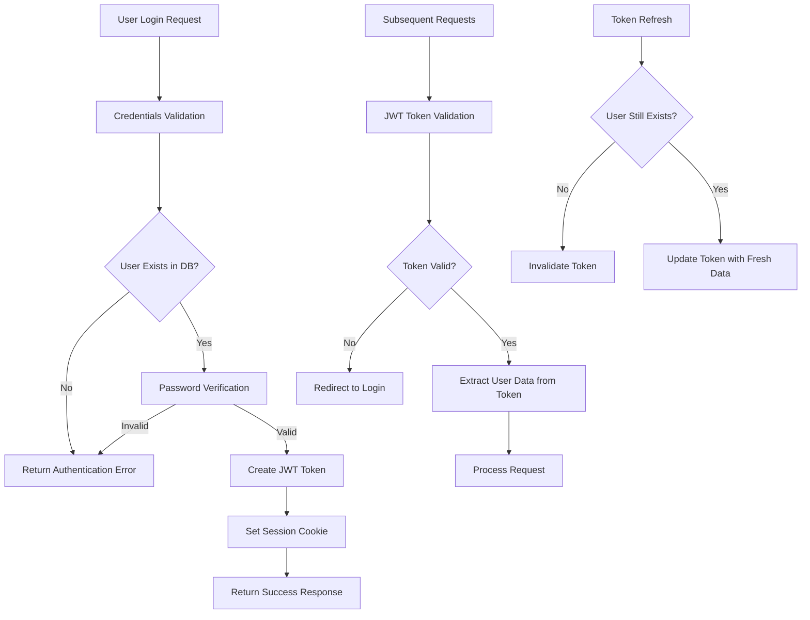
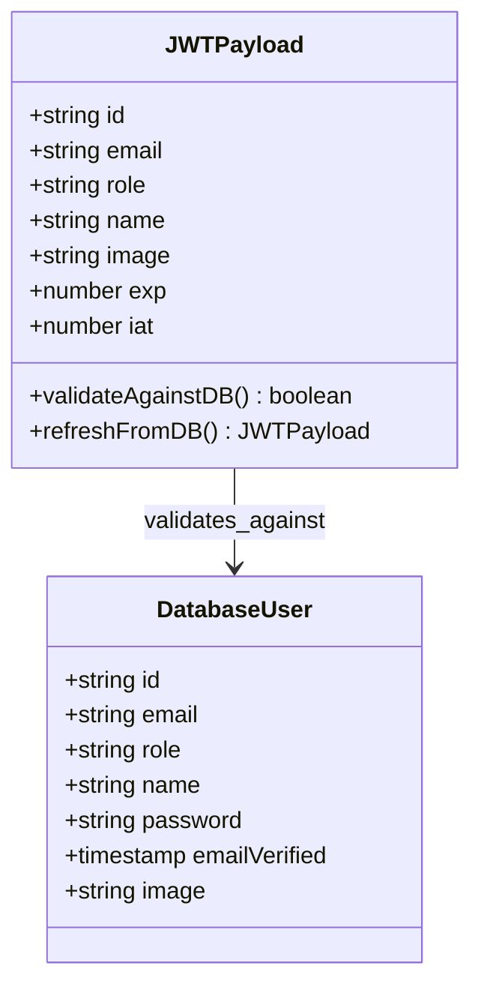
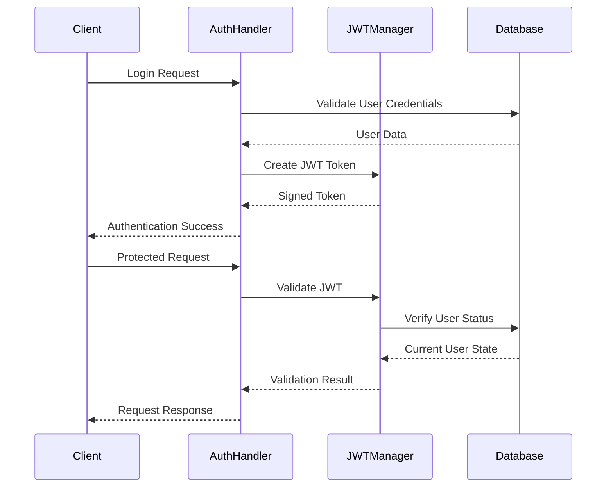
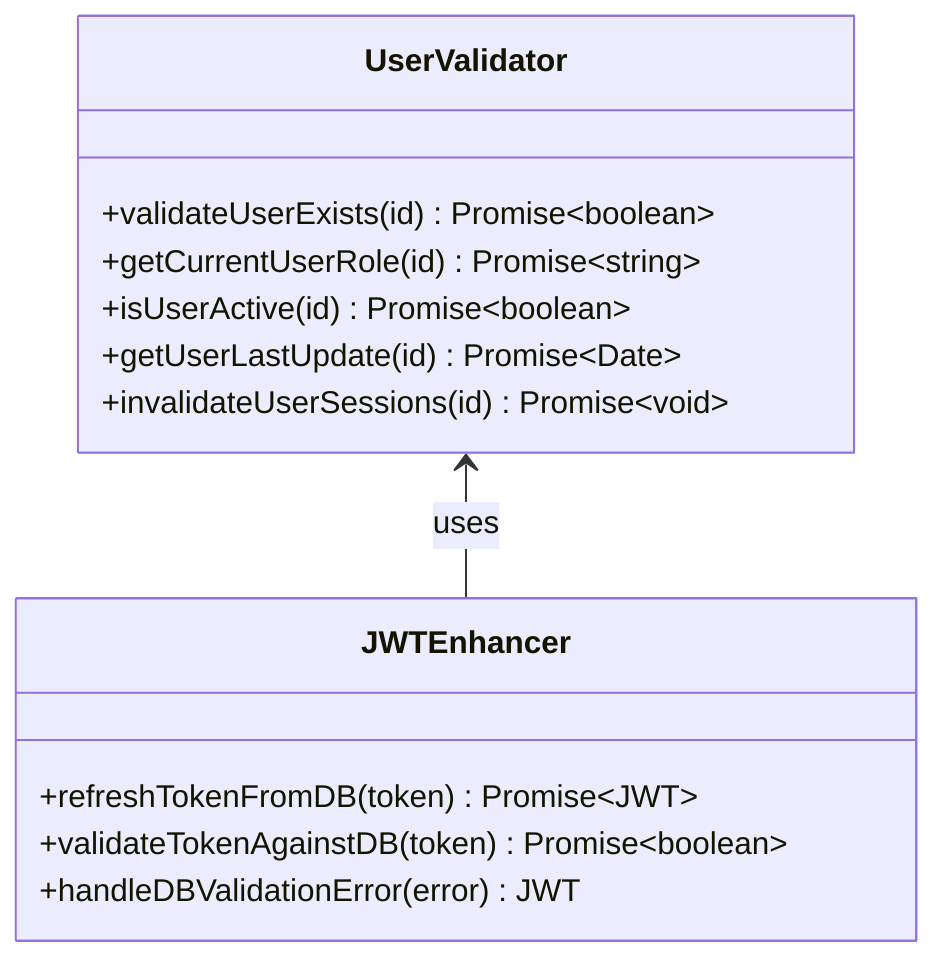
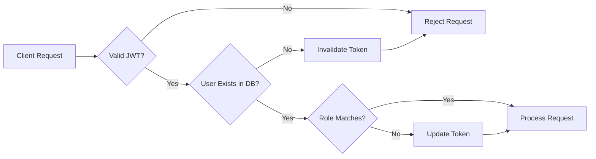

# Fix JWT Authentication with Database Validation

## Overview

The authentication system currently uses JWT tokens but lacks proper database validation during critical authentication flows. This design addresses the gaps in the JWT authentication implementation to ensure secure, reliable user authentication with database consistency.

## Current Authentication Issues

### JWT Token Management Problems
- JWT tokens don't automatically validate against database state changes
- Session validation bypasses database checks for user existence and role updates
- Token refresh doesn't verify current user status in the database
- User role changes require manual token invalidation

### Database Synchronization Issues
- JWT strategy removes automatic database session management
- User deletions/deactivations don't invalidate existing JWT tokens
- Role updates don't propagate to active JWT sessions immediately
- Password changes don't invalidate existing sessions

## Authentication Flow Analysis



## Enhanced Authentication Architecture

### Hybrid JWT-Database Strategy

#### JWT Token Structure


#### Authentication Configuration Updates

**Enhanced JWT Callbacks**
- JWT callback validates user existence on token refresh
- Database queries verify user status during token operations
- Role changes trigger token invalidation
- Password updates invalidate existing sessions

**Session Callback Improvements**
- Session creation includes fresh database validation
- User role verification against current database state
- Enhanced error handling for database inconsistencies

### Database Validation Points

#### Critical Validation Checkpoints
1. **Login Authentication**
   - Verify user exists and is active
   - Validate password hash
   - Check account status and role

2. **Token Refresh Operations**
   - Query database for current user state
   - Validate user still exists
   - Update token with latest role information
   - Invalidate token if user deleted/deactivated

3. **Session Validation**
   - Cross-reference JWT data with database
   - Verify role permissions are current
   - Handle database connection failures gracefully

## Implementation Strategy

### Authentication Flow Enhancements



### JWT Configuration Improvements

**Token Refresh Strategy**
- Implement database validation during token refresh
- Add user existence checks in JWT callback
- Handle database errors gracefully
- Implement exponential backoff for database queries

**Session Management**
- Maintain JWT strategy while adding database validation
- Implement selective database queries for critical operations
- Add caching layer for frequently accessed user data
- Handle network latency and database unavailability

### Database Integration Points

#### User Validation Functions


#### Database Query Optimization
- Implement efficient user lookup queries
- Add database indexes for authentication-related queries
- Cache frequently accessed user data
- Implement query timeout handling

### Error Handling Strategy

#### Authentication Error Types
1. **Database Connection Errors**
   - Fallback to cached user data
   - Implement circuit breaker pattern
   - Log errors for monitoring

2. **User State Inconsistencies**
   - Force token refresh
   - Redirect to login if user deleted
   - Handle role changes gracefully

3. **Token Validation Failures**
   - Clear invalid tokens
   - Provide clear error messages
   - Implement retry mechanisms

## Security Enhancements

### Token Security Measures

#### JWT Token Protection
- Implement proper token signing and verification
- Add token blacklisting for compromised tokens
- Implement sliding session expiration
- Add device fingerprinting for enhanced security

#### Database Security Integration
- Implement proper database connection security
- Add query parameterization to prevent SQL injection
- Implement proper error logging without exposing sensitive data
- Add rate limiting for authentication attempts

### Session Management Security



## Testing Strategy

### Unit Testing Requirements
- JWT token creation and validation
- Database validation functions
- Error handling scenarios
- Token refresh mechanisms

### Integration Testing
- End-to-end authentication flows
- Database connection failure handling
- Token invalidation scenarios
- Role-based access control validation

### Performance Testing
- Database query performance under load
- JWT token processing performance
- Cache effectiveness measurements
- Connection pool management

## Configuration Updates

### Environment Variables
```
# JWT Configuration
JWT_SECRET=secure-secret-key
JWT_EXPIRATION=30d
JWT_REFRESH_THRESHOLD=24h

# Database Configuration
DB_VALIDATION_TIMEOUT=5s
DB_RETRY_ATTEMPTS=3
DB_CACHE_TTL=300s

# Security Configuration
AUTH_RATE_LIMIT=10
TOKEN_BLACKLIST_SIZE=1000
SESSION_TIMEOUT=30d
```

### NextAuth Configuration Changes
- Update JWT callback to include database validation
- Enhance session callback with error handling
- Implement proper redirect handling
- Add comprehensive logging for debugging

## Migration Strategy

### Phase 1: Enhanced Validation
- Add database validation to existing JWT callbacks
- Implement error handling for database failures
- Add logging for monitoring authentication flows

### Phase 2: Security Hardening
- Implement token blacklisting
- Add rate limiting for authentication
- Enhance error messages and user feedback

### Phase 3: Performance Optimization
- Add caching layer for user data
- Optimize database queries
- Implement connection pooling

## Monitoring and Logging

### Authentication Metrics
- Track authentication success/failure rates
- Monitor database validation performance
- Log token refresh patterns
- Track user role changes and their impact

### Error Monitoring
- Database connection failures
- JWT validation errors
- Token refresh failures
- User state inconsistencies

### Performance Monitoring
- Authentication response times
- Database query performance
- Cache hit rates
- Token processing times