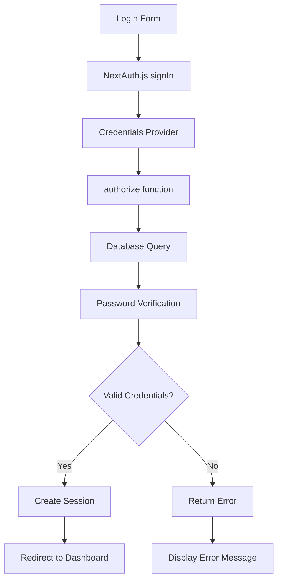
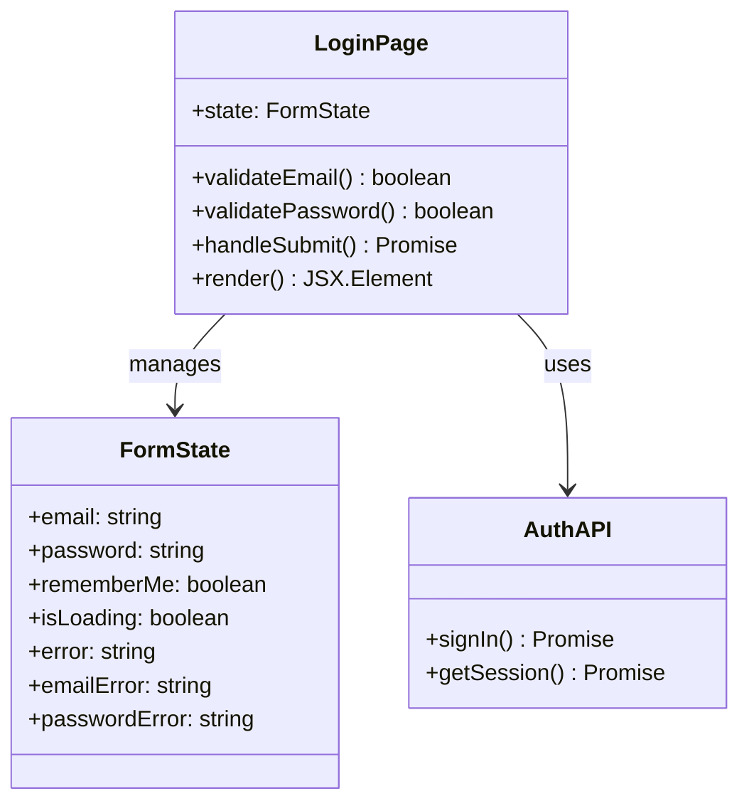
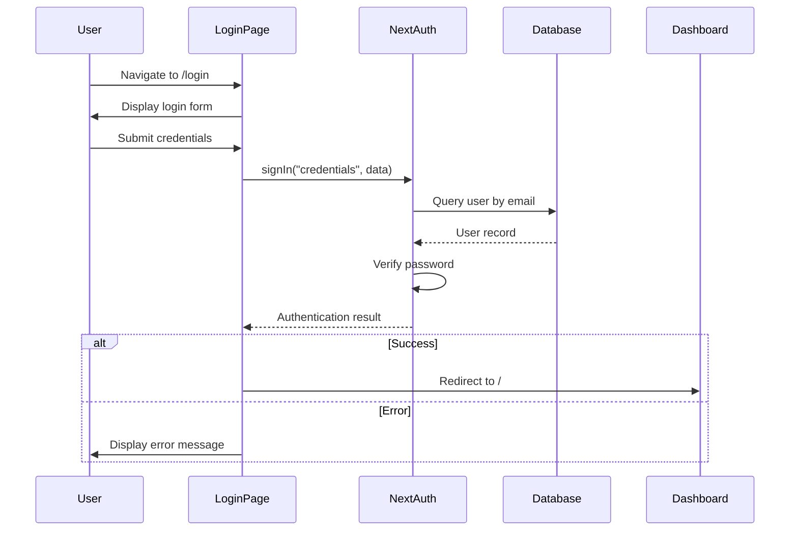

# Login Layout Fix Design Document

## Overview

This design document outlines the implementation plan for fixing the ePatient login page by removing the Discord OAuth button and ensuring proper integration with the credentials-based authentication API. The current login page includes both Discord OAuth and email/password authentication, but the requirement is to simplify the interface by keeping only the email/password form and properly linking it to the NextAuth.js credentials provider.

## Current State Analysis

### Existing Login Implementation
The current login page (`src/app/login/page.tsx`) includes:
- Discord OAuth button with social login functionality
- Email/password form with client-side validation
- Form submission using NextAuth.js `signIn("credentials", ...)` 
- Loading states and error handling
- Responsive design with Tailwind CSS

### Authentication Configuration
The current NextAuth.js configuration (`src/server/auth/config.ts`) includes:
- DiscordProvider for OAuth authentication
- Drizzle adapter for database integration
- Session callback for user ID assignment
- **Missing**: Credentials provider implementation

## Architecture Changes

### Authentication Provider Configuration

The NextAuth.js configuration needs to be updated to include a proper credentials provider:



### Database Schema Requirements

The existing user schema in `src/server/db/schema.ts` needs enhancement:

| Field | Type | Description | Required |
|-------|------|-------------|----------|
| id | text(255) | Primary key (UUID) | ✓ |
| name | text(255) | User display name | ✗ |
| email | text(255) | Email address | ✓ |
| password | text(255) | Hashed password | ✓ |
| emailVerified | timestamp | Email verification | ✗ |
| image | text(255) | Profile image URL | ✗ |

## Component Architecture

### Login Page Structure



### UI Component Hierarchy

```
LoginPage
├── Header Section
│   ├── ePatient Branding
│   ├── Platform Description
│   └── Sign-in Title
├── Login Form Container
│   ├── Error Message Display
│   ├── Email Input Field
│   │   ├── Label with Required Indicator
│   │   ├── Input Element
│   │   └── Error Message
│   ├── Password Input Field
│   │   ├── Label with Required Indicator
│   │   ├── Input Element
│   │   └── Error Message
│   ├── Form Options Row
│   │   ├── Remember Me Checkbox
│   │   └── Forgot Password Link
│   └── Submit Button
└── Footer Section
    ├── Terms & Privacy Links
    └── Copyright Notice
```

## Styling Strategy

### Layout Improvements

The current layout uses a centered design with gradient background. Key improvements:

1. **Remove Discord Section**: Eliminate OAuth button and divider
2. **Simplify Form Layout**: Direct focus on email/password authentication
3. **Maintain Accessibility**: Preserve ARIA attributes and screen reader support
4. **Responsive Design**: Ensure mobile-first approach with Tailwind utilities

### CSS Class Structure

| Component | Tailwind Classes | Purpose |
|-----------|-----------------|---------|
| Container | `min-h-screen bg-gradient-to-br from-green-50 to-blue-50` | Full-height gradient background |
| Form Card | `bg-white py-8 px-4 shadow sm:rounded-lg sm:px-10` | White card with shadow |
| Input Fields | `border border-gray-300 rounded-md px-4 py-3 focus:border-green-500` | Consistent form styling |
| Submit Button | `bg-green-600 text-white rounded-md hover:bg-green-700` | Primary action button |
| Error States | `border-red-300 text-red-600` | Error indication |

## API Integration Layer

### NextAuth.js Credentials Provider

Implementation of the credentials provider in `src/server/auth/config.ts`:

```typescript
CredentialsProvider({
  name: "credentials",
  credentials: {
    email: { label: "Email", type: "email" },
    password: { label: "Password", type: "password" },
  },
  async authorize(credentials) {
    // Input validation
    if (!credentials?.email || !credentials?.password) {
      return null;
    }

    // Database query for user
    const user = await db
      .select()
      .from(users)
      .where(eq(users.email, credentials.email))
      .limit(1);

    if (user.length === 0) {
      return null;
    }

    // Password verification (implement bcrypt comparison)
    const isValidPassword = await bcrypt.compare(
      credentials.password,
      user[0].password
    );

    if (!isValidPassword) {
      return null;
    }

    // Return user object for session creation
    return {
      id: user[0].id,
      email: user[0].email,
      name: user[0].name,
      image: user[0].image,
    };
  },
})
```

### Password Security Implementation

Password handling requirements:
- Use bcrypt for password hashing
- Minimum 6 character requirement (as per current validation)
- Salt rounds: 12 (recommended for security)
- Secure password storage in database

## Routing & Navigation

### Authentication Flow



### Route Protection

Current authentication routes:
- `/login` - Public route with redirect for authenticated users
- `/api/auth/[...nextauth]` - NextAuth.js API routes
- `/` - Protected route requiring authentication

## Testing Strategy

### Unit Testing Requirements

| Component | Test Cases | Priority |
|-----------|------------|----------|
| Email Validation | Valid/invalid email formats | High |
| Password Validation | Length requirements, empty values | High |
| Form Submission | Success/error scenarios | High |
| Loading States | Button states during submission | Medium |
| Accessibility | ARIA attributes, keyboard navigation | Medium |

### Integration Testing

1. **Authentication Flow**: End-to-end login process
2. **Database Integration**: User credential verification
3. **Session Management**: Post-login session handling
4. **Error Handling**: Invalid credential scenarios

## Implementation Steps

### Phase 1: Authentication Backend Setup
1. Add credentials provider to NextAuth.js configuration
2. Implement password hashing utilities
3. Update user schema to include password field
4. Test credential verification logic

### Phase 2: UI Component Updates
1. Remove Discord OAuth button and related handlers
2. Remove divider section between OAuth and form
3. Update form layout to fill available space
4. Ensure proper focus management

### Phase 3: Testing & Validation
1. Test form submission with valid credentials
2. Verify error handling for invalid credentials
3. Confirm responsive design across devices
4. Validate accessibility compliance

### Phase 4: Security & Performance
1. Implement rate limiting for login attempts
2. Add CSRF protection verification
3. Optimize form validation performance
4. Conduct security audit

## Security Considerations

### Password Security
- Implement bcrypt with appropriate salt rounds
- Secure password storage in database
- Password strength validation on client and server

### Session Security
- Secure session token generation
- Proper session expiration handling
- CSRF protection for authentication routes

### Input Validation
- Server-side validation of all inputs
- SQL injection prevention through Drizzle ORM
- XSS protection through proper input sanitization

## Performance Considerations

### Client-Side Optimization
- Debounced validation to reduce re-renders
- Optimized loading states for better UX
- Minimal bundle size impact from removed OAuth code

### Server-Side Optimization
- Efficient database queries for user lookup
- Proper indexing on email field for fast searches
- Connection pooling for database performance

## Deployment Considerations

### Environment Variables
Required environment variables for credentials authentication:
- `AUTH_SECRET`: NextAuth.js secret for JWT signing
- `DATABASE_URL`: Database connection string
- Additional security-related environment variables

### Database Migration
If password field is missing from users table:
1. Create migration to add password column
2. Update existing users with temporary passwords
3. Implement password reset flow for existing users

## Accessibility Features

### Form Accessibility
- Proper label associations with form inputs
- ARIA attributes for error states and validation
- Keyboard navigation support
- Screen reader announcements for state changes

### Visual Accessibility
- Sufficient color contrast ratios
- Clear error indication without relying solely on color
- Responsive text sizing
- Focus indicators for keyboard navigation