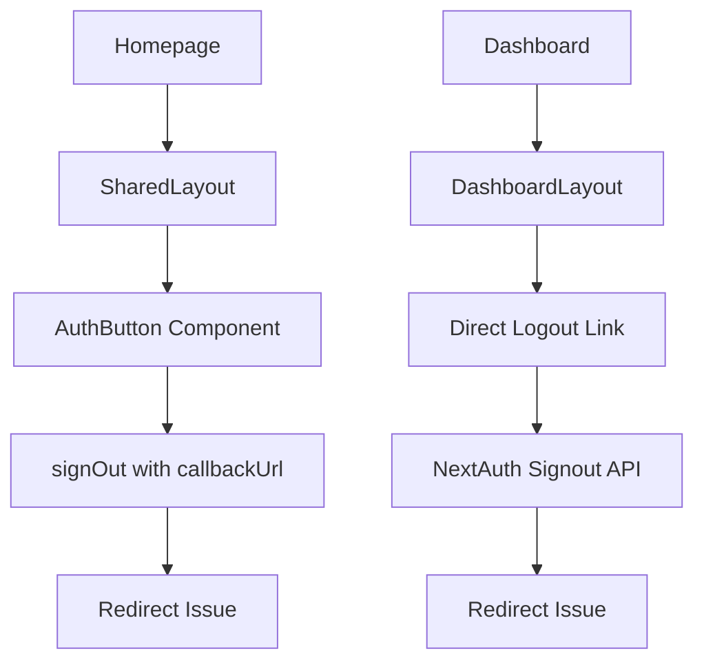
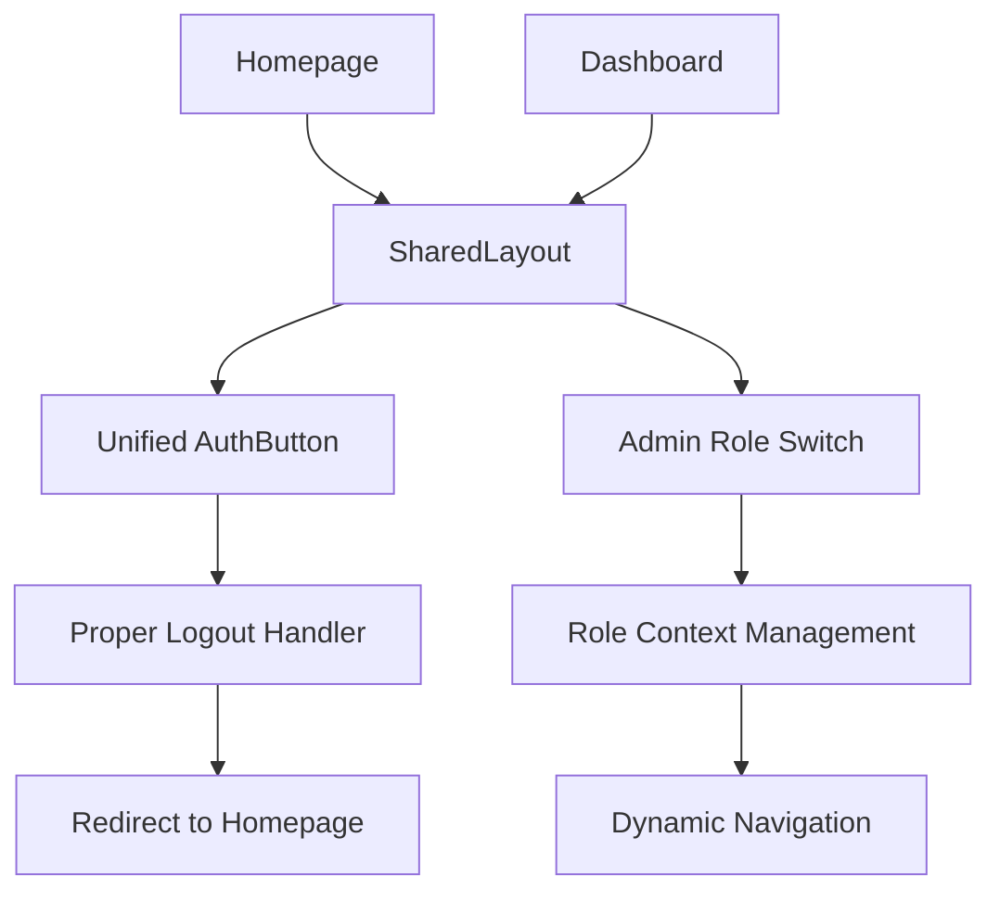
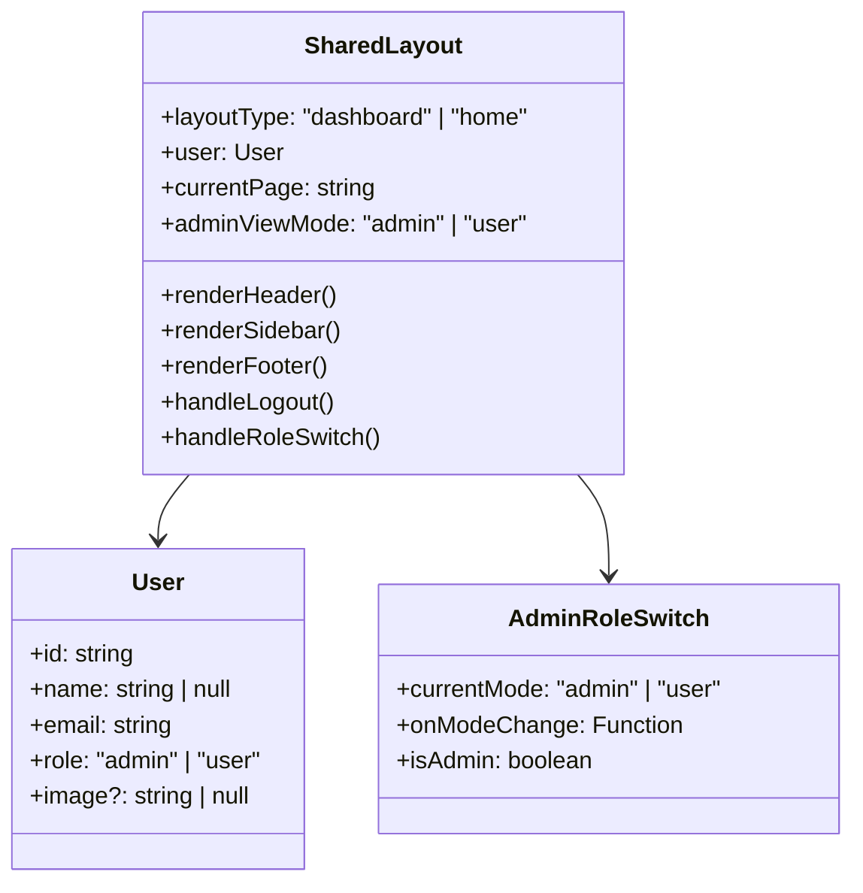
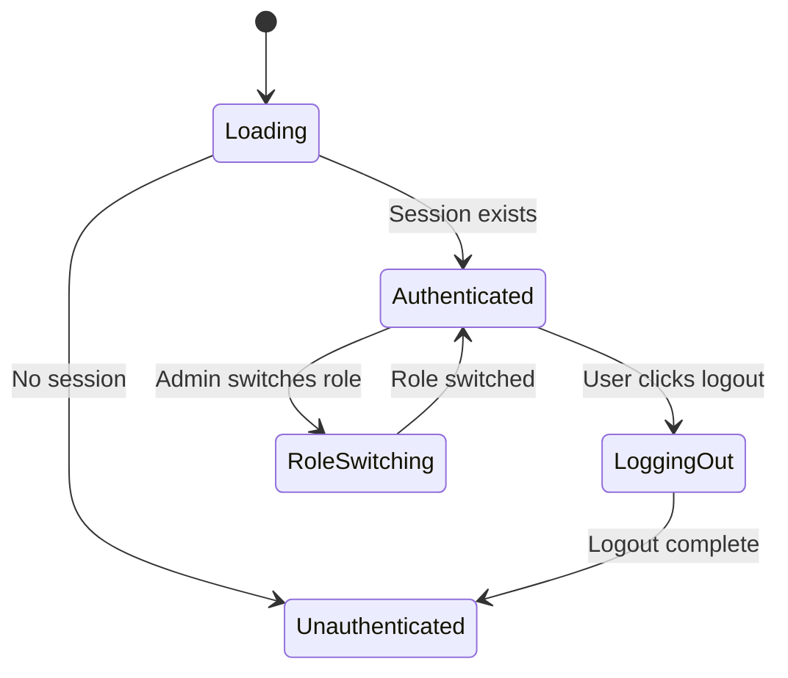
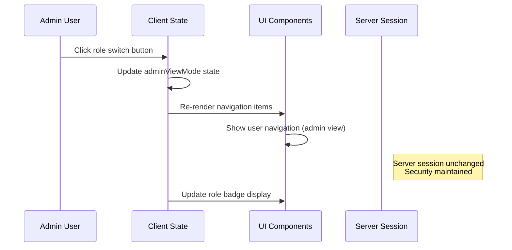
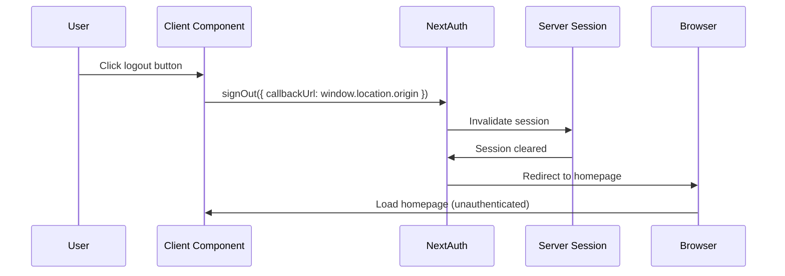
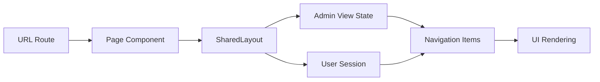

# Fix Logout Redirect and Add Admin Role Switch Button

## Overview

This design addresses several interconnected issues in the ePatient Next.js application's authentication and navigation system:

1. **Logout Redirect Issue**: Currently logout redirects to `localhost:3001` and doesn't properly log users out
2. **Admin Role Switching**: Add functionality for admins to switch between admin and user role views
3. **Unified Navigation**: Implement the same navbar for both homepage and dashboard
4. **Consistent Styling**: Ensure dashboard uses fonts and colors from SharedLayout

## Architecture

### Current State Analysis

The application currently has two separate layout systems:
- `DashboardLayout.tsx` for dashboard pages
- `SharedLayout.tsx` for home pages and advanced functionality

The logout functionality is implemented differently across components:
- `AuthButton.tsx` uses `signOut({ callbackUrl: '/' })`
- Dashboard layouts use direct links to `/api/auth/signout`



### Target Architecture

Unified layout system with consistent logout behavior and admin role switching:



## Component Architecture

### Unified Layout Strategy

Replace the dual layout system with a single `SharedLayout` component that adapts based on page type:



### Enhanced AuthButton Component

Consolidate authentication logic into a single, reusable component:



## Role Switching System

### Admin View Mode Management

Implement client-side role switching that doesn't affect server-side permissions:



### Navigation Items Logic

Dynamic navigation based on actual role and view mode:

| Actual Role | View Mode | Navigation Items | Role Badge |
|-------------|-----------|------------------|------------|
| admin | admin | Admin navigation | Admin |
| admin | user | User navigation | Admin (User View) |
| user | N/A | User navigation | Utente |

## Logout Fix Implementation

### Root Cause Analysis

Current logout issues stem from:
1. Inconsistent callback URL handling
2. Missing proper session invalidation
3. Redirect configuration problems

### Proper Logout Flow



## Implementation Details

### Unified Layout Component Structure

```typescript
interface SharedLayoutProps {
  children: React.ReactNode;
  user: User;
  layoutType: "dashboard" | "home";
  currentPage?: string;
}

interface AdminRoleSwitchState {
  viewMode: "admin" | "user";
  setViewMode: (mode: "admin" | "user") => void;
}
```

### Admin Role Switch Button Design

Visual component specifications:
- **Position**: Header, next to user name and role badge
- **Style**: Toggle button with clear visual indication of current mode
- **Text**: "Switch to User View" / "Switch to Admin View"
- **Icon**: Role-specific icons for clarity
- **Accessibility**: Proper ARIA labels and keyboard navigation

### Logout Button Enhancement

Standardized logout implementation:
- **Method**: Use `signOut()` from next-auth/react consistently
- **Callback**: Dynamic callback URL based on current environment
- **Confirmation**: Optional confirmation dialog for important sessions
- **Loading State**: Visual feedback during logout process

### Style Consistency

Ensure dashboard inherits SharedLayout styling:
- **Font Family**: Merriweather font from globals.css
- **Color Palette**: Primary green colors and semantic colors
- **Typography Scale**: Consistent font sizes and line heights
- **Component Styles**: Reuse button and navigation styles

## Data Flow Integration

### State Management Strategy



### Session Context Flow

- **Authentication**: NextAuth session provides user data
- **Role Information**: User role determines base permissions
- **View Mode**: Client-side state for admin role switching
- **Navigation**: Dynamic based on role + view mode combination

## Testing Strategy

### Authentication Flow Testing

1. **Login/Logout Cycle**: Verify proper redirect behavior
2. **Session Persistence**: Test session handling across page refreshes
3. **Role-based Access**: Confirm proper route protection
4. **Logout Redirect**: Ensure consistent homepage redirection

### Role Switching Testing

1. **Admin Role Switch**: Test switching between admin/user views
2. **Navigation Updates**: Verify correct menu items display
3. **State Persistence**: Test view mode across page navigation
4. **Non-admin Users**: Confirm switch button doesn't appear

### Layout Consistency Testing

1. **Style Inheritance**: Verify dashboard uses SharedLayout styles
2. **Responsive Design**: Test layout on different screen sizes
3. **Font Loading**: Confirm Merriweather font displays correctly
4. **Color Consistency**: Verify color palette usage across components