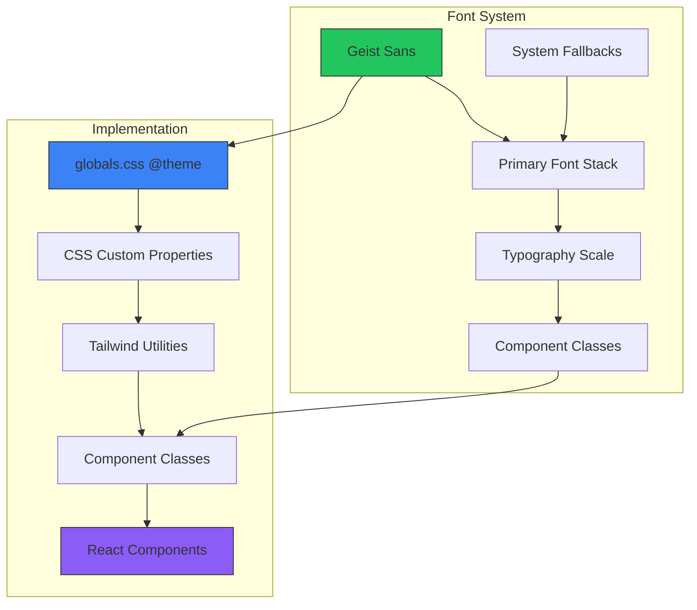
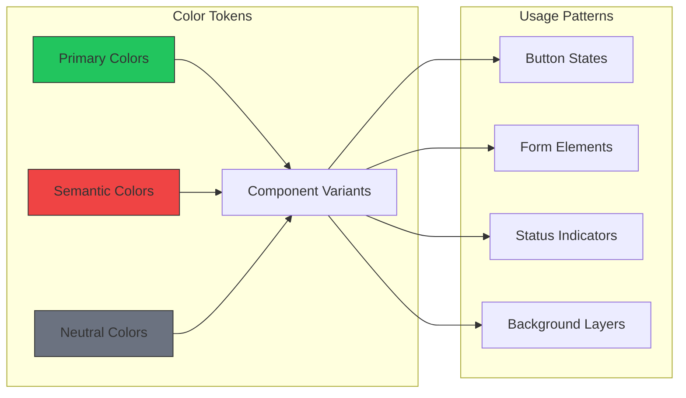

# Font and Color Palette Design

## Overview

This design document outlines the implementation of a comprehensive font and color palette system for the ePatient application. The system will integrate with the existing Tailwind CSS v4 configuration and T3 Stack architecture, extending the current component design system with standardized typography scales and color tokens.

## Technology Stack & Dependencies

### Core Dependencies
- **Tailwind CSS 4.0**: Utility-first CSS framework with @theme directive support
- **Geist Font**: Primary typography system (already configured)
- **Next.js 15**: App Router with React Server Components
- **CSS Custom Properties**: CSS variables for dynamic theming

### Integration Points
- `src/styles/globals.css`: Theme configuration with @theme directive
- `src/styles/components.css`: Component-specific styles with palette integration
- `src/app/layout.tsx`: Font loading and provider setup

## Component Architecture

### Typography System Architecture



### Color System Architecture



## Font Architecture

### Font Stack Definition

| Category | Font Family | Fallback Chain | Usage |
|----------|-------------|----------------|-------|
| **Primary Sans** | Geist Sans | ui-sans-serif, system-ui, sans-serif | Body text, headings, UI components |
| **System Fallback** | System UI | -apple-system, BlinkMacSystemFont | OS-native fallback |
| **Emoji Support** | Apple Color Emoji | Segoe UI Emoji, Noto Color Emoji | Icon and emoji rendering |

### Typography Scale

| Scale | Font Size | Line Height | Letter Spacing | Usage |
|-------|-----------|-------------|----------------|-------|
| **xs** | 0.75rem (12px) | 1rem (16px) | 0.05em | Captions, labels |
| **sm** | 0.875rem (14px) | 1.25rem (20px) | 0.025em | Small text, metadata |
| **base** | 1rem (16px) | 1.5rem (24px) | 0 | Body text, paragraphs |
| **lg** | 1.125rem (18px) | 1.75rem (28px) | -0.025em | Large body text |
| **xl** | 1.25rem (20px) | 1.75rem (28px) | -0.025em | Subheadings |
| **2xl** | 1.5rem (24px) | 2rem (32px) | -0.05em | Section headings |
| **3xl** | 1.875rem (30px) | 2.25rem (36px) | -0.05em | Page headings |
| **4xl** | 2.25rem (36px) | 2.5rem (40px) | -0.075em | Hero headings |

### Font Weight System

| Weight | Value | CSS Class | Usage |
|--------|-------|-----------|-------|
| **Light** | 300 | `.font-light` | Subtle text, captions |
| **Normal** | 400 | `.font-normal` | Body text, default |
| **Medium** | 500 | `.font-medium` | Emphasis, labels |
| **Semibold** | 600 | `.font-semibold` | Subheadings, important text |
| **Bold** | 700 | `.font-bold` | Headings, strong emphasis |

## Color Palette Architecture

### Primary Color System

| Color | Hex Code | RGB | CSS Variable | Usage |
|-------|----------|-----|--------------|-------|
| **Green 50** | #F0FDF4 | rgb(240, 253, 244) | `--color-primary-50` | Light backgrounds, hover states |
| **Green 100** | #DCFCE7 | rgb(220, 252, 231) | `--color-primary-100` | Subtle backgrounds |
| **Green 200** | #BBF7D0 | rgb(187, 247, 208) | `--color-primary-200` | Light accents |
| **Green 300** | #86EFAC | rgb(134, 239, 172) | `--color-primary-300` | Medium accents |
| **Green 400** | #4ADE80 | rgb(74, 222, 128) | `--color-primary-400` | Active states |
| **Green 500** | #22C55E | rgb(34, 197, 94) | `--color-primary-500` | Primary brand color |
| **Green 600** | #16A34A | rgb(22, 163, 74) | `--color-primary-600` | Hover states |
| **Green 700** | #15803D | rgb(21, 128, 61) | `--color-primary-700` | Active/pressed states |
| **Green 800** | #166534 | rgb(22, 101, 52) | `--color-primary-800` | Dark accents |
| **Green 900** | #14532D | rgb(20, 83, 45) | `--color-primary-900` | Darkest shades |

### Semantic Color System

| Semantic | Color | Hex Code | CSS Variable | Usage |
|----------|-------|----------|--------------|-------|
| **Success** | Green 500 | #22C55E | `--color-success` | Success messages, positive actions |
| **Warning** | Amber 500 | #F59E0B | `--color-warning` | Warnings, caution states |
| **Error** | Red 500 | #EF4444 | `--color-error` | Error messages, destructive actions |
| **Info** | Blue 500 | #3B82F6 | `--color-info` | Information, neutral actions |

### Neutral Color System

| Shade | Hex Code | RGB | CSS Variable | Usage |
|-------|----------|-----|--------------|-------|
| **Gray 50** | #F9FAFB | rgb(249, 250, 251) | `--color-gray-50` | Light backgrounds |
| **Gray 100** | #F3F4F6 | rgb(243, 244, 246) | `--color-gray-100` | Subtle borders |
| **Gray 200** | #E5E7EB | rgb(229, 231, 235) | `--color-gray-200` | Dividers, borders |
| **Gray 300** | #D1D5DB | rgb(209, 213, 219) | `--color-gray-300` | Disabled states |
| **Gray 400** | #9CA3AF | rgb(156, 163, 175) | `--color-gray-400` | Placeholder text |
| **Gray 500** | #6B7280 | rgb(107, 114, 128) | `--color-gray-500` | Secondary text |
| **Gray 600** | #4B5563 | rgb(75, 85, 99) | `--color-gray-600` | Body text |
| **Gray 700** | #374151 | rgb(55, 65, 81) | `--color-gray-700` | Headings |
| **Gray 800** | #1F2937 | rgb(31, 41, 55) | `--color-gray-800` | Dark text |
| **Gray 900** | #111827 | rgb(17, 24, 39) | `--color-gray-900` | Darkest text |

### Background Color System

| Layer | Color | CSS Variable | Usage |
|-------|-------|--------------|-------|
| **Background** | White | `--color-background` | Main page background |
| **Surface** | Gray 50 | `--color-surface` | Card backgrounds |
| **Overlay** | Gray 900/50% | `--color-overlay` | Modal overlays |

## Component Integration

### Button Variant Color Mapping

| Variant | Background | Text | Border | Hover | Active |
|---------|------------|------|--------|-------|-------|
| **Primary** | Green 500 | White | None | Green 600 | Green 700 |
| **Secondary** | Gray 600 | White | None | Gray 700 | Gray 800 |
| **Outline** | Transparent | Green 500 | Green 500 | Green 50 | Green 100 |
| **Ghost** | Transparent | Gray 700 | None | Gray 100 | Gray 200 |
| **Danger** | Red 500 | White | None | Red 600 | Red 700 |

### Form Element Color Mapping

| Element | Default | Focus | Error | Disabled |
|---------|---------|-------|-------|----------|
| **Input Border** | Gray 300 | Green 500 | Red 500 | Gray 200 |
| **Input Text** | Gray 900 | Gray 900 | Gray 900 | Gray 500 |
| **Label Text** | Gray 700 | Gray 700 | Gray 700 | Gray 400 |
| **Error Text** | Red 500 | Red 500 | Red 500 | Gray 400 |

### Status Indicator Colors

| Status | Background | Text | Border |
|--------|------------|------|--------|
| **Success** | Green 100 | Green 800 | Green 200 |
| **Warning** | Amber 100 | Amber 800 | Amber 200 |
| **Error** | Red 100 | Red 800 | Red 200 |
| **Info** | Blue 100 | Blue 800 | Blue 200 |

## CSS Implementation Strategy

### Globals.css Theme Configuration

```css
@import "tailwindcss";
@import "./components.css";

@theme {
  /* Font Family Configuration */
  --font-sans: var(--font-geist-sans), ui-sans-serif, system-ui, sans-serif,
    "Apple Color Emoji", "Segoe UI Emoji", "Segoe UI Symbol", "Noto Color Emoji";

  /* Primary Color Palette */
  --color-primary-50: #F0FDF4;
  --color-primary-100: #DCFCE7;
  --color-primary-200: #BBF7D0;
  --color-primary-300: #86EFAC;
  --color-primary-400: #4ADE80;
  --color-primary-500: #22C55E;
  --color-primary-600: #16A34A;
  --color-primary-700: #15803D;
  --color-primary-800: #166534;
  --color-primary-900: #14532D;

  /* Semantic Colors */
  --color-success: #22C55E;
  --color-warning: #F59E0B;
  --color-error: #EF4444;
  --color-info: #3B82F6;

  /* Typography Scale */
  --font-size-xs: 0.75rem;
  --font-size-sm: 0.875rem;
  --font-size-base: 1rem;
  --font-size-lg: 1.125rem;
  --font-size-xl: 1.25rem;
  --font-size-2xl: 1.5rem;
  --font-size-3xl: 1.875rem;
  --font-size-4xl: 2.25rem;

  /* Line Heights */
  --line-height-xs: 1rem;
  --line-height-sm: 1.25rem;
  --line-height-base: 1.5rem;
  --line-height-lg: 1.75rem;
  --line-height-xl: 1.75rem;
  --line-height-2xl: 2rem;
  --line-height-3xl: 2.25rem;
  --line-height-4xl: 2.5rem;
}
```

### Component.css Extensions

```css
@layer components {
  /* Typography Classes */
  .text-heading-1 {
    font-size: var(--font-size-4xl);
    line-height: var(--line-height-4xl);
    font-weight: 700;
    letter-spacing: -0.075em;
    color: var(--color-gray-900);
  }

  .text-heading-2 {
    font-size: var(--font-size-3xl);
    line-height: var(--line-height-3xl);
    font-weight: 600;
    letter-spacing: -0.05em;
    color: var(--color-gray-900);
  }

  .text-heading-3 {
    font-size: var(--font-size-2xl);
    line-height: var(--line-height-2xl);
    font-weight: 600;
    letter-spacing: -0.05em;
    color: var(--color-gray-800);
  }

  .text-body-lg {
    font-size: var(--font-size-lg);
    line-height: var(--line-height-lg);
    font-weight: 400;
    color: var(--color-gray-700);
  }

  .text-body {
    font-size: var(--font-size-base);
    line-height: var(--line-height-base);
    font-weight: 400;
    color: var(--color-gray-700);
  }

  .text-body-sm {
    font-size: var(--font-size-sm);
    line-height: var(--line-height-sm);
    font-weight: 400;
    color: var(--color-gray-600);
  }

  .text-caption {
    font-size: var(--font-size-xs);
    line-height: var(--line-height-xs);
    font-weight: 500;
    letter-spacing: 0.05em;
    color: var(--color-gray-500);
    text-transform: uppercase;
  }

  /* Status Classes */
  .status-success {
    background-color: var(--color-primary-100);
    color: var(--color-primary-800);
    border: 1px solid var(--color-primary-200);
  }

  .status-warning {
    background-color: rgb(254, 243, 199);
    color: rgb(146, 64, 14);
    border: 1px solid rgb(252, 211, 77);
  }

  .status-error {
    background-color: rgb(254, 226, 226);
    color: rgb(153, 27, 27);
    border: 1px solid rgb(252, 165, 165);
  }

  .status-info {
    background-color: rgb(219, 234, 254);
    color: rgb(30, 64, 175);
    border: 1px solid rgb(147, 197, 253);
  }
}
```

## Testing Strategy

### Visual Regression Testing
- Component library with all typography scales
- Color contrast validation (WCAG AA compliance)
- Cross-browser font rendering verification
- Dark mode compatibility testing

### Accessibility Testing
- Color contrast ratios for all combinations
- Typography scale readability testing
- Screen reader compatibility
- High contrast mode support

### Performance Testing
- Font loading optimization
- CSS bundle size impact measurement
- Runtime performance of CSS custom properties

## Integration Guidelines

### Component Usage Patterns

```typescript
// Typography component example
interface TypographyProps {
  variant: 'heading-1' | 'heading-2' | 'heading-3' | 'body-lg' | 'body' | 'body-sm' | 'caption';
  color?: 'primary' | 'secondary' | 'muted';
  children: React.ReactNode;
}

// Status badge component example
interface StatusProps {
  variant: 'success' | 'warning' | 'error' | 'info';
  size?: 'sm' | 'md' | 'lg';
  children: React.ReactNode;
}
```

### Migration Strategy
1. **Phase 1**: Update globals.css with new @theme configuration
2. **Phase 2**: Extend components.css with typography and status classes
3. **Phase 3**: Update existing components to use new color variables
4. **Phase 4**: Implement new typography components
5. **Phase 5**: Validate accessibility and performance metrics

### Maintenance Considerations
- Regular color contrast auditing
- Font loading performance monitoring
- CSS custom property browser compatibility
- Tailwind CSS v4 update compatibility

## Page Implementation

### Implementation Files Update

#### globals.css Update

```css
@import "tailwindcss";
@import "./components.css";

@theme {
  /* Font Family Configuration */
  --font-sans: var(--font-geist-sans), ui-sans-serif, system-ui, sans-serif,
    "Apple Color Emoji", "Segoe UI Emoji", "Segoe UI Symbol", "Noto Color Emoji";

  /* Primary Color Palette */
  --color-primary-50: #F0FDF4;
  --color-primary-100: #DCFCE7;
  --color-primary-200: #BBF7D0;
  --color-primary-300: #86EFAC;
  --color-primary-400: #4ADE80;
  --color-primary-500: #22C55E;
  --color-primary-600: #16A34A;
  --color-primary-700: #15803D;
  --color-primary-800: #166534;
  --color-primary-900: #14532D;

  /* Semantic Colors */
  --color-success: #22C55E;
  --color-warning: #F59E0B;
  --color-error: #EF4444;
  --color-info: #3B82F6;

  /* Neutral Gray Palette */
  --color-gray-50: #F9FAFB;
  --color-gray-100: #F3F4F6;
  --color-gray-200: #E5E7EB;
  --color-gray-300: #D1D5DB;
  --color-gray-400: #9CA3AF;
  --color-gray-500: #6B7280;
  --color-gray-600: #4B5563;
  --color-gray-700: #374151;
  --color-gray-800: #1F2937;
  --color-gray-900: #111827;

  /* Typography Scale */
  --font-size-xs: 0.75rem;
  --font-size-sm: 0.875rem;
  --font-size-base: 1rem;
  --font-size-lg: 1.125rem;
  --font-size-xl: 1.25rem;
  --font-size-2xl: 1.5rem;
  --font-size-3xl: 1.875rem;
  --font-size-4xl: 2.25rem;

  /* Line Heights */
  --line-height-xs: 1rem;
  --line-height-sm: 1.25rem;
  --line-height-base: 1.5rem;
  --line-height-lg: 1.75rem;
  --line-height-xl: 1.75rem;
  --line-height-2xl: 2rem;
  --line-height-3xl: 2.25rem;
  --line-height-4xl: 2.5rem;
}
```

#### components.css Extensions

Add these new typography and component classes to the existing components.css:

```css
@layer components {
  /* Typography Classes */
  .text-heading-1 {
    font-size: var(--font-size-4xl);
    line-height: var(--line-height-4xl);
    font-weight: 700;
    letter-spacing: -0.075em;
    color: var(--color-gray-900);
  }

  .text-heading-2 {
    font-size: var(--font-size-3xl);
    line-height: var(--line-height-3xl);
    font-weight: 600;
    letter-spacing: -0.05em;
    color: var(--color-gray-900);
  }

  .text-heading-3 {
    font-size: var(--font-size-2xl);
    line-height: var(--line-height-2xl);
    font-weight: 600;
    letter-spacing: -0.05em;
    color: var(--color-gray-800);
  }

  .text-body-lg {
    font-size: var(--font-size-lg);
    line-height: var(--line-height-lg);
    font-weight: 400;
    color: var(--color-gray-700);
  }

  .text-body {
    font-size: var(--font-size-base);
    line-height: var(--line-height-base);
    font-weight: 400;
    color: var(--color-gray-700);
  }

  .text-body-sm {
    font-size: var(--font-size-sm);
    line-height: var(--line-height-sm);
    font-weight: 400;
    color: var(--color-gray-600);
  }

  .text-caption {
    font-size: var(--font-size-xs);
    line-height: var(--line-height-xs);
    font-weight: 500;
    letter-spacing: 0.05em;
    color: var(--color-gray-500);
    text-transform: uppercase;
  }

  /* Enhanced Button Variants */
  .btn-primary {
    background-color: var(--color-primary-500);
    color: white;
    border-radius: 0.375rem;
    padding: 0.75rem 1rem;
    font-weight: 500;
    transition: all 0.2s;
  }
  
  .btn-primary:hover:not(:disabled) {
    background-color: var(--color-primary-600);
    transform: scale(0.98);
  }
  
  .btn-primary:active {
    background-color: var(--color-primary-700);
    transform: scale(0.95);
  }

  /* Enhanced Form Elements */
  .input-field {
    width: 100%;
    padding: 0.75rem 1rem;
    border: 1px solid var(--color-gray-300);
    border-radius: 0.375rem;
    font-size: var(--font-size-base);
    color: var(--color-gray-900);
    transition: all 0.2s;
    min-height: 44px;
  }
  
  .input-field::placeholder {
    color: var(--color-gray-400);
  }
  
  .input-field:focus {
    outline: none;
    border-color: var(--color-primary-500);
    box-shadow: 0 0 0 3px rgba(34, 197, 94, 0.1);
  }

  /* Status Classes */
  .status-success {
    background-color: var(--color-primary-100);
    color: var(--color-primary-800);
    border: 1px solid var(--color-primary-200);
    padding: 0.75rem 1rem;
    border-radius: 0.375rem;
    font-size: var(--font-size-sm);
  }

  .status-error {
    background-color: rgba(254, 226, 226, 1);
    color: rgb(153, 27, 27);
    border: 1px solid rgba(252, 165, 165, 1);
    padding: 0.75rem 1rem;
    border-radius: 0.375rem;
    font-size: var(--font-size-sm);
  }

  /* Hero Section Styling */
  .hero-section {
    background: linear-gradient(135deg, var(--color-primary-50) 0%, rgba(219, 234, 254, 1) 100%);
    min-height: 500px;
    display: flex;
    align-items: center;
    padding: 3rem 1rem;
  }

  .hero-overlay {
    background: linear-gradient(45deg, rgba(17, 24, 39, 0.8) 0%, rgba(31, 41, 55, 0.6) 100%);
  }

  /* Card Components */
  .card {
    background-color: white;
    border-radius: 0.75rem;
    padding: 2rem;
    box-shadow: 0 4px 6px -1px rgba(0, 0, 0, 0.1), 0 2px 4px -1px rgba(0, 0, 0, 0.06);
    border: 1px solid var(--color-gray-200);
    transition: all 0.3s ease;
  }

  .card:hover {
    box-shadow: 0 10px 15px -3px rgba(0, 0, 0, 0.1), 0 4px 6px -2px rgba(0, 0, 0, 0.05);
    transform: translateY(-2px);
  }

  /* Navigation Styling */
  .nav-link {
    color: var(--color-gray-600);
    transition: color 0.2s ease;
    font-weight: 500;
  }

  .nav-link:hover {
    color: var(--color-primary-600);
  }

  /* Enhanced Login Container */
  .login-container {
    min-height: 100vh;
    background: linear-gradient(135deg, var(--color-primary-50) 0%, rgba(219, 234, 254, 1) 100%);
    display: flex;
    flex-direction: column;
    justify-content: center;
    padding: 3rem 1.5rem;
  }
}
```

### Home Page Integration

The home page will showcase the new typography and color system through:

#### Updated Home Page Structure (page.tsx)

```tsx
import Link from "next/link";
import { auth } from "~/server/auth";
import { HydrateClient } from "~/trpc/server";

export default async function Home() {
  const session = await auth();

  return (
    <HydrateClient>
      <div className="min-h-screen bg-gray-50">
        {/* Header with New Typography */}
        <header className="bg-white shadow-sm">
          <div className="max-w-7xl mx-auto px-4 sm:px-6 lg:px-8">
            <div className="flex justify-between items-center h-16">
              <div className="flex items-center">
                <div className="flex-shrink-0">
                  <div className="w-8 h-8 bg-primary-500 rounded"></div>
                </div>
                <span className="ml-2 text-heading-3 text-gray-900">ePatient</span>
              </div>
              <nav className="hidden md:flex space-x-8">
                <Link href="#" className="nav-link">Home</Link>
                <Link href="#" className="nav-link">About Us</Link>
                <Link href="#" className="nav-link">Platform</Link>
                <Link href="#" className="nav-link">News</Link>
              </nav>
              <div>
                <Link
                  href={session ? "/api/auth/signout" : "/api/auth/signin"}
                  className="btn btn-primary btn-md"
                >
                  {session ? "Sign Out" : "Sign In"}
                </Link>
              </div>
            </div>
          </div>
        </header>

        {/* Hero Section with New Typography */}
        <section className="hero-section">
          <div className="hero-overlay absolute inset-0"></div>
          <div className="relative max-w-7xl mx-auto px-4 sm:px-6 lg:px-8 w-full">
            <div className="text-white text-center">
              <h1 className="text-heading-1 text-white mb-6">
                Simulate. Evaluate. Learn.
              </h1>
              <p className="text-body-lg text-gray-200 mb-8 max-w-3xl mx-auto">
                Explore realistic medical scenarios where you can practice diagnosis 
                and develop clinical skills in a safe and controlled environment.
              </p>
              <Link
                href="#"
                className="btn btn-primary btn-lg inline-flex items-center"
              >
                <svg className="icon icon-md mr-2" fill="currentColor" viewBox="0 0 20 20">
                  <path fillRule="evenodd" d="M10 18a8 8 0 100-16 8 8 0 000 16zM9.555 7.168A1 1 0 008 8v4a1 1 0 001.555.832l3-2a1 1 0 000-1.664l-3-2z" clipRule="evenodd" />
                </svg>
                Discover the Project
              </Link>
            </div>
          </div>
        </section>

        {/* Features Section with Cards */}
        <section className="py-16 bg-gray-50">
          <div className="max-w-7xl mx-auto px-4 sm:px-6 lg:px-8">
            <h2 className="text-heading-2 text-center mb-12">
              Your Learning Journey, Step by Step
            </h2>
            
            <div className="grid grid-cols-1 md:grid-cols-3 gap-8">
              {/* Feature Card 1 */}
              <div className="card text-center">
                <div className="w-16 h-16 bg-primary-500 rounded-full flex items-center justify-center text-white text-2xl font-bold mx-auto mb-6">
                  1
                </div>
                <h3 className="text-heading-3 mb-4">Realistic Simulation</h3>
                <p className="text-body text-gray-600">
                  Enter a virtual environment where you can interact with 
                  patients and realistic clinical situations. Develop your 
                  diagnostic and therapeutic skills through advanced 
                  simulations that faithfully reflect medical reality.
                </p>
              </div>

              {/* Feature Card 2 */}
              <div className="card text-center">
                <div className="w-16 h-16 bg-warning rounded-full flex items-center justify-center text-white text-2xl font-bold mx-auto mb-6">
                  2
                </div>
                <h3 className="text-heading-3 mb-4">Automated Assessment</h3>
                <p className="text-body text-gray-600">
                  The evaluation system records every action and decision, 
                  providing immediate and detailed feedback to enhance 
                  your learning experience.
                </p>
              </div>

              {/* Feature Card 3 */}
              <div className="card text-center">
                <div className="w-16 h-16 bg-info rounded-full flex items-center justify-center text-white text-2xl font-bold mx-auto mb-6">
                  3
                </div>
                <h3 className="text-heading-3 mb-4">Guided Reflection</h3>
                <p className="text-body text-gray-600">
                  Find the actual original metrics and deepen 
                  your understanding of your achievements through 
                  comprehensive reporting.
                </p>
              </div>
            </div>

            <div className="text-center mt-12">
              <Link href="#" className="btn btn-primary btn-lg">
                Get Started Now
              </Link>
            </div>
          </div>
        </section>

        {/* News Section */}
        <section className="py-16 bg-gray-800">
          <div className="max-w-7xl mx-auto px-4 sm:px-6 lg:px-8">
            <div className="flex justify-between items-center mb-12">
              <h2 className="text-heading-2 text-white">Latest News</h2>
              <Link href="#" className="text-primary-400 hover:text-primary-300 font-medium">
                → All News
              </Link>
            </div>
            
            <div className="grid grid-cols-1 md:grid-cols-2 lg:grid-cols-3 gap-8">
              {[1, 2, 3, 4, 5, 6].map((item) => (
                <div key={item} className="bg-gray-700 rounded-lg overflow-hidden hover:bg-gray-600 transition-colors">
                  <div className="h-48 bg-primary-400"></div>
                  <div className="p-6">
                    <h3 className="text-white font-semibold mb-2 text-body-lg">
                      Healthcare Innovation Update
                    </h3>
                    <p className="text-gray-300 text-body-sm mb-4">
                      Discover the latest developments in medical education 
                      and simulation technology that are transforming healthcare training.
                    </p>
                    <Link href="#" className="btn btn-primary btn-sm">
                      Learn More
                    </Link>
                  </div>
                </div>
              ))}
            </div>
          </div>
        </section>

        {/* Enhanced Footer */}
        <footer className="bg-gray-900 text-white">
          <div className="bg-gray-700 py-8">
            <div className="max-w-7xl mx-auto px-4 sm:px-6 lg:px-8 flex flex-col md:flex-row justify-between items-center">
              <div className="mb-4 md:mb-0">
                <p className="text-body-sm text-gray-300">
                  Want to receive updates on projects and free research?
                  <br />
                  Subscribe to our newsletter.
                </p>
              </div>
              <div className="flex">
                <input
                  type="email"
                  placeholder="Your email address"
                  className="input-field rounded-r-none"
                />
                <button className="btn btn-primary rounded-l-none">
                  Subscribe
                </button>
              </div>
            </div>
          </div>

          <div className="py-12">
            <div className="max-w-7xl mx-auto px-4 sm:px-6 lg:px-8">
              <div className="grid grid-cols-1 md:grid-cols-4 gap-8">
                <div className="col-span-2">
                  <div className="flex items-center mb-4">
                    <div className="w-12 h-12 bg-primary-500 rounded mr-4"></div>
                    <div>
                      <h3 className="text-heading-3 text-white mb-2">ePatient</h3>
                      <p className="text-body-sm text-gray-400">
                        Project developed in collaboration with the University of Milan-Bicocca
                      </p>
                    </div>
                  </div>
                </div>

                <div>
                  <h3 className="text-body font-semibold text-white mb-4">Quick Links</h3>
                  <ul className="space-y-2 text-body-sm">
                    <li><Link href="#" className="text-gray-400 hover:text-primary-400">About Us</Link></li>
                    <li><Link href="#" className="text-gray-400 hover:text-primary-400">News</Link></li>
                    <li><Link href="#" className="text-gray-400 hover:text-primary-400">Platform</Link></li>
                    <li><Link href="#" className="text-gray-400 hover:text-primary-400">Contact</Link></li>
                  </ul>
                </div>

                <div>
                  <h3 className="text-body font-semibold text-white mb-4">Contact</h3>
                  <div className="space-y-2 text-body-sm text-gray-400">
                    <p>ePatient Healthcare</p>
                    <p>contact@epatient.com</p>
                  </div>
                </div>
              </div>
              
              <div className="mt-8 pt-8 border-t border-gray-600">
                <div className="flex flex-col md:flex-row justify-between items-center">
                  <p className="text-body-sm text-gray-400">
                    © 2024 ePatient. All rights reserved.
                  </p>
                  <div className="flex space-x-6 text-body-sm text-gray-400 mt-4 md:mt-0">
                    <Link href="#" className="hover:text-primary-400">Privacy Policy</Link>
                    <Link href="#" className="hover:text-primary-400">Terms & Conditions</Link>
                    <Link href="#" className="hover:text-primary-400">Cookie Policy</Link>
                  </div>
                </div>
              </div>
            </div>
          </div>
        </footer>
      </div>
    </HydrateClient>
  );
}
```

### Login Page Integration

The login page will demonstrate form styling with the new palette:

#### Updated Login Page Structure (login/page.tsx)

```tsx
"use client";

import { signIn, getSession } from "next-auth/react";
import { useState, useEffect } from "react";
import { useRouter } from "next/navigation";
import Link from "next/link";

export default function LoginPage() {
  const [email, setEmail] = useState("");
  const [password, setPassword] = useState("");
  const [rememberMe, setRememberMe] = useState(false);
  const [isLoading, setIsLoading] = useState(false);
  const [error, setError] = useState("");
  const [emailError, setEmailError] = useState("");
  const [passwordError, setPasswordError] = useState("");
  const router = useRouter();

  // Check if user is already authenticated
  useEffect(() => {
    const checkAuth = async () => {
      const session = await getSession();
      if (session) {
        router.push("/");
      }
    };
    checkAuth();
  }, [router]);

  // Email validation
  const validateEmail = (email: string): boolean => {
    const emailRegex = /^[^\s@]+@[^\s@]+\.[^\s@]+$/;
    if (!email) {
      setEmailError("Email is required");
      return false;
    }
    if (!emailRegex.test(email)) {
      setEmailError("Please enter a valid email address");
      return false;
    }
    setEmailError("");
    return true;
  };

  // Password validation
  const validatePassword = (password: string): boolean => {
    if (!password) {
      setPasswordError("Password is required");
      return false;
    }
    if (password.length < 6) {
      setPasswordError("Password must be at least 6 characters");
      return false;
    }
    setPasswordError("");
    return true;
  };

  // Handle form submission
  const handleSubmit = async (e: React.FormEvent) => {
    e.preventDefault();
    setError("");
    
    // Validate inputs
    const isEmailValid = validateEmail(email);
    const isPasswordValid = validatePassword(password);
    
    if (!isEmailValid || !isPasswordValid) {
      return;
    }

    setIsLoading(true);
    
    try {
      const result = await signIn("credentials", {
        email,
        password,
        redirect: false,
      });

      if (result?.error) {
        setError("Invalid email or password. Please try again.");
      } else if (result?.ok) {
        router.push("/");
      }
    } catch (error) {
      setError("An unexpected error occurred. Please try again.");
    } finally {
      setIsLoading(false);
    }
  };

  return (
    <div className="login-container">
      <div className="login-header">
        <div className="text-center">
          <h1 className="text-heading-1 text-primary-600 mb-2">ePatient</h1>
          <p className="text-body text-gray-600">Healthcare Management Platform</p>
        </div>
        <h2 className="text-heading-2 text-center mt-6">Sign in to your account</h2>
        <p className="text-body-sm text-center text-gray-600 mt-2">
          Or{" "}
          <Link href="/register" className="link-primary font-medium">
            create a new account
          </Link>
        </p>
      </div>

      <div className="login-card">
        <div className="login-form">
          {/* Enhanced Form with New Styles */}
          <form onSubmit={handleSubmit} className="space-y-6">
            {/* Global Error Message */}
            {error && (
              <div className="status-error text-center">
                {error}
              </div>
            )}

            {/* Email Field */}
            <div className="form-group">
              <label htmlFor="email" className="label label-required text-body-sm font-medium">
                Email Address
              </label>
              <input
                id="email"
                name="email"
                type="email"
                autoComplete="email"
                required
                value={email}
                onChange={(e) => {
                  setEmail(e.target.value);
                  if (emailError) validateEmail(e.target.value);
                }}
                onBlur={() => validateEmail(email)}
                className={emailError ? "input-field-error" : "input-field"}
                placeholder="Enter your email"
                aria-describedby={emailError ? "email-error" : undefined}
                aria-invalid={!!emailError}
              />
              {emailError && (
                <p id="email-error" className="error-message" role="alert">
                  {emailError}
                </p>
              )}
            </div>

            {/* Password Field */}
            <div className="form-group">
              <label htmlFor="password" className="label label-required text-body-sm font-medium">
                Password
              </label>
              <input
                id="password"
                name="password"
                type="password"
                autoComplete="current-password"
                required
                value={password}
                onChange={(e) => {
                  setPassword(e.target.value);
                  if (passwordError) validatePassword(e.target.value);
                }}
                onBlur={() => validatePassword(password)}
                className={passwordError ? "input-field-error" : "input-field"}
                placeholder="Enter your password"
                aria-describedby={passwordError ? "password-error" : undefined}
                aria-invalid={!!passwordError}
              />
              {passwordError && (
                <p id="password-error" className="error-message" role="alert">
                  {passwordError}
                </p>
              )}
            </div>

            {/* Remember Me & Forgot Password */}
            <div className="flex items-center justify-between">
              <div className="flex items-center">
                <input
                  id="remember-me"
                  name="remember-me"
                  type="checkbox"
                  checked={rememberMe}
                  onChange={(e) => setRememberMe(e.target.checked)}
                  className="checkbox-field"
                />
                <label htmlFor="remember-me" className="ml-2 text-body-sm text-gray-700">
                  Remember me
                </label>
              </div>

              <Link href="/forgot-password" className="link-primary text-body-sm">
                Forgot your password?
              </Link>
            </div>

            {/* Submit Button */}
            <div>
              <button
                type="submit"
                disabled={isLoading}
                className={`form-submit-btn ${isLoading ? "btn-loading" : ""}`}
                aria-label="Sign in to your account"
              >
                {isLoading ? (
                  <>
                    <div className="loading-spinner" />
                    <span className="sr-only">Signing in...</span>
                  </>
                ) : (
                  "Sign in"
                )}
              </button>
            </div>
          </form>

          {/* Social Login Section */}
          <div className="social-divider">
            <div className="social-divider-text">
              <span>Or continue with</span>
            </div>
          </div>

          <button
            onClick={() => signIn("discord")}
            className="social-login-btn"
            disabled={isLoading}
          >
            <svg className="icon icon-md" fill="currentColor" viewBox="0 0 24 24">
              <path d="M20.317 4.37a19.791 19.791 0 0 0-4.885-1.515a.074.074 0 0 0-.079.037c-.21.375-.444.864-.608 1.25a18.27 18.27 0 0 0-5.487 0a12.64 12.64 0 0 0-.617-1.25a.077.077 0 0 0-.079-.037A19.736 19.736 0 0 0 3.677 4.37a.07.07 0 0 0-.032.027C.533 9.046-.32 13.58.099 18.057a.082.082 0 0 0 .031.057a19.9 19.9 0 0 0 5.993 3.03a.078.078 0 0 0 .084-.028a14.09 14.09 0 0 0 1.226-1.994a.076.076 0 0 0-.041-.106a13.107 13.107 0 0 1-1.872-.892a.077.077 0 0 1-.008-.128a10.2 10.2 0 0 0 .372-.292a.074.074 0 0 1 .077-.01c3.928 1.793 8.18 1.793 12.062 0a.074.074 0 0 1 .078.01c.12.098.246.198.373.292a.077.077 0 0 1-.006.127a12.299 12.299 0 0 1-1.873.892a.077.077 0 0 0-.041.107c.36.698.772 1.362 1.225 1.993a.076.076 0 0 0 .084.028a19.839 19.839 0 0 0 6.002-3.03a.077.077 0 0 0 .032-.054c.5-5.177-.838-9.674-3.549-13.66a.061.061 0 0 0-.031-.03z"/>
            </svg>
            Continue with Discord
          </button>
        </div>

        {/* Enhanced Footer */}
        <div className="text-center mt-6">
          <p className="text-body-sm text-gray-600">
            By signing in, you agree to our{" "}
            <Link href="/terms" className="link-primary">
              Terms of Service
            </Link>{" "}
            and{" "}
            <Link href="/privacy" className="link-primary">
              Privacy Policy
            </Link>
          </p>
          <p className="text-body-sm text-gray-500 mt-2">
            © 2024 ePatient. All rights reserved.
          </p>
        </div>
      </div>
    </div>
  );
}
```

### Implementation Priority
1. **Phase 1**: Update globals.css and components.css with new theme
2. **Phase 2**: Apply typography classes to home page hero section
3. **Phase 3**: Update login page form styling
4. **Phase 4**: Add status indicators and interactive states
5. **Phase 5**: Test responsive behavior and accessibility

### Page-Specific Color Applications

#### Home Page Color Scheme
- Background: Gradient from `primary-50` to `blue-50`
- Card backgrounds: White with `gray-100` borders
- Text hierarchy: `gray-900` for headings, `gray-700` for body
- Accent colors: `primary-500` for CTAs and links

#### Login Page Color Scheme
- Form background: White with subtle shadow
- Input borders: `gray-300` default, `primary-500` focus
- Button: `primary-500` background with hover states
- Error states: `error` color for validation messages

### Accessibility Enhancements
- WCAG AA compliant color contrast ratios
- Focus indicators using `primary-500` with proper opacity
- Screen reader friendly typography hierarchy
- High contrast mode compatibility