# ePatient Layout Fix Design

## Overview

The ePatient application currently suffers from significant layout issues affecting user experience and accessibility. The main problems include cramped navigation, poor responsive behavior, inconsistent spacing, and broken visual hierarchy. This design document outlines a comprehensive solution to restructure the layout system for optimal usability across all devices.

## Architecture

### Layout System Architecture

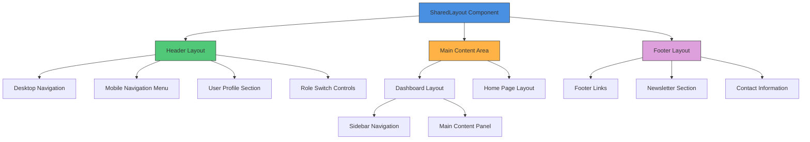

### Responsive Breakpoint Strategy

| Breakpoint | Width | Layout Behavior |
|------------|-------|-----------------|
| Mobile | < 640px | Collapsed navigation, stacked layout |
| Tablet | 640px - 1024px | Condensed sidebar, adjusted spacing |
| Desktop | 1024px - 1440px | Full sidebar, optimal spacing |
| Large Desktop | > 1440px | Fixed max-width, centered content |

### Layout State Management

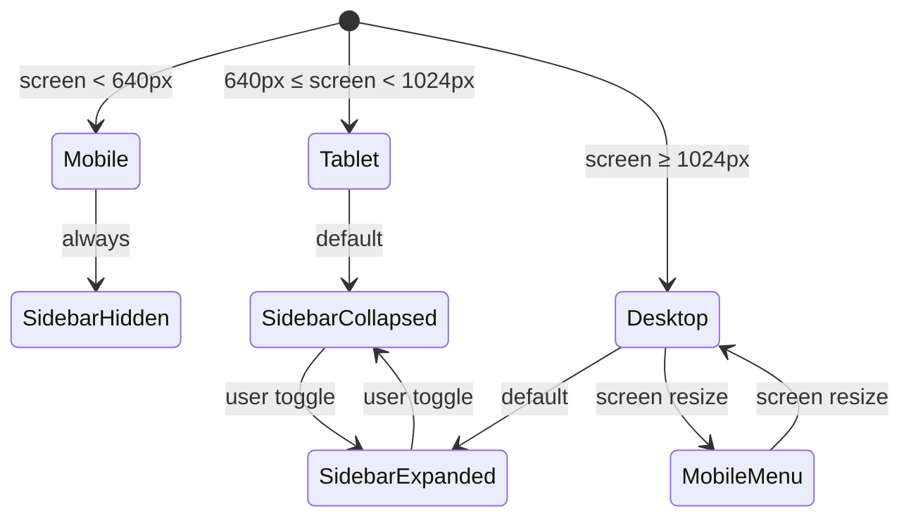

## Component Architecture

### Header Component Structure

#### Desktop Header Layout
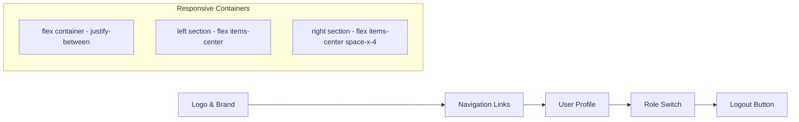

#### Mobile Header Layout
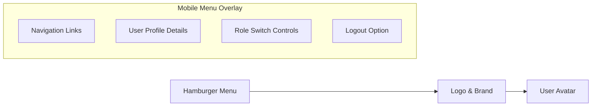

### Sidebar Component Structure

#### Navigation Item Hierarchy
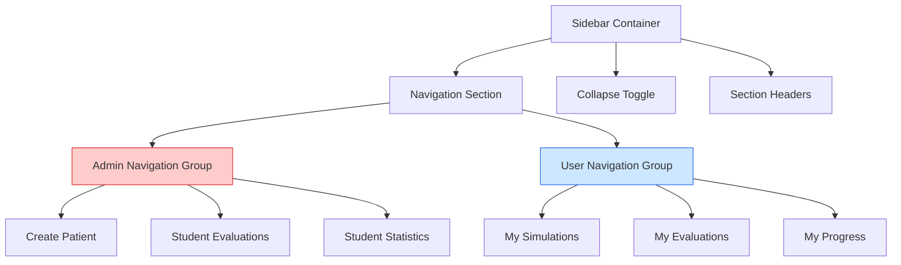

### Main Content Area Layout

#### Dashboard Layout Structure
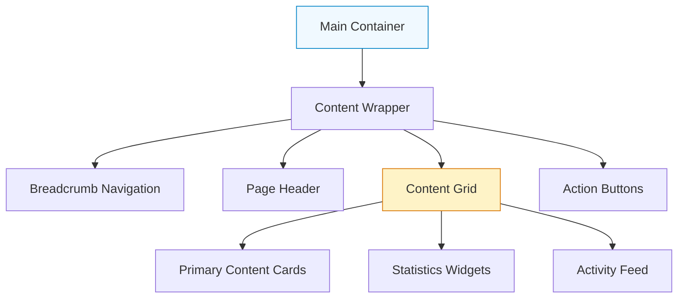

## CSS Architecture Improvements

### Layout Container Classes

| Class Name | Purpose | CSS Properties |
|------------|---------|----------------|
| `.layout-container` | Root layout wrapper | `min-height: 100vh; display: flex; flex-direction: column` |
| `.header-container` | Header wrapper | `flex-shrink: 0; sticky positioning` |
| `.main-container` | Main content area | `flex: 1; display: flex` |
| `.sidebar-container` | Sidebar wrapper | `width: 16rem; transition: width 0.3s` |
| `.content-container` | Page content | `flex: 1; padding: 2rem; overflow-y: auto` |

### Responsive Grid System

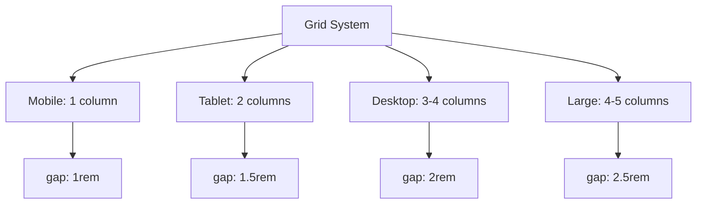

### Spacing Scale System

| Token | Value | Usage |
|-------|-------|-------|
| `--space-xs` | 0.25rem | Icon margins, fine adjustments |
| `--space-sm` | 0.5rem | Button padding, small gaps |
| `--space-md` | 1rem | Standard component spacing |
| `--space-lg` | 1.5rem | Section spacing |
| `--space-xl` | 2rem | Page margins, major sections |
| `--space-2xl` | 3rem | Page-level spacing |

## Navigation System

### Header Navigation Improvements

#### Desktop Navigation Structure
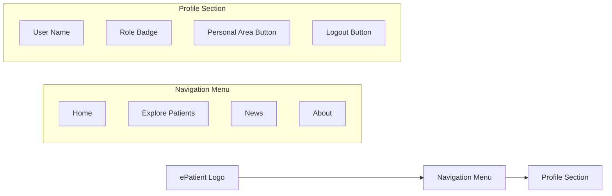

#### Mobile Navigation UX Flow
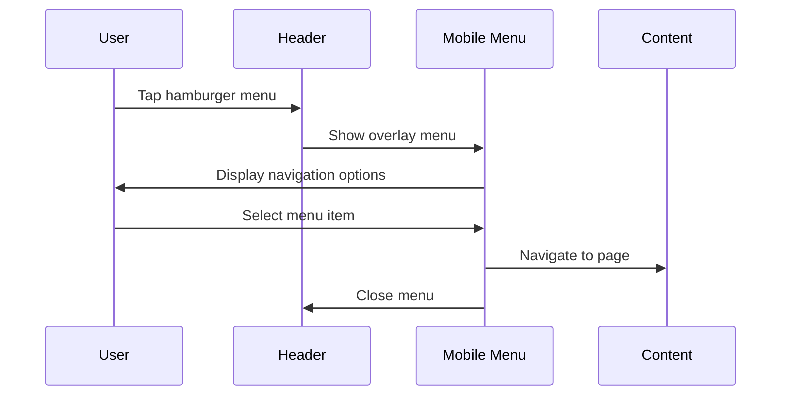

### Sidebar Navigation Enhancements

#### Collapsed State Behavior
- Icons remain visible with tooltips
- Section headers become compact
- Hover reveals full labels
- Smooth animations for state changes

#### Expanded State Features
- Full navigation labels
- Section grouping with clear headers
- Active state highlighting
- Role-based content filtering

## Responsive Design Strategy

### Mobile-First Implementation

#### Breakpoint Definitions
```css
/* Mobile First Approach */
.component {
  /* Mobile styles (default) */
  padding: 1rem;
  font-size: 0.875rem;
}

@media (min-width: 640px) {
  /* Tablet styles */
  .component {
    padding: 1.5rem;
    font-size: 1rem;
  }
}

@media (min-width: 1024px) {
  /* Desktop styles */
  .component {
    padding: 2rem;
    font-size: 1.125rem;
  }
}
```

#### Touch-Friendly Interface Elements
- Minimum touch target: 44px × 44px
- Increased spacing between interactive elements
- Larger buttons on mobile devices
- Optimized thumb zone placement

### Layout Adaptation Patterns

#### Content Reflow Strategy
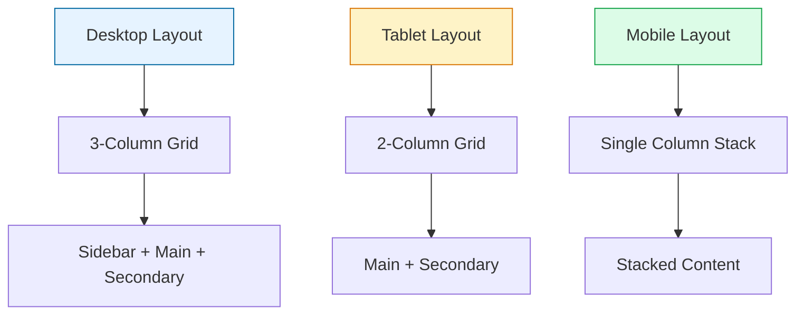

## Accessibility Improvements

### Keyboard Navigation Support

#### Tab Order Optimization
1. Skip to main content link
2. Logo/home link
3. Main navigation items
4. User profile controls
5. Sidebar navigation
6. Main content
7. Footer links

#### Focus Management
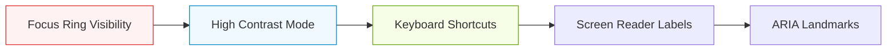

### Screen Reader Optimizations
- Semantic HTML structure
- ARIA labels for interactive elements
- Landmark regions for navigation
- Skip links for main content
- Status announcements for dynamic content

## Visual Design Enhancements

### Color System Consistency

#### Role-Based Color Coding
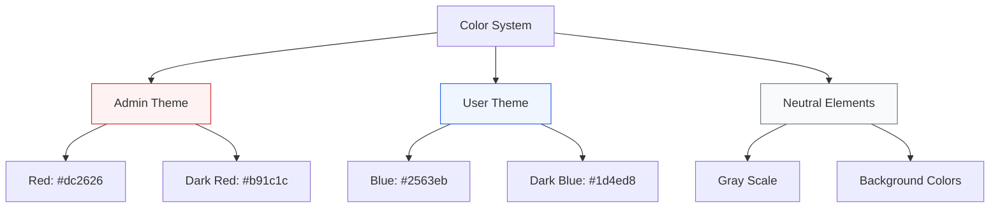

### Typography Hierarchy
- H1: Page titles (2.25rem, font-weight: 700)
- H2: Section headers (1.875rem, font-weight: 600)
- H3: Subsection headers (1.5rem, font-weight: 600)
- Body: Regular content (1rem, font-weight: 400)
- Caption: Meta information (0.875rem, font-weight: 500)

### Spacing and Layout Consistency

#### Component Spacing Rules
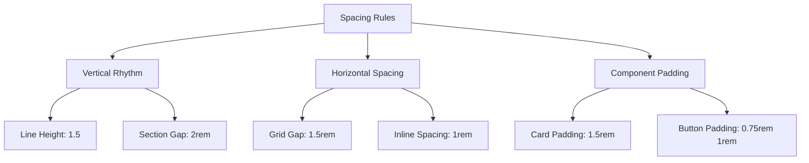

## Testing Strategy

### Layout Testing Scenarios

#### Responsive Testing Matrix
| Device Category | Screen Sizes | Key Test Points |
|----------------|--------------|-----------------|
| Mobile | 375px, 414px | Navigation menu, content stacking |
| Tablet | 768px, 1024px | Sidebar behavior, content flow |
| Desktop | 1280px, 1440px | Full layout, optimal spacing |
| Large Screen | 1920px+ | Content centering, max-width limits |

#### Accessibility Testing Checklist
- [ ] Keyboard navigation flow
- [ ] Screen reader compatibility
- [ ] High contrast mode support
- [ ] Focus indicator visibility
- [ ] Color contrast compliance
- [ ] Touch target sizing
- [ ] Motion preference respect

### Browser Compatibility
- Chrome 90+
- Firefox 88+
- Safari 14+
- Edge 90+
- Mobile Safari iOS 14+
- Chrome Mobile Android 90+

## Implementation Phases

### Phase 1: Core Layout Structure
1. Update SharedLayout component structure
2. Implement responsive breakpoint system
3. Fix header navigation spacing
4. Optimize sidebar component

### Phase 2: Visual Design Improvements
1. Apply consistent spacing scale
2. Implement color system refinements
3. Enhance typography hierarchy
4. Update component styling

### Phase 3: Accessibility Enhancements
1. Keyboard navigation improvements
2. Screen reader optimizations
3. Focus management system
4. ARIA label implementation

### Phase 4: Testing and Optimization
1. Cross-browser testing
2. Performance optimization
3. Accessibility auditing
4. User acceptance testing