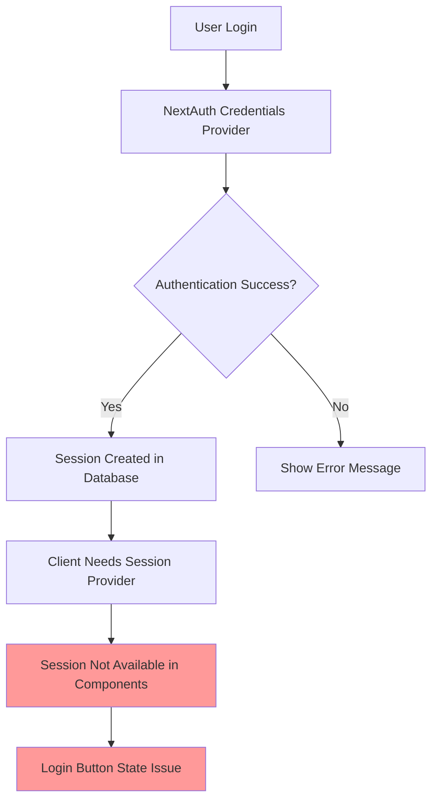
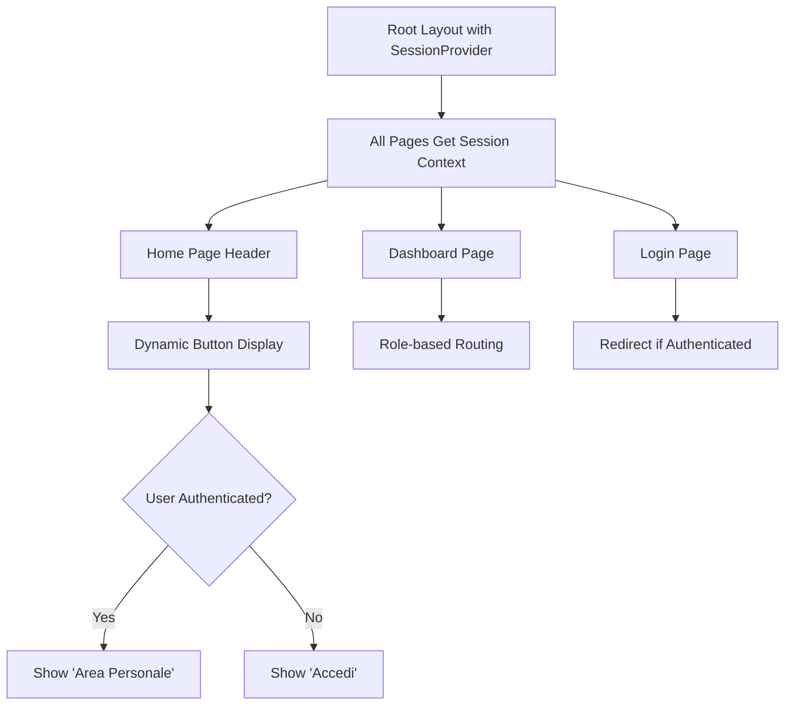
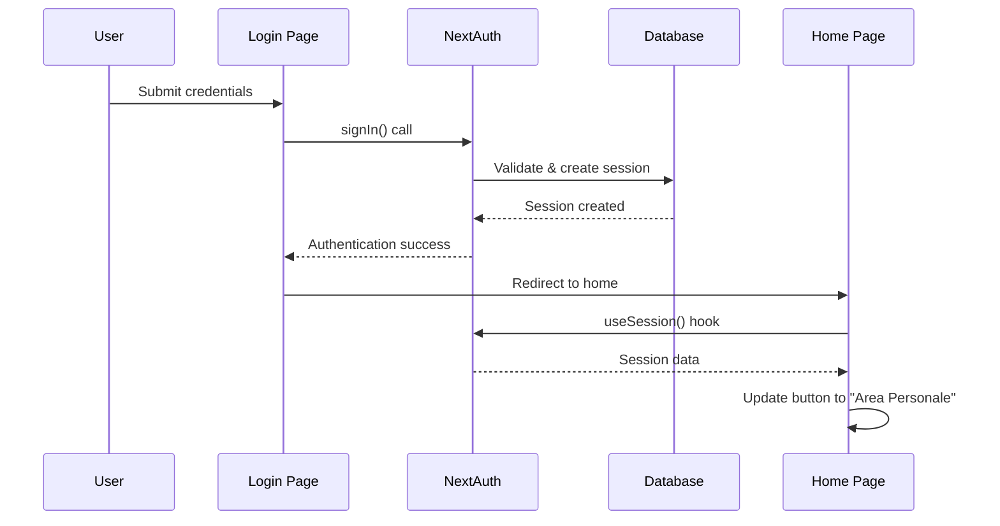
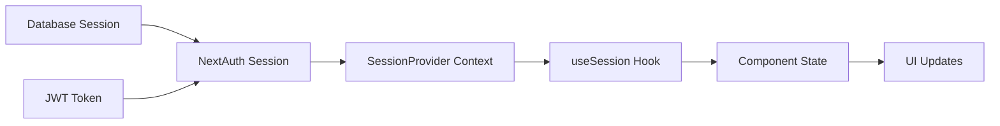

# Login System Enhancement Design

## Overview

This design document addresses the authentication state management issues in the ePatient application. The primary problems are:
1. Login button state not updating properly after successful authentication
2. Session persistence issues throughout the application
3. Missing NextAuth.js session provider in the application layout

## Architecture

### Current Authentication Flow Issues

The current system has several architectural gaps:
- No session provider in root layout
- Login page uses client-side session checking with `getSession()`
- Home page doesn't properly handle session state changes
- Missing middleware for session validation



### Required Session Management Architecture



## Component Architecture

### Session Provider Integration

**Root Layout Enhancement**
- Wrap application with NextAuth SessionProvider
- Enable session context throughout the app
- Maintain client-side session state

**Component Hierarchy**
```
RootLayout
├── SessionProvider (NextAuth)
│   ├── TRPCReactProvider
│   │   └── Page Components
│   │       ├── HomePage (with dynamic header)
│   │       ├── LoginPage (with redirect logic)
│   │       └── DashboardPage (with auth check)
```

### Header Navigation Component

**Dynamic Authentication Button**
```typescript
interface HeaderButtonProps {
  session: Session | null;
}

// Button Logic:
// - If session exists → "Area Personale" link to /dashboard
// - If no session → "Accedi" link to /login
```

## Session State Management

### Client-Side Session Handling

**useSession Hook Integration**
- Replace manual `getSession()` calls with `useSession()` hook
- Automatic session synchronization across tabs
- Real-time authentication state updates

**Session Persistence Strategy**
- Database-backed sessions via Drizzle adapter
- JWT token for client-side state
- Automatic session refresh handling

### Authentication Flow Improvements

**Login Page Enhancements**


## Implementation Requirements

### Root Layout Modifications

**SessionProvider Integration**
```typescript
// Add SessionProvider wrapper in layout.tsx
import { SessionProvider } from "next-auth/react"

export default function RootLayout({ children }) {
  return (
    <html>
      <body>
        <SessionProvider>
          <TRPCReactProvider>
            {children}
          </TRPCReactProvider>
        </SessionProvider>
      </body>
    </html>
  )
}
```

### Home Page Header Enhancement

**Dynamic Button Component**
```typescript
// Replace static login button with dynamic component
const AuthButton = () => {
  const { data: session, status } = useSession()
  
  if (status === "loading") return <ButtonSkeleton />
  
  if (session) {
    return (
      <Link href="/dashboard" className="btn btn-primary">
        Area Personale
      </Link>
    )
  }
  
  return (
    <Link href="/login" className="btn btn-primary">
      Accedi
    </Link>
  )
}
```

### Login Page Session Check

**useSession Hook Implementation**
```typescript
// Replace getSession() with useSession() hook
const { data: session, status } = useSession()

useEffect(() => {
  if (status !== "loading" && session) {
    router.push("/dashboard")
  }
}, [session, status, router])
```

### Middleware Implementation

**Session Validation Middleware**
```typescript
// Create middleware.ts for protected routes
export { default } from "next-auth/middleware"

export const config = {
  matcher: ["/dashboard/:path*"]
}
```

## Data Flow Between Layers

### Authentication State Propagation



### Session Synchronization

**Cross-Tab Session Sync**
- NextAuth handles automatic session synchronization
- Session changes propagate across browser tabs
- Logout in one tab affects all tabs

**Real-time Updates**
- Session context automatically updates components
- No manual polling or refresh required
- Reactive authentication state management

## Testing Strategy

### Authentication Flow Testing

**Login Flow Validation**
- Verify successful login updates button state
- Confirm session persistence across page navigation
- Test session expiration handling

**Session State Testing**
- Validate cross-tab synchronization
- Test automatic logout functionality
- Confirm protected route access control

**Component Integration Testing**
- Header button state transitions
- Dashboard access with valid session
- Login page redirect behavior

## Security Considerations

### Session Management Security

**Session Token Security**
- HTTPOnly cookies for session tokens
- Secure flag for HTTPS environments
- SameSite attribute for CSRF protection

**Authentication State Validation**
- Server-side session validation
- Client-side session verification
- Automatic token refresh handling

### Protected Route Access

**Middleware Protection**
- Automatic redirect for unauthenticated users
- Role-based access control for admin routes
- Session validation on each protected request