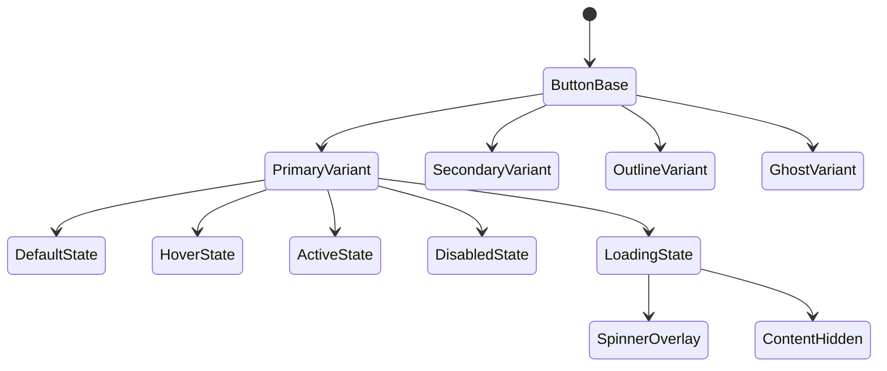
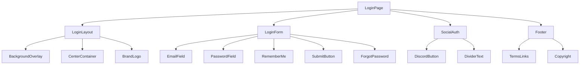
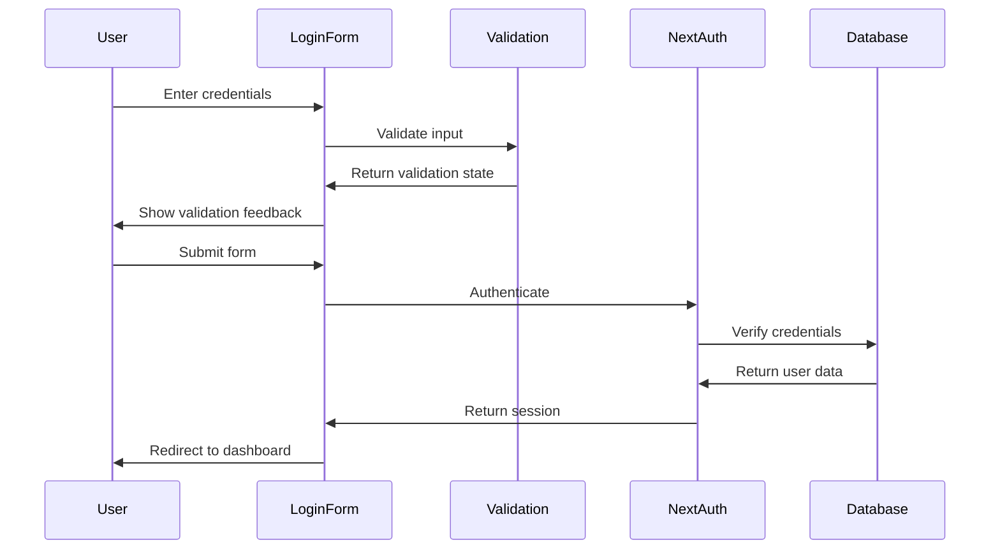
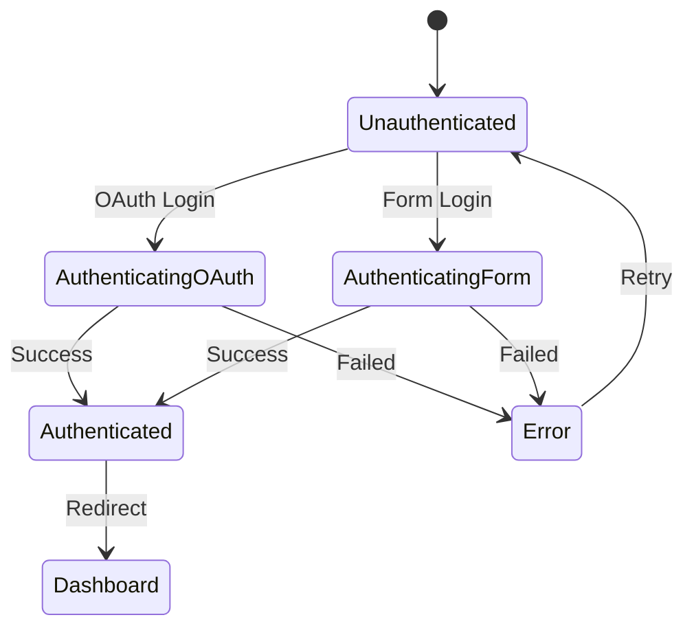
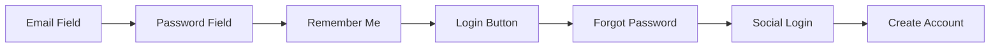
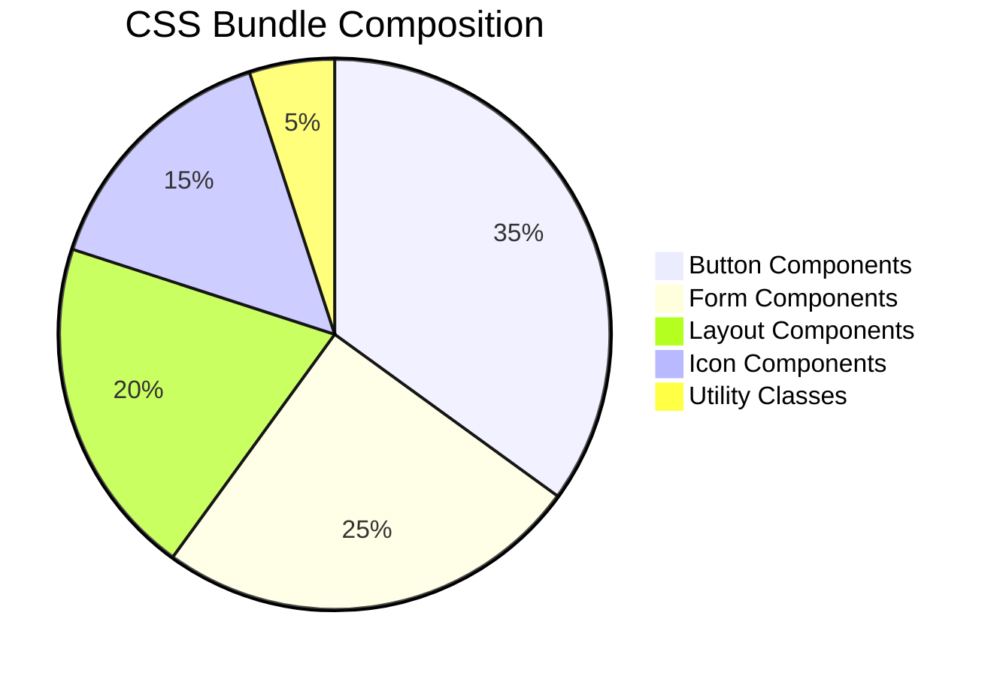

# MD to CSS Conversion and Login Page Design

## Overview

This design document outlines the conversion of the shared button and icon style system from Markdown documentation to CSS implementation, followed by the design of a comprehensive login page that leverages the newly created CSS component system and integrates with the existing NextAuth.js authentication infrastructure.

**Design Goals:**
- Convert Markdown style specifications into production-ready CSS components
- Create a cohesive login page using the shared design system
- Integrate seamlessly with NextAuth.js authentication flow
- Maintain consistency with existing epatient healthcare application design
- Ensure accessibility and responsive design compliance

## Technology Stack & Dependencies

**Core Technologies:**
- **Next.js 15.2.3** - App Router framework with server components
- **NextAuth.js 5.0.0-beta.25** - Authentication system with Discord provider
- **Tailwind CSS 4.0.15** - Utility-first styling with custom component layer
- **React 19** - Component architecture with server/client components
- **TypeScript 5.8.2** - Type safety and development experience
- **Drizzle ORM 0.41.0** - Database integration with LibSQL/Turso

**Supporting Tools:**
- **Geist Font Family** - Typography system via Google Fonts
- **tRPC 11.0.0** - Type-safe API layer
- **Prettier + Tailwind Plugin** - Code formatting and class ordering
- **ESLint** - Code quality and consistency

## CSS Component System Architecture

### File Structure Implementation

```mermaid
graph TD
    A[src/styles/] --> B[globals.css]
    A --> C[components.css]
    B --> D[@import tailwindcss]
    B --> E[@import components.css]
    B --> F[@theme configuration]
    C --> G[Button Components]
    C --> H[Icon Components]
    C --> I[Form Components]
    C --> J[Layout Components]
```

### Component Layer Architecture

The CSS implementation uses Tailwind's `@layer components` directive to create reusable component classes while maintaining utility-first principles:

| Layer | Purpose | Examples |
|-------|---------|----------|
| **Base** | Foundation styles | `.btn`, `.icon`, `.form-field` |
| **Components** | Composite patterns | `.btn-primary`, `.btn-loading`, `.login-form` |
| **Utilities** | Custom utilities | `.btn-group`, `.form-grid` |

### Button System Implementation



### CSS Component Categories

| Category | Classes | Usage Context |
|----------|---------|---------------|
| **Button Variants** | `.btn-primary`, `.btn-secondary`, `.btn-outline`, `.btn-ghost`, `.btn-danger` | All interactive elements |
| **Button Sizes** | `.btn-xs`, `.btn-sm`, `.btn-md`, `.btn-lg`, `.btn-xl` | Size hierarchy |
| **Icon Buttons** | `.btn-icon`, `.btn-icon-primary`, `.btn-icon-secondary` | Actions without text |
| **Form Components** | `.form-submit-btn`, `.form-cancel-btn`, `.input-field` | Form interactions |
| **Loading States** | `.btn-loading`, `.loading-spinner` | Async operations |

## Login Page Architecture

### Component Hierarchy



### Layout Structure

| Section | Height | Content | Responsive Behavior |
|---------|--------|---------|-------------------|
| **Header** | Auto | Logo and minimal navigation | Collapses on mobile |
| **Main** | Flex-1 | Centered login form | Full height on mobile |
| **Footer** | Auto | Legal links and copyright | Sticky bottom |

### Form Validation Flow



## Authentication Integration

### NextAuth.js Flow Integration

| Component | NextAuth Integration | Functionality |
|-----------|---------------------|---------------|
| **Social Login** | `signIn('discord')` | OAuth with Discord provider |
| **Form Submission** | `signIn('credentials', {...})` | Email/password authentication |
| **Session Management** | `auth()` server function | Server-side session handling |
| **Route Protection** | Middleware integration | Redirect unauthenticated users |

### Authentication States



### Database Schema Integration

The login system integrates with the existing Drizzle schema:

| Table | Usage | Fields |
|-------|-------|--------|
| **users** | User accounts | `id`, `name`, `email`, `emailVerified`, `image` |
| **accounts** | OAuth connections | Provider data, tokens |
| **sessions** | Active sessions | Session tokens, expiry |
| **verificationTokens** | Email verification | Token validation |

## CSS Implementation Details

### Button Component Classes

```css
/* Base button foundation */
.btn {
  @apply inline-flex items-center justify-center font-medium transition-all duration-200 ease-in-out;
  @apply focus:outline-none focus:ring-2 focus:ring-offset-2;
  @apply disabled:cursor-not-allowed disabled:opacity-60;
}

/* Primary variant for main actions */
.btn-primary {
  @apply btn bg-green-600 text-white;
  @apply hover:bg-green-700 active:bg-green-800 active:scale-95;
  @apply focus:ring-green-500;
  @apply disabled:bg-gray-400;
}

/* Loading state implementation */
.btn-loading {
  @apply relative cursor-wait;
}

.btn-loading .btn-content {
  @apply opacity-0;
}

.loading-spinner {
  @apply animate-spin w-4 h-4 border-2 border-current border-t-transparent rounded-full;
}
```

### Form Component Classes

```css
/* Form input styling */
.input-field {
  @apply w-full px-4 py-3 border border-gray-300 rounded-md;
  @apply focus:outline-none focus:ring-2 focus:ring-green-500 focus:border-green-500;
  @apply placeholder-gray-400 text-gray-900;
  @apply transition-colors duration-200;
}

.input-field:invalid {
  @apply border-red-300 focus:ring-red-500 focus:border-red-500;
}

/* Checkbox styling */
.checkbox-field {
  @apply w-4 h-4 text-green-600 border-gray-300 rounded;
  @apply focus:ring-green-500 focus:ring-2;
}
```

### Layout Component Classes

```css
/* Login page layout */
.login-container {
  @apply min-h-screen bg-gray-50 flex flex-col justify-center py-12 sm:px-6 lg:px-8;
}

.login-card {
  @apply mt-8 sm:mx-auto sm:w-full sm:max-w-md;
}

.login-form {
  @apply bg-white py-8 px-4 shadow sm:rounded-lg sm:px-10;
}

/* Healthcare theme background */
.healthcare-bg {
  @apply bg-gradient-to-br from-green-50 to-blue-50;
}
```

## Responsive Design Strategy

### Breakpoint Implementation

| Breakpoint | Login Form | Button Sizing | Layout Changes |
|------------|------------|---------------|----------------|
| **Mobile (< 640px)** | Full width, minimal padding | Larger touch targets (min 44px) | Single column, stacked elements |
| **Tablet (640px - 1024px)** | Max-width 400px, centered | Standard sizing | Two-column social options |
| **Desktop (> 1024px)** | Max-width 500px, enhanced spacing | Full feature set | Side-by-side layout options |

### Touch Target Guidelines

```css
@media (max-width: 640px) {
  .btn {
    @apply min-h-[44px];
  }
  
  .input-field {
    @apply min-h-[44px] text-base;
  }
  
  .social-login-btn {
    @apply p-4 min-h-[48px];
  }
}
```

## Accessibility Implementation

### WCAG 2.1 AA Compliance

| Requirement | Implementation | Testing Method |
|-------------|----------------|----------------|
| **Color Contrast** | 4.5:1 minimum ratio | Automated testing with axe-core |
| **Focus Management** | Visible focus indicators, logical tab order | Keyboard navigation testing |
| **Screen Reader** | Semantic HTML, ARIA labels | Screen reader testing |
| **Error Handling** | Clear error messages, aria-describedby | Accessibility audit |

### ARIA Implementation

```typescript
interface LoginFormAccessibility {
  'aria-label': string;
  'aria-describedby': string;
  'aria-invalid': boolean;
  'aria-required': boolean;
  role: 'form' | 'button' | 'textbox';
}
```

### Keyboard Navigation



## Testing Strategy

### Component Testing

| Test Type | Coverage | Tools |
|-----------|----------|-------|
| **Unit Tests** | CSS class application, button variants | Jest + React Testing Library |
| **Integration Tests** | NextAuth flow, form validation | Playwright |
| **Accessibility Tests** | WCAG compliance, keyboard navigation | axe-core, manual testing |
| **Visual Regression** | Cross-browser consistency | Chromatic/Percy |

### Authentication Testing

```typescript
interface LoginTestScenarios {
  validCredentials: 'Should authenticate and redirect';
  invalidCredentials: 'Should show error message';
  oauthFlow: 'Should handle Discord OAuth';
  formValidation: 'Should validate required fields';
  loadingStates: 'Should show loading indicators';
  errorHandling: 'Should handle network errors';
}
```

## Performance Considerations

### CSS Optimization

| Optimization | Implementation | Impact |
|--------------|----------------|--------|
| **Tailwind Purging** | Remove unused classes | Reduced bundle size |
| **Critical CSS** | Inline login page styles | Faster initial render |
| **Component Chunking** | Separate component CSS | Better caching |
| **Font Optimization** | Geist font preloading | Reduced layout shift |

### Bundle Analysis



## Implementation Files

### Core CSS Files

| File | Purpose | Size Estimate |
|------|---------|---------------|
| **`src/styles/components.css`** | All button and form components | ~15KB |
| **`src/styles/globals.css`** | Tailwind imports and theme | ~2KB |
| **`src/app/login/page.tsx`** | Login page component | ~8KB |
| **`src/components/ui/Button.tsx`** | TypeScript Button component | ~5KB |

### Directory Structure

```
src/
├── styles/
│   ├── globals.css              # Updated with component imports
│   └── components.css           # Complete button/icon system
├── app/
│   ├── login/
│   │   └── page.tsx            # Login page implementation
│   └── layout.tsx              # Root layout (existing)
└── components/
    └── ui/
        ├── Button.tsx          # Reusable button component
        └── Input.tsx           # Form input component
```

## Security Considerations

### Authentication Security

| Security Measure | Implementation | Purpose |
|------------------|----------------|---------|
| **CSRF Protection** | NextAuth.js built-in | Prevent cross-site requests |
| **Session Security** | HTTP-only cookies | Prevent XSS attacks |
| **Input Validation** | Zod schema validation | Prevent injection attacks |
| **Rate Limiting** | Middleware implementation | Prevent brute force |

### Privacy Compliance

```typescript
interface PrivacyFeatures {
  dataMinimization: 'Only collect necessary fields';
  consentManagement: 'Clear privacy policy links';
  dataRetention: 'Session-based storage only';
  userRights: 'Account deletion capability';
}
```