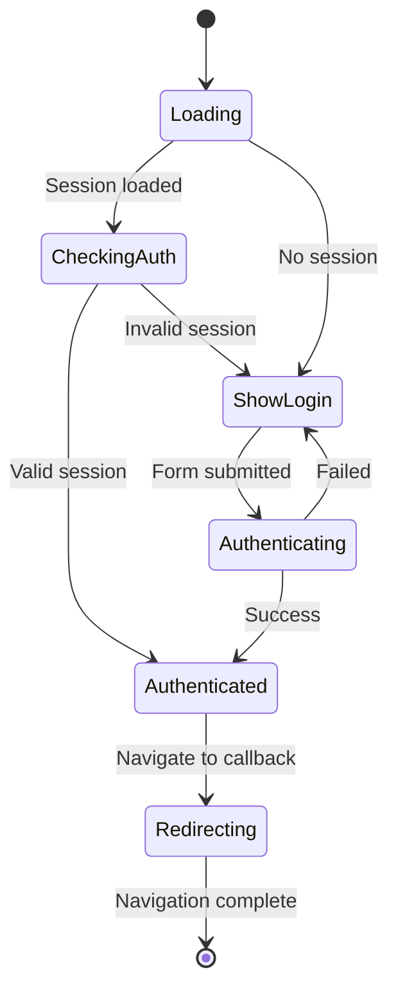

# React Router Conflict Resolution Design

## Overview
This design addresses a critical React rendering issue in the ePatient application where the `LoginPage` component is attempting to update the `Router` component during the rendering phase, causing the error: "Cannot update a component (`Router`) while rendering a different component (`LoginPage`)."

## Problem Analysis

### Root Cause
The issue occurs in `src/app/login/page.tsx` where multiple `useEffect` hooks and state updates are executing during the component's render cycle, triggering router navigation calls that conflict with React's rendering process.

### Specific Problem Areas

1. **Authentication State Check in useEffect**
   ```typescript
   useEffect(() => {
     if (status !== "loading" && session) {
       router.push(callbackUrl); // Router update during render
     }
   }, [session, status, router, callbackUrl]);
   ```

2. **Multiple Concurrent useEffect Hooks**
   - URL parameter error checking
   - Session authentication verification  
   - Redirect countdown management

3. **State Update Timing Issues**
   - Router navigation triggered immediately when session state changes
   - Multiple state setters executing in rapid succession

## Solution Architecture

### 1. Deferred Navigation Pattern
Instead of immediate router updates during render, implement a deferred navigation system that schedules navigation for the next tick.

### 2. Consolidated useEffect Management
Merge related useEffect hooks to prevent race conditions and ensure proper dependency management.

### 3. Navigation State Machine
Implement a finite state machine to manage the various navigation states and prevent conflicting updates.

## Technical Implementation

### Navigation State Machine



### Core Components Refactoring

#### LoginPage Component Structure
```typescript
interface LoginState {
  phase: 'loading' | 'login' | 'authenticating' | 'success' | 'redirecting';
  error: string | null;
  countdown: number;
}
```

#### Navigation Manager
- Centralized navigation logic
- Deferred router updates using `setTimeout`
- State-based navigation decisions

### Implementation Strategy

#### 1. Replace Multiple useEffect with Single Navigation Controller
```typescript
useEffect(() => {
  let timeoutId: NodeJS.Timeout;
  
  const handleNavigation = () => {
    if (status === "loading") return;
    
    if (session && !isRedirecting) {
      // Defer navigation to next tick
      timeoutId = setTimeout(() => {
        router.push(callbackUrl);
      }, 0);
    }
  };
  
  handleNavigation();
  
  return () => {
    if (timeoutId) clearTimeout(timeoutId);
  };
}, [session, status, router, callbackUrl, isRedirecting]);
```

#### 2. State Consolidation
Merge related state variables into a single state object to prevent multiple simultaneous updates:

```typescript
const [loginState, setLoginState] = useState<LoginState>({
  phase: 'loading',
  error: null,
  countdown: 3
});
```

#### 3. Controlled Navigation Flow
Implement navigation guards that prevent router updates during rendering:

```typescript
const navigate = useCallback((url: string, delay: number = 0) => {
  setTimeout(() => {
    router.push(url);
  }, delay);
}, [router]);
```

### Error Handling Improvements

#### Graceful Degradation
- Fallback navigation mechanisms
- Error boundary implementation
- State recovery procedures

#### Debug Mode
- Enhanced logging for development
- Navigation event tracking
- State transition monitoring

## Testing Strategy

### Unit Tests
- Navigation state machine transitions
- useEffect dependency management
- Router update timing

### Integration Tests
- Authentication flow end-to-end
- Error scenario handling
- Multiple browser tab scenarios

### Performance Tests
- Render cycle optimization
- Memory leak prevention
- Navigation timing analysis

## Migration Plan

### Phase 1: State Consolidation
1. Merge multiple useState calls into single state object
2. Update component logic to use consolidated state
3. Test basic functionality

### Phase 2: Navigation Refactoring
1. Implement deferred navigation pattern
2. Replace immediate router.push calls with scheduled navigation
3. Add navigation guards

### Phase 3: useEffect Optimization
1. Consolidate multiple useEffect hooks
2. Implement proper cleanup functions
3. Optimize dependency arrays

### Phase 4: Validation & Testing
1. Comprehensive testing across scenarios
2. Performance optimization
3. Documentation updates

## Risk Mitigation

### Backward Compatibility
- Maintain existing API surface
- Gradual migration approach
- Feature flag implementation

### Performance Impact
- Minimal additional overhead
- Optimized state management
- Efficient re-rendering

### Browser Compatibility
- Cross-browser navigation testing
- Polyfill requirements assessment
- Mobile device considerations

## Monitoring & Metrics

### Key Performance Indicators
- Navigation success rate
- Component render frequency
- Error occurrence rate
- User experience metrics

### Alerting
- React error boundary notifications
- Navigation failure detection
- Performance regression alerts