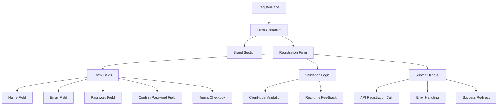
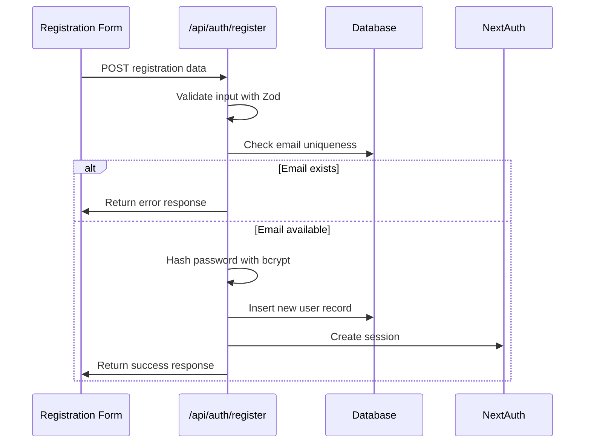
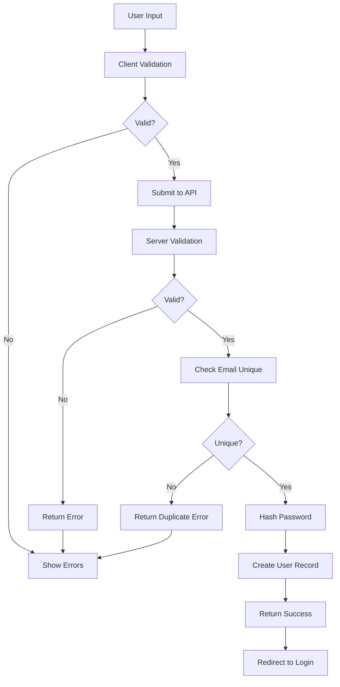

# Registration Page Setup Design

## Overview

This design document outlines the implementation of a registration page for the ePatient application, including user registration functionality, default user seeding, color scheme updates, and global style enhancements. The implementation follows the existing T3 Stack architecture and maintains consistency with the current login page design patterns.

**Scope:**
- Registration page component with form validation
- Database seeding for default admin user
- Color scheme alignment with design specifications
- Global style updates for consistent theming
- Integration with NextAuth.js authentication system

## Technology Stack & Dependencies

**Frontend Framework:**
- Next.js 15.2.3 with App Router
- React 19 with TypeScript
- Tailwind CSS 4.0.15 for styling

**Authentication & Validation:**
- NextAuth.js 5.0.0-beta.25 with credentials provider
- Zod 3.24.2 for form validation
- bcryptjs for password hashing

**Database & ORM:**
- Drizzle ORM 0.41.0 with LibSQL client
- Drizzle Kit 0.30.5 for migrations

## Component Architecture

### Registration Page Component
The registration page will be implemented as a client component following the same architectural pattern as the login page.

**Location:** `src/app/register/page.tsx`

**Component Structure:**

### Form Field Components
Each form field includes:
- Label with proper semantic markup
- Input with appropriate HTML attributes
- Real-time validation feedback
- Error state styling
- Accessibility attributes (aria-labels, aria-describedby)

### Validation Strategy
**Client-side Validation Rules:**
- Name: Required, minimum 2 characters, maximum 50 characters
- Email: Required, valid email format, unique check
- Password: Required, minimum 8 characters, contains uppercase, lowercase, number, and special character
- Confirm Password: Required, must match password field
- Terms Acceptance: Required checkbox

**Validation Implementation:**
- Real-time validation on field blur
- Form-level validation on submit
- Visual feedback with error messages
- Prevention of submission with invalid data

## API Integration Layer

### Registration API Endpoint
**Location:** `src/app/api/auth/register/route.ts`

**Request Flow:**

**API Endpoint Structure:**
- Input validation using Zod schema
- Email uniqueness verification
- Password hashing with bcrypt (10 salt rounds)
- User creation with Drizzle ORM
- Error handling with appropriate HTTP status codes

### Database Integration
**User Creation Process:**
1. Validate input data against Zod schema
2. Check email uniqueness in users table
3. Hash password using bcrypt
4. Create user record with auto-generated UUID
5. Return sanitized user object (exclude password)

## Styling Strategy

### Color Scheme Implementation
Based on the existing login page and global styles, the registration page will use the following color palette:

**Primary Colors:**
- Green-700 (#15803D) - Primary action buttons
- Green-500 (#22C55E) - Links and accent elements
- Green-800 (#166534) - Button hover states

**Background Colors:**
- Gray-900 (#111827) - Main background
- Gray-800 (#1F2937) - Left brand section
- Gray-700 (#374151) - Form container background

**Text Colors:**
- White (#FFFFFF) - Primary text
- Gray-300 (#D1D5DB) - Labels and secondary text
- Gray-400 (#9CA3AF) - Placeholder text

**State Colors:**
- Red-400 (#F87171) - Error text
- Red-500 (#EF4444) - Error borders
- Red-900/20 - Error background with opacity

### Component Styling Patterns
**Form Container:**
- Dark gray background (gray-700)
- Rounded corners (rounded-lg)
- Drop shadow (shadow-xl)
- Responsive padding

**Input Fields:**
- White background for contrast
- Gray border with focus states
- Green-700 focus ring
- Error state styling with red accents

**Button Styling:**
- Green-700 background with hover transition
- White text with medium font weight
- Loading state with spinner animation
- Disabled state styling

### Responsive Design
- Mobile-first approach
- Full-width layout on mobile
- Two-column layout on desktop (lg:w-1/2)
- Flexible padding and spacing
- Touch-friendly input sizes

## Data Flow Between Layers

### Registration Flow Architecture

### State Management
**Component State:**
- Form field values (name, email, password, confirmPassword)
- Validation errors for each field
- Loading state during submission
- Global error messages
- Terms acceptance status

**State Flow:**
1. User input updates field values
2. Validation triggers on blur/change events
3. Error states update in real-time
4. Submission state manages loading indicators
5. Success state triggers navigation

## Database Schema Extensions

### Default User Seeding
**Admin User Specification:**
- Email: "admin"
- Password: "Qwerty123!" (hashed with bcrypt)
- Name: "Administrator"
- Role: Admin (if role system implemented)

**Seeding Implementation:**
- Database migration script or seeding function
- Check for existing admin user before creation
- Use same password hashing strategy as registration
- Include in database initialization

### User Model Considerations
The existing user schema supports the registration requirements:
- `id`: Auto-generated UUID primary key
- `name`: User's full name
- `email`: Unique identifier for login
- `password`: Hashed password storage
- `emailVerified`: Timestamp for email verification
- `image`: Optional profile image URL

## Testing Strategy

### Unit Testing Approach
**Component Testing:**
- Form validation logic testing
- User interaction simulation
- Error state verification
- Accessibility compliance testing

**API Testing:**
- Input validation testing
- Database integration testing
- Error handling verification
- Security testing (password hashing)

**Integration Testing:**
- End-to-end registration flow
- Database seeding verification
- Authentication integration testing
- Cross-browser compatibility

### Test Implementation Tools
- Jest for unit testing
- React Testing Library for component testing
- Playwright or Cypress for E2E testing
- Database mocking for isolated testing

## Security Considerations

### Password Security
- Minimum 8 characters with complexity requirements
- bcrypt hashing with appropriate salt rounds
- No plain text password storage
- Secure password validation

### Input Validation
- Server-side validation for all inputs
- SQL injection prevention through ORM
- XSS protection via input sanitization
- CSRF protection through NextAuth

### Session Management
- Secure session creation after registration
- HTTP-only cookies for session storage
- Session expiration handling
- Secure logout functionality

## Implementation Phases

### Phase 1: Core Registration Form
1. Create registration page component
2. Implement form fields with validation
3. Add client-side validation logic
4. Style components following design system

### Phase 2: API Integration
1. Create registration API endpoint
2. Implement server-side validation
3. Add database user creation logic
4. Integrate with NextAuth session creation

### Phase 3: Styling & Polish
1. Apply color scheme updates
2. Implement responsive design
3. Add loading states and animations
4. Enhance accessibility features

### Phase 4: Database & Seeding
1. Create database seeding script
2. Add default admin user creation
3. Test user creation and authentication
4. Verify password hashing integrity

### Phase 5: Testing & Refinement
1. Implement unit tests
2. Add integration tests
3. Perform security testing
4. Cross-browser testing and optimization