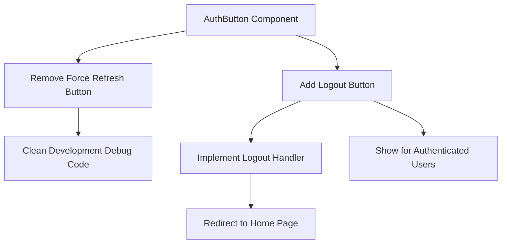
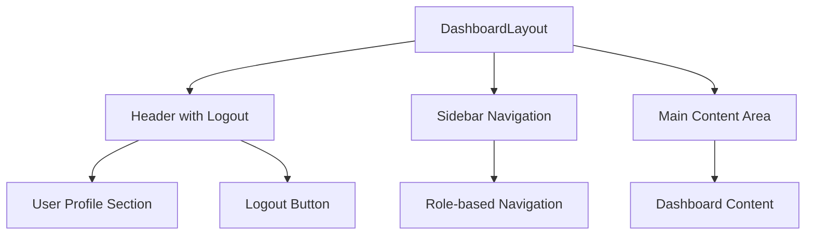
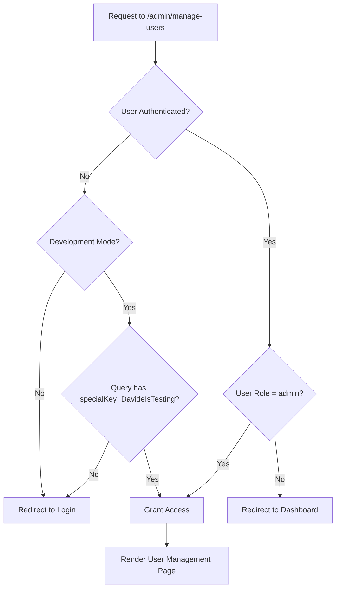
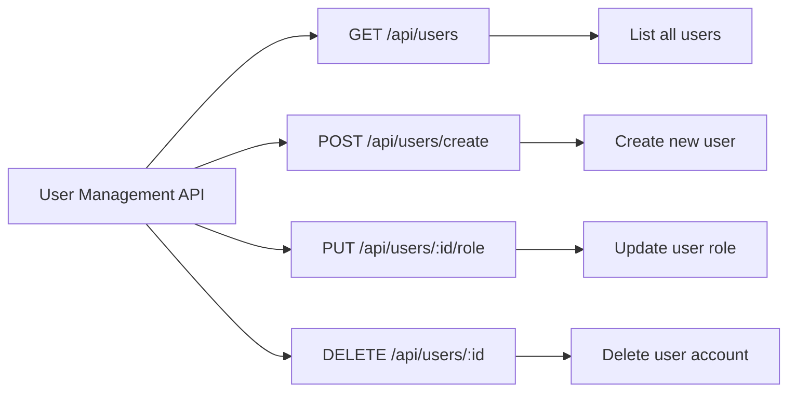
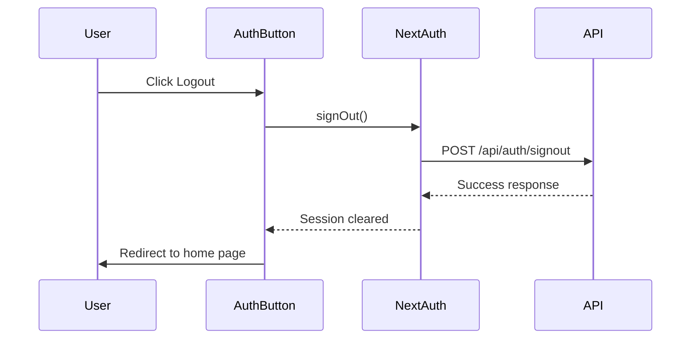
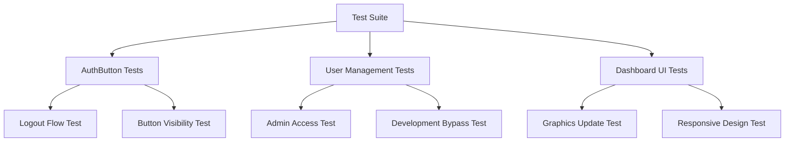

# Remove Force Session Button & Add Logout Button Design

## Overview

This design document outlines the requirements for updating the authentication user interface by removing the force session button from AuthButton component, adding a proper logout functionality, updating dashboard graphics to match design specifications, and creating a special admin user management page with development access controls.

## Technology Stack & Dependencies

- **Frontend Framework**: Next.js 14 with App Router
- **Authentication**: NextAuth.js with JWT strategy
- **UI Framework**: React with TypeScript
- **Styling**: CSS modules with design system classes
- **Database**: Drizzle ORM with database schema
- **State Management**: React Query (tRPC integration)

## Component Architecture

### AuthButton Component Updates

#### Current State Analysis
The existing AuthButton component includes:
- Development-only force session refresh button (🔄)
- Session validation with retry logic
- Loading states with skeleton UI
- Conditional rendering based on authentication status

#### Required Changes


### Dashboard Layout Updates

#### Graphics Modernization Requirements
- Update dashboard visual components to match PNG design specifications
- Implement shared template system for consistent styling
- Enhance admin and user dashboard visual hierarchy
- Improve responsive design patterns

#### Component Hierarchy Updates


### Special Admin User Management Page

#### Access Control Architecture


## API Endpoints Reference

### Authentication Endpoints
- **POST /api/auth/signout**: Handles user logout with session cleanup
- **GET /api/auth/session**: Current session validation
- **POST /api/auth/register**: User registration (for admin user creation)

### User Management Endpoints


## Data Models & ORM Mapping

### User Entity Extensions
```typescript
interface UserManagement {
  id: string;
  name: string | null;
  email: string;
  role: "admin" | "user";
  createdAt: Date;
  lastLogin: Date | null;
  isActive: boolean;
}

interface CreateUserRequest {
  name: string;
  email: string;
  password: string;
  role: "admin" | "user";
}
```

### Database Schema Updates
- Extend users table with lastLogin and isActive fields
- Add user activity tracking for admin insights
- Implement proper indexes for user management queries

## Business Logic Layer

### AuthButton Component Logic


### User Management Business Rules
- Only admin users can access user management in production
- Development bypass requires specific query parameter
- User creation validates email uniqueness
- Role changes require admin privileges
- Audit trail for all user management actions

### Session Management Updates
- Remove force refresh functionality from production builds
- Maintain session validation and automatic refresh
- Implement proper logout with server-side session cleanup
- Clear client-side session data on logout

## Middleware & Interceptors

### Route Protection Middleware
```typescript
// middleware.ts updates
export function middleware(request: NextRequest) {
  const { pathname, searchParams } = request.nextUrl;
  
  // Special admin access in development
  if (pathname === '/admin/manage-users') {
    if (process.env.NODE_ENV === 'development') {
      const specialKey = searchParams.get('specialKey');
      if (specialKey === 'DavideIsTesting') {
        return NextResponse.next();
      }
    }
    
    // Redirect to authentication check
    return NextResponse.redirect(new URL('/api/auth/session', request.url));
  }
  
  return NextResponse.next();
}
```

### Authentication Interceptor Updates
- Remove development-only session debugging
- Implement proper logout flow with cleanup
- Maintain session refresh for authenticated users
- Add user management route protection

## Testing Strategy

### Component Testing Requirements
- AuthButton logout functionality testing
- User management page access control testing
- Dashboard graphics rendering verification
- Session cleanup validation testing

### Integration Testing Scenarios


### Test Case Coverage
- Authenticated user logout functionality
- Unauthenticated user button states
- Admin user management access
- Development environment bypass
- Dashboard visual consistency
- Session cleanup verification

## Implementation Roadmap

### Phase 1: AuthButton Updates
1. Remove force session refresh button from component
2. Add logout button for authenticated users
3. Implement logout handler with proper session cleanup
4. Update component styling and accessibility

### Phase 2: Dashboard Graphics
1. Analyze PNG design specifications
2. Update dashboard component styling
3. Implement shared template system
4. Test responsive design across devices

### Phase 3: Admin User Management
1. Create user management page component
2. Implement access control logic
3. Add development environment bypass
4. Build user CRUD operations
5. Add audit logging

### Phase 4: Testing & Validation
1. Unit test component changes
2. Integration test authentication flows
3. Validate dashboard graphics updates
4. Security test admin access controls