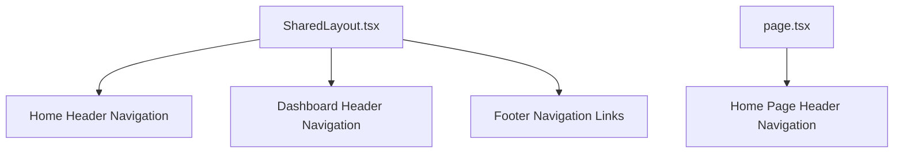
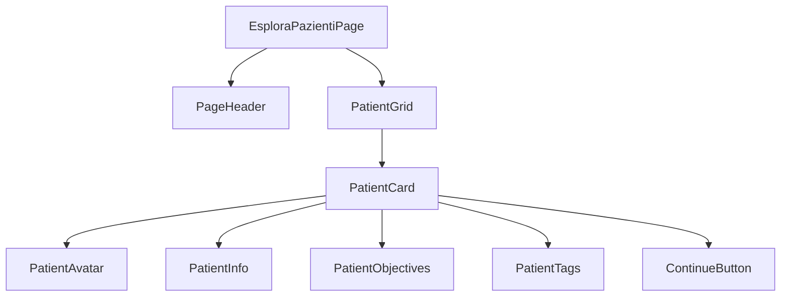

# Platform Name Update and Patient Exploration Page Design

## Overview

This design outlines the implementation of two key updates to the ePatient platform:
1. Replace all instances of "Esplora platform" with "Esplora pazienti" throughout the application
2. Create a comprehensive patient exploration page based on the provided interface design

## Technology Stack & Dependencies

- **Frontend Framework**: Next.js 15 with App Router
- **UI Components**: React 19 with Server Components  
- **Styling**: Tailwind CSS 4.0.15
- **Type Safety**: TypeScript 5.8.2
- **State Management**: React Query 5.69.0
- **API Layer**: tRPC 11.0.0
- **Database**: Drizzle ORM with LibSQL/SQLite

## Component Architecture

### Navigation Menu Updates

The platform currently displays "Esplora platform" in multiple navigation components that need to be updated to "Esplora pazienti".

#### Affected Components


#### Component Hierarchy
- **SharedLayout Component**: Main layout wrapper containing navigation
  - Home page header (unauthenticated users)
  - Dashboard header (authenticated users)  
  - Footer with quick links
- **Home Page Component**: Standalone navigation for landing page

#### Navigation Update Requirements
| Component | Current Text | New Text | Location |
|-----------|--------------|----------|----------|
| SharedLayout | "Esplora platform" | "Esplora pazienti" | Home header nav |
| SharedLayout | "Esplora platform" | "Esplora pazienti" | Footer links |
| HomePage | "Esplora platform" | "Esplora pazienti" | Main header nav |

### Patient Exploration Page Architecture

#### Component Definition


#### Component Specifications

**EsploraPazientiPage**
- Route: `/esplora-pazienti`
- Layout: Full-width container with dark background
- Responsive: Mobile-first design with responsive grid

**PatientCard**
- Dimensions: Fixed aspect ratio cards in grid layout
- Background: Dark themed cards with subtle borders
- Content: Patient image, description, objectives, tags, action button
- Interaction: Hover effects and click handlers

**PatientAvatar**  
- Format: Square profile images with rounded corners
- Variants: Illustrated avatars, real photos, stylized portraits
- Fallback: Default avatar for missing images

**PatientInfo**
- Name: Displayed prominently below avatar
- Description: Multi-line patient background and clinical scenario
- Age and Condition: Formatted metadata display

**PatientObjectives**
- Label: "Obiettivo:" prefix
- Content: Clinical learning objectives for the scenario
- Style: Highlighted text to emphasize goals

**PatientTags**
- Types: Mood tags ("Tono dell'umore basso", "Impulsività") 
- Style: Pill-shaped badges with subtle styling
- Interactive: Clickable for filtering (future enhancement)

**ContinueButton**
- Text: "Continua con [Patient Name]"
- Style: Full-width button with primary styling
- Action: Navigate to patient simulation scenario

## Data Models & ORM Mapping

### Patient Entity Extension

The existing patient creation infrastructure needs extension to support the exploration interface.

```typescript
interface VirtualPatient {
  id: string;
  name: string;
  age: number;
  gender: 'male' | 'female' | 'other';
  condition: string;
  background: string;
  objectives: string[];
  tags: PatientTag[];
  avatarUrl?: string;
  avatarType: 'photo' | 'illustration' | 'avatar';
  difficulty: 'Facile' | 'Medio' | 'Difficile';
  estimatedDuration: number; // minutes
  isActive: boolean;
  createdAt: Date;
  updatedAt: Date;
}

interface PatientTag {
  id: string;
  label: string;
  category: 'psychological' | 'physical' | 'behavioral';
  color: string;
}
```

### Database Schema Updates

#### New Tables Required
```sql
-- Virtual Patients Table (extends existing patient creation)
CREATE TABLE virtual_patients (
  id TEXT PRIMARY KEY,
  name TEXT NOT NULL,
  age INTEGER NOT NULL,
  gender TEXT NOT NULL,
  condition TEXT NOT NULL,
  background TEXT NOT NULL,
  objectives TEXT NOT NULL, -- JSON array
  avatar_url TEXT,
  avatar_type TEXT DEFAULT 'illustration',
  difficulty TEXT NOT NULL,
  estimated_duration INTEGER DEFAULT 30,
  is_active BOOLEAN DEFAULT true,
  created_at INTEGER DEFAULT (unixepoch()),
  updated_at INTEGER DEFAULT (unixepoch())
);

-- Patient Tags Table
CREATE TABLE patient_tags (
  id TEXT PRIMARY KEY,
  label TEXT NOT NULL,
  category TEXT NOT NULL,
  color TEXT DEFAULT '#gray'
);

-- Patient-Tag Relations
CREATE TABLE patient_tag_relations (
  patient_id TEXT REFERENCES virtual_patients(id),
  tag_id TEXT REFERENCES patient_tags(id),
  PRIMARY KEY (patient_id, tag_id)
);
```

## Routing & Navigation

### New Route Structure
```
/esplora-pazienti
├── page.tsx                 # Main exploration page
├── _components/
│   ├── PatientGrid.tsx      # Grid layout container
│   ├── PatientCard.tsx      # Individual patient cards
│   ├── PatientAvatar.tsx    # Avatar display component
│   └── PatientFilters.tsx   # Future filtering options
└── [patientId]/
    └── page.tsx             # Individual patient detail/start page
```

### Navigation Integration
- Update main navigation to link to `/esplora-pazienti`
- Add breadcrumb navigation for patient detail pages
- Implement proper meta tags and SEO optimization

## API Integration Layer

### tRPC Router Extensions

```typescript
// src/server/api/routers/patients.ts
export const patientsRouter = createTRPCRouter({
  getExplorationPatients: publicProcedure
    .query(async ({ ctx }) => {
      return await ctx.db.query.virtualPatients.findMany({
        where: eq(virtualPatients.isActive, true),
        with: {
          tags: {
            with: {
              tag: true
            }
          }
        },
        orderBy: [asc(virtualPatients.difficulty), asc(virtualPatients.name)]
      });
    }),

  getPatientById: publicProcedure
    .input(z.object({ id: z.string() }))
    .query(async ({ ctx, input }) => {
      return await ctx.db.query.virtualPatients.findFirst({
        where: eq(virtualPatients.id, input.id),
        with: {
          tags: {
            with: {
              tag: true
            }
          }
        }
      });
    }),

  getPatientTags: publicProcedure
    .query(async ({ ctx }) => {
      return await ctx.db.query.patientTags.findMany({
        orderBy: [asc(patientTags.category), asc(patientTags.label)]
      });
    })
});
```

### Client-Side Data Fetching

```typescript
// src/app/esplora-pazienti/_components/PatientGrid.tsx
export function PatientGrid() {
  const { data: patients, isLoading } = api.patients.getExplorationPatients.useQuery();
  
  if (isLoading) return <LoadingGrid />;
  
  return (
    <div className="grid grid-cols-1 md:grid-cols-2 lg:grid-cols-3 gap-6">
      {patients?.map(patient => (
        <PatientCard key={patient.id} patient={patient} />
      ))}
    </div>
  );
}
```

## Styling Strategy

### Design System Updates

#### Color Palette
- **Background**: Dark theme (`bg-gray-900`, `bg-gray-800`)
- **Cards**: Dark cards with subtle borders (`bg-gray-800`, `border-gray-700`)
- **Text**: High contrast text (`text-white`, `text-gray-300`)
- **Accents**: Brand colors for interactive elements

#### Typography Scale
- **Page Title**: `text-4xl font-bold text-white`
- **Patient Names**: `text-xl font-semibold text-white`
- **Descriptions**: `text-sm text-gray-300 leading-relaxed`
- **Objectives**: `text-sm text-gray-200 font-medium`

#### Component Styling

**PatientCard Styling**
```css
.patient-card {
  @apply bg-gray-800 rounded-lg border border-gray-700 overflow-hidden;
  @apply transition-all duration-300 hover:border-gray-600 hover:shadow-lg;
  @apply flex flex-col h-full;
}

.patient-avatar {
  @apply w-full h-48 object-cover object-center;
  @apply bg-gray-700; /* fallback for loading */
}

.patient-info {
  @apply p-6 flex-1 flex flex-col justify-between;
}

.patient-tags {
  @apply flex flex-wrap gap-2 mb-4;
}

.patient-tag {
  @apply px-3 py-1 text-xs font-medium rounded-full;
  @apply bg-gray-700 text-gray-300 border border-gray-600;
}

.continue-button {
  @apply w-full bg-green-600 hover:bg-green-700 text-white;
  @apply font-medium py-3 px-4 rounded-md transition-colors;
}
```

## State Management

### Patient Exploration State

```typescript
interface PatientExplorationState {
  patients: VirtualPatient[];
  selectedPatient: VirtualPatient | null;
  filters: {
    difficulty: string[];
    tags: string[];
    searchQuery: string;
  };
  isLoading: boolean;
  error: string | null;
}
```

### React Query Integration

```typescript
// Custom hooks for patient data
export function usePatients() {
  return api.patients.getExplorationPatients.useQuery(undefined, {
    staleTime: 5 * 60 * 1000, // 5 minutes
    cacheTime: 10 * 60 * 1000, // 10 minutes
  });
}

export function usePatient(patientId: string) {
  return api.patients.getPatientById.useQuery(
    { id: patientId },
    { enabled: !!patientId }
  );
}
```

## Testing Strategy

### Unit Testing Requirements

**Component Tests**
- PatientCard rendering with mock data
- PatientGrid layout and responsive behavior
- Navigation link updates verification
- Avatar fallback handling

**API Tests**  
- Patient data fetching and transformation
- Error handling for missing patients
- Pagination and filtering logic

**Integration Tests**
- Full page rendering with real data
- Navigation flow from exploration to patient detail
- Search and filtering functionality

### Test Implementation

```typescript
// src/app/esplora-pazienti/_components/__tests__/PatientCard.test.tsx
describe('PatientCard', () => {
  it('renders patient information correctly', () => {
    const mockPatient = {
      id: '1',
      name: 'Juanita Delgado',
      age: 33,
      condition: 'Depression therapy',
      // ... other props
    };
    
    render(<PatientCard patient={mockPatient} />);
    
    expect(screen.getByText('Juanita Delgado')).toBeInTheDocument();
    expect(screen.getByText(/33 anni/)).toBeInTheDocument();
    expect(screen.getByRole('button', { name: /continua con juanita/i })).toBeInTheDocument();
  });
});
```