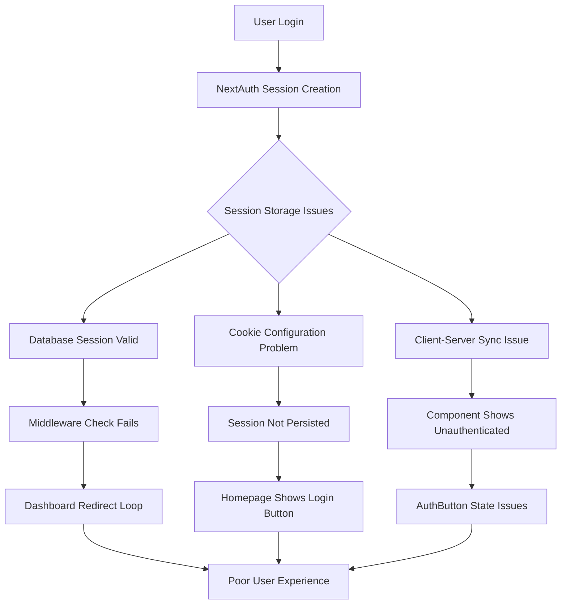
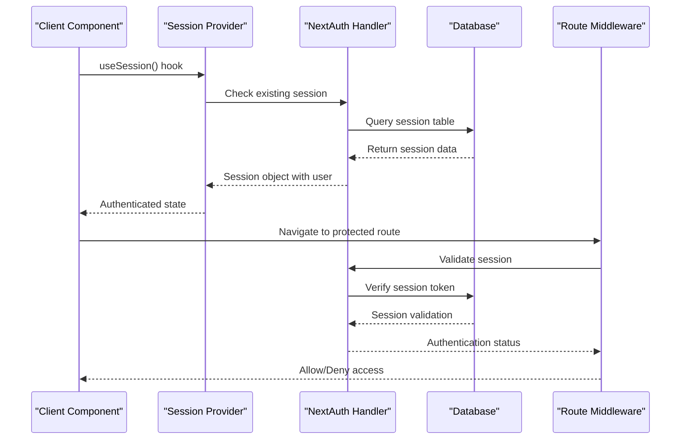
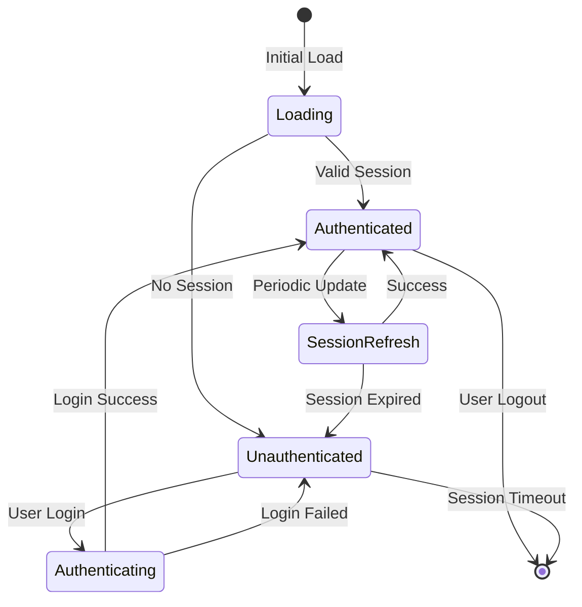
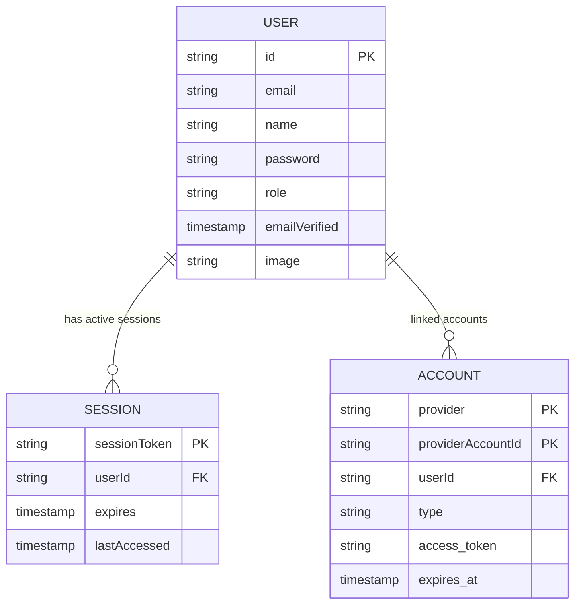
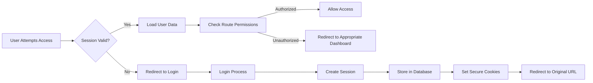
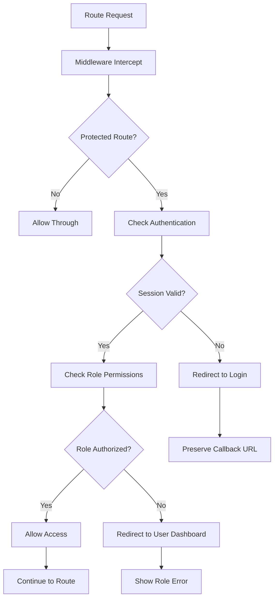
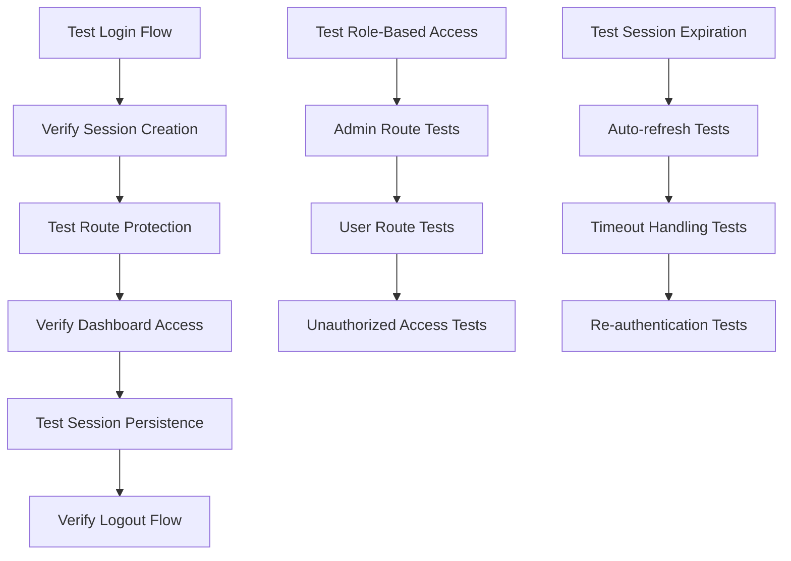

# Session and Login Authentication Fix Design

## Overview

This design addresses critical session management and authentication issues in the ePatient application where users are not staying logged in on the homepage and the dashboard continuously redirects to login despite valid authentication. The problems stem from inconsistent session handling, cookie configuration issues, and improper NextAuth.js v5 beta implementation patterns.

## Architecture

### Current Issues Identified

### Root Cause Analysis

1. **NextAuth v5 Beta Configuration Issues**
   - Missing critical session configuration for database strategy
   - Incomplete cookie security settings
   - Improper adapter configuration for Drizzle ORM

2. **Session Strategy Conflicts**
   - Mixed JWT and database session strategies
   - Inconsistent callback implementations
   - Missing session validation in components

3. **Middleware Authentication Logic**
   - Cache invalidation issues with auth function
   - Route matching problems
   - Insufficient session refresh handling

4. **Client-Side Session Management**
   - AuthButton component session retrieval issues
   - Missing session revalidation triggers
   - Improper loading state handling

## Component Architecture

### Enhanced Authentication Flow

### Session State Management

## Data Models & Configuration

### Enhanced NextAuth Configuration

| Configuration | Current Issue | Fixed Implementation |
|---------------|---------------|---------------------|
| Session Strategy | Mixed JWT/Database | Consistent Database Strategy |
| Cookie Security | Basic settings | Enhanced security with proper domains |
| Session Duration | Default values | Extended with proper refresh |
| Callback Functions | Incomplete | Complete user role integration |
| Adapter Configuration | Type compatibility issues | Proper Drizzle adapter setup |

### Session Database Schema

## Business Logic Layer

### Session Validation Process

1. **Server-Side Session Verification**
   - Database session token validation
   - Session expiration checking
   - User role verification
   - Activity logging

2. **Client-Side Session Management**
   - Automatic session refresh
   - Loading state handling
   - Error state management
   - Logout cleanup

3. **Route Protection Logic**
   - Middleware authentication checks
   - Role-based access control
   - Redirect handling
   - Callback URL preservation

### Authentication State Flow

## Middleware & Security

### Enhanced Route Protection

### Cookie Security Implementation

| Setting | Configuration | Purpose |
|---------|---------------|---------|
| httpOnly | true | Prevent XSS attacks |
| secure | production only | HTTPS only transmission |
| sameSite | 'lax' | CSRF protection |
| domain | environment-specific | Cross-subdomain support |
| path | '/' | Application-wide access |
| maxAge | 30 days | Session persistence |

## Implementation Strategy

### Phase 1: Core Authentication Fixes

1. **NextAuth Configuration Update**
   - Fix session strategy consistency
   - Enhance cookie security settings
   - Implement proper adapter configuration
   - Add comprehensive callback functions

2. **Session Management Enhancement**
   - Implement automatic session refresh
   - Add proper error handling
   - Fix loading states
   - Ensure consistent user data flow

### Phase 2: Component Integration

1. **AuthButton Component Fix**
   - Implement proper session state handling
   - Add loading state management
   - Fix authentication state updates
   - Ensure consistent UI behavior

2. **Dashboard Session Handling**
   - Fix role-based routing
   - Implement proper session validation
   - Add error boundary handling
   - Ensure smooth navigation flow

### Phase 3: Middleware & Security

1. **Route Protection Enhancement**
   - Fix middleware authentication logic
   - Implement proper caching strategy
   - Add comprehensive logging
   - Ensure consistent behavior

2. **Security Hardening**
   - Implement CSRF protection
   - Add session timeout handling
   - Enhance cookie security
   - Add audit logging

## Testing Strategy

### Authentication Flow Testing

### Test Scenarios

1. **User Authentication**
   - Login with valid credentials
   - Login with invalid credentials
   - Registration flow
   - Logout functionality

2. **Session Persistence**
   - Browser refresh retention
   - Tab switching behavior
   - Extended inactivity
   - Cross-device session handling

3. **Route Protection**
   - Protected route access
   - Role-based redirects
   - Unauthorized access attempts
   - Callback URL preservation

4. **Error Handling**
   - Network connectivity issues
   - Database connection failures
   - Session corruption scenarios
   - Invalid token handling

## Integration Points

### NextAuth.js Integration

- Session provider wrapper for React components
- Server-side session validation in API routes
- Middleware integration for route protection
- Database adapter for session persistence

### Database Integration

- Session storage in SQLite via Drizzle ORM
- User role management and retrieval
- Activity logging for audit trails
- Session cleanup and maintenance

### Frontend Integration

- Real-time session state updates
- Loading states during authentication
- Error message display and handling
- Seamless navigation experience

## Performance Considerations

### Session Optimization

1. **Database Query Optimization**
   - Efficient session lookups
   - Proper indexing on session tables
   - Minimal database round trips
   - Connection pooling considerations

2. **Client-Side Performance**
   - Reduced session validation requests
   - Efficient state management
   - Optimized component re-renders
   - Proper caching strategies

3. **Security vs Performance Balance**
   - Reasonable session timeouts
   - Efficient token validation
   - Optimized middleware processing
   - Minimal authentication overhead