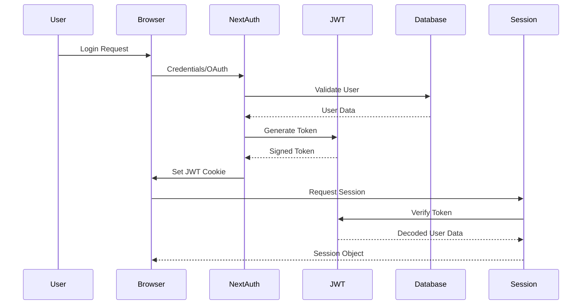
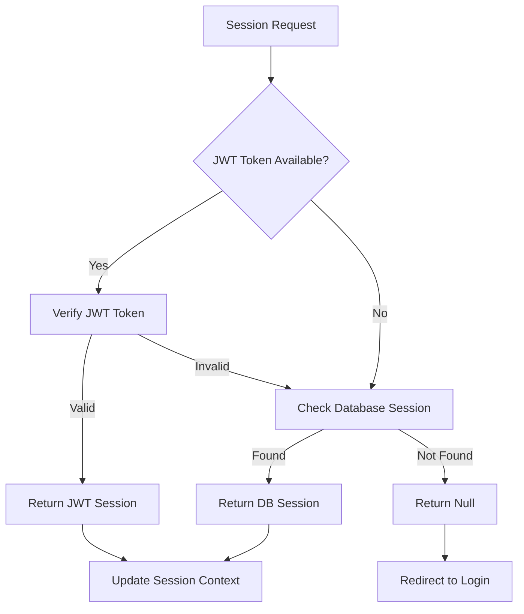

# Session Null Fix Design - JWT Token Implementation

## Overview

The current ePatient application experiences null session issues due to inconsistent session management configuration. This design provides a comprehensive solution to fix session persistence across the entire project by implementing JWT token-based authentication with proper fallback mechanisms.

## Problem Analysis

### Current Issues
1. **Session Returns Null**: Authentication succeeds but session retrieval fails
2. **Database vs JWT Strategy Mismatch**: Current configuration uses database strategy but lacks proper JWT fallback
3. **Cookie Configuration Issues**: Inconsistent cookie settings across environments
4. **Missing JWT Configuration**: No JWT secret or token handling
5. **Session Persistence Problems**: Sessions don't persist across browser restarts

### Root Causes
- Missing JWT configuration in NextAuth
- Incomplete session strategy implementation
- Environment variable gaps for JWT secrets
- Cookie configuration not optimized for JWT tokens
- Missing token encryption/decryption handling

## Architecture Design

### Authentication Flow with JWT Tokens



### Session Strategy Architecture



## Implementation Strategy

### 1. JWT Configuration Enhancement

#### Environment Variables
```typescript
// Add to env.js
server: {
  AUTH_SECRET: z.string().min(32),
  NEXTAUTH_SECRET: z.string().min(32), // Fallback for NextAuth
  JWT_SECRET: z.string().min(32),
  DATABASE_URL: z.string().url(),
  NODE_ENV: z.enum(["development", "test", "production"]).default("development"),
}
```

#### NextAuth Configuration Update
```typescript
// Enhanced authConfig with JWT support
export const authConfig = {
  session: {
    strategy: "jwt", // Primary strategy: JWT
    maxAge: 30 * 24 * 60 * 60, // 30 days
    updateAge: 24 * 60 * 60, // 24 hours
  },
  
  jwt: {
    secret: process.env.JWT_SECRET || process.env.AUTH_SECRET,
    maxAge: 30 * 24 * 60 * 60, // 30 days
    encode: async ({ secret, token }) => {
      // Custom JWT encoding with user data
      return jwt.sign(
        {
          ...token,
          iat: Math.floor(Date.now() / 1000),
          exp: Math.floor(Date.now() / 1000) + (30 * 24 * 60 * 60),
        },
        secret,
        { algorithm: 'HS256' }
      );
    },
    decode: async ({ secret, token }) => {
      try {
        return jwt.verify(token, secret, { algorithms: ['HS256'] });
      } catch (error) {
        console.error('JWT decode error:', error);
        return null;
      }
    },
  },
}
```

### 2. Enhanced Session Callbacks

#### JWT Callback Implementation
```typescript
callbacks: {
  // JWT callback - runs whenever JWT is created/updated
  jwt: async ({ token, user, account }) => {
    // Initial sign in
    if (user) {
      token.id = user.id;
      token.role = user.role || "user";
      token.email = user.email;
      token.name = user.name;
    }
    
    // Handle account linking
    if (account) {
      token.accessToken = account.access_token;
      token.provider = account.provider;
    }
    
    return token;
  },
  
  // Session callback - shapes the session object
  session: async ({ session, token }) => {
    if (token) {
      session.user.id = token.id as string;
      session.user.role = (token.role as "admin" | "user") || "user";
      session.user.email = token.email as string;
      session.user.name = token.name as string;
    }
    
    return session;
  },
}
```

### 3. Hybrid Strategy Implementation

#### Fallback Mechanism
```typescript
// Custom session resolver with fallback
export const getSession = async (req?: NextRequest) => {
  try {
    // Primary: Try JWT session
    const jwtSession = await getJWTSession(req);
    if (jwtSession) return jwtSession;
    
    // Fallback: Try database session
    const dbSession = await getDatabaseSession(req);
    if (dbSession) return dbSession;
    
    return null;
  } catch (error) {
    console.error('Session resolution error:', error);
    return null;
  }
};
```

### 4. Cookie Configuration Optimization

#### Enhanced Cookie Settings
```typescript
cookies: {
  sessionToken: {
    name: process.env.NODE_ENV === 'production' 
      ? '__Secure-next-auth.session-token' 
      : 'next-auth.session-token',
    options: {
      httpOnly: true,
      sameSite: 'lax',
      path: '/',
      secure: process.env.NODE_ENV === 'production',
      maxAge: 30 * 24 * 60 * 60, // 30 days
      domain: process.env.NODE_ENV === 'production' 
        ? process.env.COOKIE_DOMAIN 
        : undefined,
    }
  },
}
```

## Component Updates

### 1. AuthButton Component Enhancement

#### Session Retrieval Update
```typescript
export default function AuthButton() {
  const { data: session, status, update } = useSession({
    required: false,
    onUnauthenticated() {
      // Handle unauthenticated state
      console.log('AuthButton: User not authenticated');
    }
  });
  
  // Enhanced session validation
  const isAuthenticated = useCallback(() => {
    return !!(session?.user?.id && session?.user?.email && status === "authenticated");
  }, [session, status]);
  
  // Force session refresh mechanism
  const refreshSession = useCallback(async () => {
    try {
      await update();
      // Additional session verification
      const freshSession = await getSession();
      if (!freshSession) {
        // Force re-authentication
        await signOut({ redirect: false });
      }
    } catch (error) {
      console.error('Session refresh failed:', error);
      await signOut({ redirect: false });
    }
  }, [update]);
}
```

### 2. Dashboard Router Enhancement

#### Session Validation Update
```typescript
async function DashboardRouter() {
  try {
    // Enhanced session retrieval with retry mechanism
    let session = await auth();
    
    // Retry mechanism for session retrieval
    if (!session && typeof window !== 'undefined') {
      await new Promise(resolve => setTimeout(resolve, 100));
      session = await auth();
    }
    
    // Comprehensive validation
    if (!session?.user?.id || !session?.user?.email) {
      console.log("Dashboard: Invalid session detected");
      redirect("/login?error=session-invalid");
    }
    
    // Role-based routing with session verification
    const userRole = session.user.role ?? "user";
    
    if (userRole === "admin") {
      redirect("/dashboard/admin");
    } else {
      redirect("/dashboard/user");
    }
  } catch (error) {
    if (error instanceof Error && error.message === "NEXT_REDIRECT") {
      throw error;
    }
    console.error("Dashboard routing error:", error);
    redirect("/login?error=session-error");
  }
}
```

### 3. Login Page Session Handling

#### Enhanced Authentication Flow
```typescript
const handleSubmit = async (e: React.FormEvent) => {
  e.preventDefault();
  
  try {
    const result = await signIn("credentials", {
      email: loginState.email,
      password: loginState.password,
      redirect: false,
    });

    if (result?.ok) {
      // Wait for session to be established
      await new Promise(resolve => setTimeout(resolve, 500));
      
      // Verify session before redirect
      const session = await getSession();
      if (session?.user?.id) {
        setLoginState(prev => ({ ...prev, phase: 'success' }));
      } else {
        throw new Error("Session establishment failed");
      }
    }
  } catch (error) {
    console.error("Login error:", error);
    setLoginState(prev => ({ 
      ...prev, 
      phase: 'login', 
      error: "Authentication failed" 
    }));
  }
};
```

## Testing Strategy

### 1. Session Persistence Tests
- Browser restart session retention
- Cross-tab session synchronization
- Token expiration handling
- Session refresh validation

### 2. Authentication Flow Tests
- Login success with session creation
- Logout with complete session cleanup
- Role-based access verification
- Error handling and fallback mechanisms

### 3. JWT Token Tests
- Token generation and validation
- Token expiration and refresh
- Token tampering detection
- Cross-domain cookie handling

## Security Considerations

### 1. JWT Security
- Strong secret key generation (minimum 32 characters)
- Token expiration enforcement
- Signature verification
- Payload encryption for sensitive data

### 2. Cookie Security
- HttpOnly flag for XSS protection
- Secure flag for HTTPS-only transmission
- SameSite attribute for CSRF protection
- Proper domain and path restrictions

### 3. Session Validation
- Regular session verification
- Automatic cleanup of expired sessions
- Rate limiting for authentication attempts
- Audit logging for security events

## Migration Plan

### Phase 1: Configuration Update
1. Update environment variables
2. Enhance NextAuth configuration
3. Implement JWT strategy
4. Update cookie settings

### Phase 2: Component Updates
1. Update AuthButton component
2. Enhance session validation logic
3. Update dashboard routing
4. Implement session refresh mechanisms

### Phase 3: Testing & Validation
1. Comprehensive session testing
2. Cross-browser compatibility
3. Performance optimization
4. Security audit

### Phase 4: Deployment
1. Production environment setup
2. JWT secret configuration
3. Cookie domain configuration
4. Monitoring and logging setup

## Monitoring and Debugging

### 1. Session Logging
```typescript
// Enhanced session event logging
events: {
  async signIn({ user, account, profile }) {
    console.log('Session created:', {
      userId: user.id,
      provider: account?.provider,
      timestamp: new Date().toISOString()
    });
  },
  
  async jwt({ token, trigger }) {
    console.log('JWT event:', {
      trigger,
      userId: token.id,
      tokenAge: token.iat ? Date.now() - (token.iat * 1000) : 'unknown'
    });
  }
}
```

### 2. Error Tracking
- Session creation failures
- JWT verification errors
- Cookie setting issues
- Authentication timeouts

### 3. Performance Metrics
- Session retrieval time
- JWT processing speed
- Database query performance
- Cookie size optimization