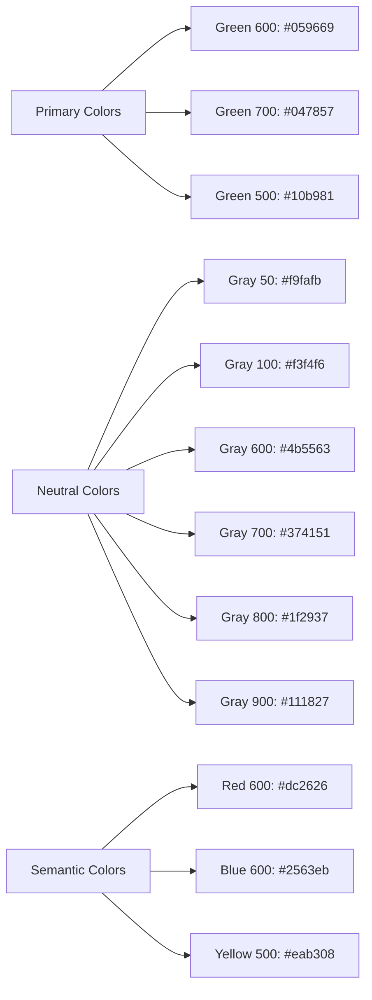
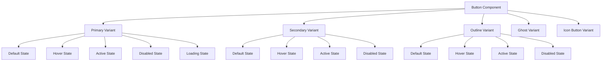
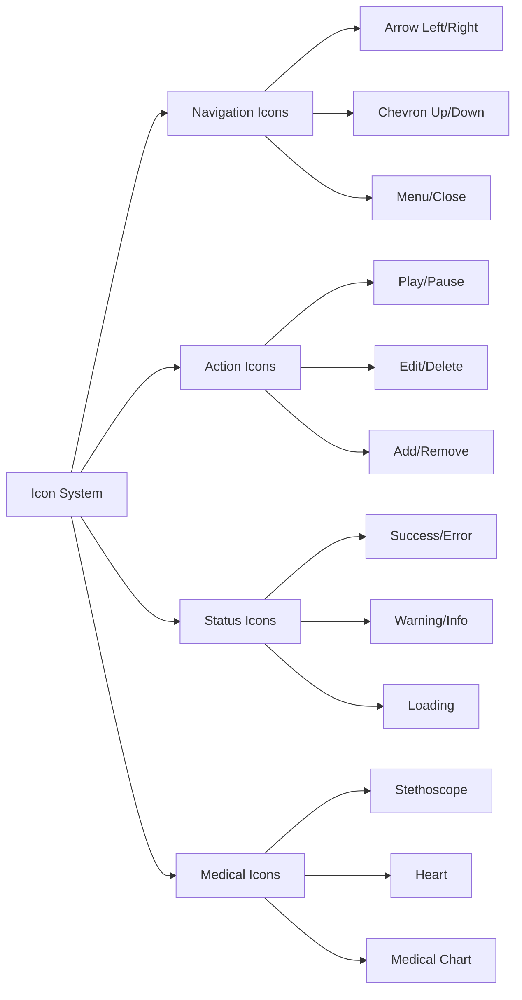

# Shared Button and Icon Style System Design

## Overview

This design document outlines a comprehensive shared button and icon style system for the epatient healthcare application. The system leverages Tailwind CSS 4.x to create consistent, accessible, and reusable UI components that maintain design coherence across the entire application.

**Design Goals:**
- Establish consistent visual language for interactive elements
- Ensure accessibility compliance (WCAG 2.1 AA)
- Provide flexible component variants for different use cases
- Integrate seamlessly with existing T3 Stack architecture
- Support both light and dark mode themes
- Optimize for healthcare-specific user interactions

## Technology Stack & Dependencies

**Core Technologies:**
- **Tailwind CSS 4.1.12** - Utility-first styling framework
- **React 19** - Component architecture
- **TypeScript 5.8.2** - Type safety and development experience
- **Next.js 15.2.3** - Framework and build system

**Supporting Tools:**
- **Prettier + Tailwind Plugin** - Code formatting and class ordering
- **ESLint** - Code quality and consistency
- **Geist Font Family** - Typography system

## Design System Foundation

### Color Palette



### Typography Scale

| Token | Size | Line Height | Weight | Usage |
|-------|------|-------------|---------|-------|
| `text-xs` | 12px | 16px | 400 | Small labels, captions |
| `text-sm` | 14px | 20px | 500 | Button text, form labels |
| `text-base` | 16px | 24px | 400 | Body text, default buttons |
| `text-lg` | 18px | 28px | 600 | Large button text |

### Spacing System

| Token | Value | Usage |
|-------|-------|-------|
| `px-2` | 8px | Compact horizontal padding |
| `px-4` | 16px | Standard horizontal padding |
| `px-6` | 24px | Large horizontal padding |
| `py-2` | 8px | Compact vertical padding |
| `py-3` | 12px | Standard vertical padding |
| `py-4` | 16px | Large vertical padding |

## Button Component Architecture

### Button Variants



### Button Style Specifications

#### Primary Button
```css
/* Base Styles */
.btn-primary {
  @apply bg-green-600 text-white px-6 py-3 rounded-md text-sm font-medium;
  @apply transition-colors duration-200 ease-in-out;
  @apply focus:outline-none focus:ring-2 focus:ring-green-500 focus:ring-offset-2;
}

/* State Variants */
.btn-primary:hover {
  @apply bg-green-700;
}

.btn-primary:active {
  @apply bg-green-800 scale-95;
}

.btn-primary:disabled {
  @apply bg-gray-400 cursor-not-allowed opacity-60;
}
```

#### Secondary Button
```css
.btn-secondary {
  @apply bg-white text-gray-700 px-6 py-3 rounded-md text-sm font-medium;
  @apply border border-gray-300 transition-colors duration-200;
  @apply focus:outline-none focus:ring-2 focus:ring-gray-500 focus:ring-offset-2;
}

.btn-secondary:hover {
  @apply bg-gray-50 border-gray-400;
}

.btn-secondary:active {
  @apply bg-gray-100 scale-95;
}
```

#### Outline Button
```css
.btn-outline {
  @apply bg-transparent text-green-600 px-6 py-3 rounded-md text-sm font-medium;
  @apply border-2 border-green-600 transition-all duration-200;
  @apply focus:outline-none focus:ring-2 focus:ring-green-500 focus:ring-offset-2;
}

.btn-outline:hover {
  @apply bg-green-600 text-white;
}
```

#### Ghost Button
```css
.btn-ghost {
  @apply bg-transparent text-gray-700 px-4 py-2 rounded-md text-sm font-medium;
  @apply transition-colors duration-200 hover:bg-gray-100;
  @apply focus:outline-none focus:ring-2 focus:ring-gray-500 focus:ring-offset-2;
}
```

### Button Size Variants

| Size | Padding | Font Size | Height | Usage |
|------|---------|-----------|---------|-------|
| `xs` | `px-2 py-1` | `text-xs` | 24px | Compact actions, tags |
| `sm` | `px-3 py-2` | `text-sm` | 32px | Secondary actions |
| `md` | `px-4 py-2` | `text-sm` | 36px | Default size |
| `lg` | `px-6 py-3` | `text-base` | 44px | Primary CTAs |
| `xl` | `px-8 py-4` | `text-lg` | 52px | Hero buttons |

## Icon System Architecture

### Icon Categories



### Icon Size Standards

| Size Token | Dimensions | Usage |
|------------|------------|-------|
| `w-4 h-4` | 16×16px | Inline text icons |
| `w-5 h-5` | 20×20px | Button icons, form elements |
| `w-6 h-6` | 24×24px | Navigation, standard actions |
| `w-8 h-8` | 32×32px | Large buttons, cards |
| `w-12 h-12` | 48×48px | Feature icons, empty states |

### Icon Button Specifications

```css
.btn-icon {
  @apply p-2 rounded-md transition-colors duration-200;
  @apply focus:outline-none focus:ring-2 focus:ring-gray-500 focus:ring-offset-2;
}

.btn-icon-primary {
  @apply text-green-600 hover:bg-green-50 hover:text-green-700;
}

.btn-icon-secondary {
  @apply text-gray-600 hover:bg-gray-100 hover:text-gray-700;
}

.btn-icon-ghost {
  @apply text-gray-400 hover:text-gray-600 hover:bg-gray-50;
}
```

## Component Usage Patterns

### Button with Icon Combinations

```typescript
interface ButtonWithIconProps {
  variant: 'primary' | 'secondary' | 'outline' | 'ghost';
  size: 'xs' | 'sm' | 'md' | 'lg' | 'xl';
  icon?: 'left' | 'right' | 'only';
  iconName: string;
  children?: React.ReactNode;
  loading?: boolean;
  disabled?: boolean;
}
```

### Navigation Button Patterns

| Pattern | Usage | Icon Position | Size |
|---------|--------|---------------|------|
| Carousel Navigation | Team section slider | Icon only | `w-6 h-6` |
| Breadcrumb Navigation | Page hierarchy | Left of text | `w-4 h-4` |
| Call-to-Action | Primary actions | Left of text | `w-5 h-5` |
| Form Submission | Submit buttons | Right of text | `w-4 h-4` |

### Social Media Icons

```css
.social-icon {
  @apply w-5 h-5 transition-colors duration-200 hover:text-gray-300;
  @apply focus:outline-none focus:ring-2 focus:ring-gray-500 focus:ring-offset-2;
}
```

## State Management Architecture

### Button State Flow

```mermaid
stateDiagram-v2
    [*] --> Default
    Default --> Hover: Mouse Enter
    Hover --> Default: Mouse Leave
    Default --> Active: Mouse Down
    Active --> Default: Mouse Up
    Default --> Disabled: disabled=true
    Disabled --> Default: disabled=false
    Default --> Loading: loading=true
    Loading --> Default: loading=false
    Loading --> Disabled: disabled=true while loading
```

### Loading State Specifications

```css
.btn-loading {
  @apply relative cursor-wait;
}

.btn-loading::before {
  @apply absolute inset-0 flex items-center justify-center;
  content: '';
}

.btn-loading .btn-content {
  @apply opacity-0;
}

.loading-spinner {
  @apply animate-spin w-4 h-4 border-2 border-white border-t-transparent rounded-full;
}
```

## Accessibility Considerations

### WCAG 2.1 AA Compliance

| Requirement | Implementation |
|-------------|----------------|
| **Color Contrast** | Minimum 4.5:1 ratio for normal text, 3:1 for large text |
| **Focus Indicators** | 2px ring with offset, high contrast colors |
| **Keyboard Navigation** | Tab order, Enter/Space activation |
| **Screen Reader Support** | Proper ARIA labels, semantic HTML |
| **Motion Sensitivity** | Respect `prefers-reduced-motion` |

### ARIA Patterns

```typescript
interface AccessibilityProps {
  'aria-label'?: string;
  'aria-describedby'?: string;
  'aria-expanded'?: boolean;
  'aria-pressed'?: boolean;
  role?: 'button' | 'link';
}
```

## Responsive Design Strategy

### Breakpoint Considerations

| Breakpoint | Button Adaptations |
|------------|-------------------|
| **Mobile (< 640px)** | Larger touch targets (min 44px), simplified layouts |
| **Tablet (640px - 1024px)** | Medium sizing, compact spacing |
| **Desktop (> 1024px)** | Full feature set, hover states |

### Touch Target Guidelines

```css
@media (max-width: 640px) {
  .btn {
    @apply min-h-[44px] min-w-[44px];
  }
  
  .btn-icon {
    @apply p-3;
  }
}
```

## Theme Integration

### Dark Mode Support

```css
@media (prefers-color-scheme: dark) {
  .btn-primary {
    @apply bg-green-500 hover:bg-green-400;
  }
  
  .btn-secondary {
    @apply bg-gray-800 text-gray-200 border-gray-600;
    @apply hover:bg-gray-700 hover:border-gray-500;
  }
  
  .btn-ghost {
    @apply text-gray-300 hover:bg-gray-800;
  }
}
```

### Healthcare Theme Considerations

- **Trust & Reliability**: Consistent green primary color
- **Clarity**: High contrast, readable typography
- **Accessibility**: Healthcare compliance requirements
- **Professional**: Clean, medical-grade interface aesthetics

## Implementation Files

### CSS Implementation

The shared button and icon styles are implemented in:
- **`src/styles/components.css`** - Main component styles using Tailwind CSS classes
- **`src/styles/globals.css`** - Updated to import component styles

### File Structure
```
src/
├── styles/
│   ├── globals.css          # Main stylesheet with imports
│   └── components.css       # Shared button and icon styles
└── app/
    └── layout.tsx          # Imports globals.css
```

### Complete CSS Implementation

**IMPORTANT: Create the following file manually in your project:**

**File: `src/styles/components.css`** *(Copy this entire content to the file)*

```css
/* =============================================================================
   SHARED BUTTON AND ICON STYLES
   epatient Healthcare Application
   
   This file contains all shared button and icon styles using Tailwind CSS
   utility classes and custom component classes for consistent UI patterns.
============================================================================= */

/* Base Button Styles */
@layer components {
  /* ============================
     PRIMARY BUTTON VARIANTS
  ============================ */
  
  .btn {
    @apply inline-flex items-center justify-center font-medium transition-all duration-200 ease-in-out;
    @apply focus:outline-none focus:ring-2 focus:ring-offset-2;
    @apply disabled:cursor-not-allowed disabled:opacity-60;
  }
  
  .btn-primary {
    @apply btn bg-green-600 text-white;
    @apply hover:bg-green-700 active:bg-green-800 active:scale-95;
    @apply focus:ring-green-500;
    @apply disabled:bg-gray-400;
  }
  
  .btn-secondary {
    @apply btn bg-white text-gray-700 border border-gray-300;
    @apply hover:bg-gray-50 hover:border-gray-400;
    @apply active:bg-gray-100 active:scale-95;
    @apply focus:ring-gray-500;
    @apply disabled:bg-gray-50 disabled:text-gray-400;
  }
  
  .btn-outline {
    @apply btn bg-transparent text-green-600 border-2 border-green-600;
    @apply hover:bg-green-600 hover:text-white;
    @apply active:bg-green-700 active:scale-95;
    @apply focus:ring-green-500;
    @apply disabled:border-gray-300 disabled:text-gray-400;
  }
  
  .btn-ghost {
    @apply btn bg-transparent text-gray-700;
    @apply hover:bg-gray-100 hover:text-gray-900;
    @apply active:bg-gray-200 active:scale-95;
    @apply focus:ring-gray-500;
    @apply disabled:text-gray-400;
  }
  
  .btn-danger {
    @apply btn bg-red-600 text-white;
    @apply hover:bg-red-700 active:bg-red-800 active:scale-95;
    @apply focus:ring-red-500;
    @apply disabled:bg-gray-400;
  }
  
  /* ============================
     BUTTON SIZE VARIANTS
  ============================ */
  
  .btn-xs {
    @apply px-2 py-1 text-xs min-h-[24px];
  }
  
  .btn-sm {
    @apply px-3 py-2 text-sm min-h-[32px];
  }
  
  .btn-md {
    @apply px-4 py-2 text-sm min-h-[36px];
  }
  
  .btn-lg {
    @apply px-6 py-3 text-base min-h-[44px];
  }
  
  .btn-xl {
    @apply px-8 py-4 text-lg min-h-[52px];
  }
  
  /* ============================
     ROUNDED VARIANTS
  ============================ */
  
  .btn-rounded-sm {
    @apply rounded;
  }
  
  .btn-rounded-md {
    @apply rounded-md;
  }
  
  .btn-rounded-lg {
    @apply rounded-lg;
  }
  
  .btn-rounded-full {
    @apply rounded-full;
  }
  
  /* ============================
     ICON BUTTON VARIANTS
  ============================ */
  
  .btn-icon {
    @apply btn p-2 rounded-md min-w-[40px] min-h-[40px];
    @apply flex items-center justify-center;
  }
  
  .btn-icon-xs {
    @apply p-1 min-w-[24px] min-h-[24px];
  }
  
  .btn-icon-sm {
    @apply p-1.5 min-w-[32px] min-h-[32px];
  }
  
  .btn-icon-md {
    @apply p-2 min-w-[40px] min-h-[40px];
  }
  
  .btn-icon-lg {
    @apply p-3 min-w-[48px] min-h-[48px];
  }
  
  .btn-icon-primary {
    @apply btn-icon text-green-600;
    @apply hover:bg-green-50 hover:text-green-700;
    @apply active:bg-green-100;
    @apply focus:ring-green-500;
  }
  
  .btn-icon-secondary {
    @apply btn-icon text-gray-600;
    @apply hover:bg-gray-100 hover:text-gray-700;
    @apply active:bg-gray-200;
    @apply focus:ring-gray-500;
  }
  
  .btn-icon-ghost {
    @apply btn-icon text-gray-400;
    @apply hover:text-gray-600 hover:bg-gray-50;
    @apply active:bg-gray-100;
    @apply focus:ring-gray-500;
  }
  
  .btn-icon-danger {
    @apply btn-icon text-red-600;
    @apply hover:bg-red-50 hover:text-red-700;
    @apply active:bg-red-100;
    @apply focus:ring-red-500;
  }
  
  /* ============================
     LOADING STATE
  ============================ */
  
  .btn-loading {
    @apply relative cursor-wait;
  }
  
  .btn-loading .btn-content {
    @apply opacity-0;
  }
  
  .btn-loading::after {
    @apply absolute inset-0 flex items-center justify-center;
    content: '';
  }
  
  .loading-spinner {
    @apply animate-spin w-4 h-4 border-2 border-current border-t-transparent rounded-full;
  }
  
  .loading-spinner-white {
    @apply loading-spinner border-white border-t-transparent;
  }
  
  .loading-spinner-primary {
    @apply loading-spinner border-green-600 border-t-transparent;
  }
  
  /* ============================
     ICON STYLES
  ============================ */
  
  .icon {
    @apply inline-block flex-shrink-0;
  }
  
  .icon-xs {
    @apply w-3 h-3;
  }
  
  .icon-sm {
    @apply w-4 h-4;
  }
  
  .icon-md {
    @apply w-5 h-5;
  }
  
  .icon-lg {
    @apply w-6 h-6;
  }
  
  .icon-xl {
    @apply w-8 h-8;
  }
  
  .icon-2xl {
    @apply w-12 h-12;
  }
  
  /* ============================
     SOCIAL MEDIA ICONS
  ============================ */
  
  .social-icon {
    @apply icon-md transition-colors duration-200;
    @apply hover:text-gray-300 focus:outline-none;
    @apply focus:ring-2 focus:ring-gray-500 focus:ring-offset-2;
  }
  
  /* ============================
     BUTTON WITH ICON COMBINATIONS
  ============================ */
  
  .btn-with-icon-left {
    @apply flex items-center gap-2;
  }
  
  .btn-with-icon-right {
    @apply flex items-center gap-2 flex-row-reverse;
  }
  
  .btn-with-icon-left .icon,
  .btn-with-icon-right .icon {
    @apply flex-shrink-0;
  }
  
  /* ============================
     NAVIGATION SPECIFIC STYLES
  ============================ */
  
  .nav-arrow {
    @apply btn-icon-ghost transition-colors duration-200;
  }
  
  .nav-arrow:hover {
    @apply text-white hover:text-gray-300;
  }
  
  .carousel-btn {
    @apply btn-icon text-white;
    @apply hover:text-gray-300 hover:bg-white/10;
    @apply active:bg-white/20;
  }
  
  /* ============================
     FORM SPECIFIC STYLES
  ============================ */
  
  .form-submit-btn {
    @apply btn-primary btn-md btn-rounded-md;
    @apply w-full sm:w-auto;
  }
  
  .form-cancel-btn {
    @apply btn-secondary btn-md btn-rounded-md;
  }
  
  .newsletter-btn {
    @apply bg-green-600 px-4 py-2 rounded-r-md text-white;
    @apply hover:bg-green-700 focus:outline-none focus:ring-2;
    @apply focus:ring-green-500 focus:ring-offset-2;
  }
  
  /* ============================
     DARK MODE SUPPORT
  ============================ */
  
  @media (prefers-color-scheme: dark) {
    .btn-primary {
      @apply bg-green-500 hover:bg-green-400;
    }
    
    .btn-secondary {
      @apply bg-gray-800 text-gray-200 border-gray-600;
      @apply hover:bg-gray-700 hover:border-gray-500;
    }
    
    .btn-ghost {
      @apply text-gray-300 hover:bg-gray-800 hover:text-gray-100;
    }
    
    .btn-icon-secondary {
      @apply text-gray-400 hover:text-gray-200 hover:bg-gray-800;
    }
  }
  
  /* ============================
     RESPONSIVE DESIGN
  ============================ */
  
  @media (max-width: 640px) {
    .btn {
      @apply min-h-[44px];
    }
    
    .btn-icon {
      @apply p-3 min-w-[44px] min-h-[44px];
    }
    
    .btn-xs {
      @apply min-h-[36px];
    }
    
    .btn-sm {
      @apply min-h-[40px];
    }
  }
  
  /* ============================
     ACCESSIBILITY ENHANCEMENTS
  ============================ */
  
  @media (prefers-reduced-motion: reduce) {
    .btn,
    .btn-icon,
    .loading-spinner {
      @apply transition-none;
    }
    
    .loading-spinner {
      @apply animate-none;
    }
  }
  
  /* High contrast mode support */
  @media (prefers-contrast: high) {
    .btn {
      @apply border-2;
    }
    
    .btn-primary {
      @apply border-green-700;
    }
    
    .btn-secondary {
      @apply border-gray-400;
    }
    
    .btn-ghost {
      @apply border-gray-600;
    }
  }
  
  /* ============================
     UTILITY CLASSES
  ============================ */
  
  .btn-group {
    @apply flex;
  }
  
  .btn-group .btn:not(:first-child) {
    @apply rounded-l-none border-l-0;
  }
  
  .btn-group .btn:not(:last-child) {
    @apply rounded-r-none;
  }
  
  .btn-group .btn:only-child {
    @apply rounded;
  }
  
  /* Focus-visible for better keyboard navigation */
  .btn:focus-visible,
  .btn-icon:focus-visible {
    @apply ring-2 ring-offset-2;
  }
}
```

### Quick Setup Instructions

**Step 1: Create the CSS file**
1. Copy the entire CSS content above
2. Create/edit `src/styles/components.css` in your project
3. Paste the CSS content into the file

**Step 2: Update globals.css**
1. Open `src/styles/globals.css`
2. Add the import line: `@import "./components.css";`
3. Your globals.css should look like:
   ```css
   @import "tailwindcss";
   @import "./components.css";
   
   @theme {
     --font-sans: var(--font-geist-sans), ui-sans-serif, system-ui, sans-serif,
       "Apple Color Emoji", "Segoe UI Emoji", "Segoe UI Symbol", "Noto Color Emoji";
   }
   ```

**Step 3: Test the implementation**
1. Run `npm run dev` to start your development server
2. The button classes will now be available throughout your application
3. Test with a simple button: `<button className="btn btn-primary btn-lg">Test</button>`

**File: `src/styles/globals.css` (Update this file)**

```css
@import "tailwindcss";
@import "./components.css";

@theme {
  --font-sans: var(--font-geist-sans), ui-sans-serif, system-ui, sans-serif,
    "Apple Color Emoji", "Segoe UI Emoji", "Segoe UI Symbol", "Noto Color Emoji";
}
```

### Usage Examples

**Basic Button Usage:**

```jsx
// Primary button
<button className="btn btn-primary btn-lg btn-rounded-md">
  Save Patient Data
</button>

// Secondary button with icon
<button className="btn btn-secondary btn-md btn-rounded-md btn-with-icon-left">
  <svg className="icon icon-sm" fill="none" stroke="currentColor" viewBox="0 0 24 24">
    <path strokeLinecap="round" strokeLinejoin="round" strokeWidth={2} d="M12 4v16m8-8H4" />
  </svg>
  Add Patient
</button>

// Icon-only button
<button className="btn-icon btn-icon-primary btn-icon-md">
  <svg className="icon icon-md" fill="none" stroke="currentColor" viewBox="0 0 24 24">
    <path strokeLinecap="round" strokeLinejoin="round" strokeWidth={2} d="M6 18L18 6M6 6l12 12" />
  </svg>
</button>

// Loading state button
<button className="btn btn-primary btn-lg btn-loading" disabled>
  <span className="btn-content">Processing...</span>
  <div className="loading-spinner loading-spinner-white"></div>
</button>
```

**Navigation Button Examples:**

```jsx
// Carousel navigation
<button className="carousel-btn">
  <svg className="icon icon-lg" fill="none" stroke="currentColor" viewBox="0 0 24 24">
    <path strokeLinecap="round" strokeLinejoin="round" strokeWidth={2} d="M15 19l-7-7 7-7" />
  </svg>
</button>

// CTA button with icon
<Link href="/dashboard" className="btn btn-primary btn-lg btn-rounded-md btn-with-icon-left">
  <svg className="icon icon-md" fill="currentColor" viewBox="0 0 20 20">
    <path fillRule="evenodd" d="M10 18a8 8 0 100-16 8 8 0 000 16zM9.555 7.168A1 1 0 008 8v4a1 1 0 001.555.832l3-2a1 1 0 000-1.664l-3-2z" clipRule="evenodd" />
  </svg>
  Start Simulation
</Link>
```

**Form Integration Examples:**

```jsx
// Form submit button
<button type="submit" className="form-submit-btn" disabled={isSubmitting}>
  {isSubmitting ? (
    <>
      <span className="btn-content">Submitting...</span>
      <div className="loading-spinner loading-spinner-white"></div>
    </>
  ) : (
    'Submit Form'
  )}
</button>

// Newsletter signup
<div className="flex">
  <input
    type="email"
    placeholder="Your email address"
    className="px-4 py-2 text-gray-900 rounded-l-md focus:outline-none flex-1"
  />
  <button className="newsletter-btn">
    Subscribe
  </button>
</div>
```

### React Component Integration

**TypeScript Button Component Example:**

```tsx
import React from 'react';
import { cva, type VariantProps } from 'class-variance-authority';
import { cn } from '~/lib/utils';

const buttonVariants = cva(
  'btn',
  {
    variants: {
      variant: {
        primary: 'btn-primary',
        secondary: 'btn-secondary',
        outline: 'btn-outline',
        ghost: 'btn-ghost',
        danger: 'btn-danger',
      },
      size: {
        xs: 'btn-xs',
        sm: 'btn-sm',
        md: 'btn-md',
        lg: 'btn-lg',
        xl: 'btn-xl',
      },
      rounded: {
        sm: 'btn-rounded-sm',
        md: 'btn-rounded-md',
        lg: 'btn-rounded-lg',
        full: 'btn-rounded-full',
      },
    },
    defaultVariants: {
      variant: 'primary',
      size: 'md',
      rounded: 'md',
    },
  }
);

export interface ButtonProps
  extends React.ButtonHTMLAttributes<HTMLButtonElement>,
    VariantProps<typeof buttonVariants> {
  loading?: boolean;
  icon?: React.ReactNode;
  iconPosition?: 'left' | 'right';
}

const Button = React.forwardRef<HTMLButtonElement, ButtonProps>(
  ({ className, variant, size, rounded, loading, icon, iconPosition = 'left', children, disabled, ...props }, ref) => {
    const buttonClass = cn(
      buttonVariants({ variant, size, rounded }),
      {
        'btn-loading': loading,
        'btn-with-icon-left': icon && iconPosition === 'left',
        'btn-with-icon-right': icon && iconPosition === 'right',
      },
      className
    );

    return (
      <button
        className={buttonClass}
        ref={ref}
        disabled={disabled || loading}
        {...props}
      >
        {loading ? (
          <>
            <span className="btn-content">{children}</span>
            <div className="loading-spinner loading-spinner-white" />
          </>
        ) : (
          <>
            {icon && iconPosition === 'left' && icon}
            {children}
            {icon && iconPosition === 'right' && icon}
          </>
        )}
      </button>
    );
  }
);

Button.displayName = 'Button';

export { Button, buttonVariants };
```

### Migration Guide

**Step 1: Create CSS Files**

1. Create `src/styles/components.css` with the provided CSS content
2. Update `src/styles/globals.css` to import the components file

**Step 2: Update Existing Components**

```jsx
// Before (inline Tailwind classes)
<button className="bg-green-600 text-white px-6 py-3 rounded-md text-sm font-medium hover:bg-green-700">
  Click me
</button>

// After (shared button classes)
<button className="btn btn-primary btn-lg btn-rounded-md">
  Click me
</button>
```

**Step 3: Replace Existing Button Patterns**

```jsx
// Replace existing carousel buttons
// Before:
<button className="text-white hover:text-gray-300">
  <svg className="w-6 h-6">...</svg>
</button>

// After:
<button className="carousel-btn">
  <svg className="icon icon-lg">...</svg>
</button>
```

## Testing Strategy

### Component Testing

| Test Type | Coverage |
|-----------|----------|
| **Unit Tests** | Individual button variants and props |
| **Integration Tests** | Button interactions with forms and navigation |
| **Accessibility Tests** | Screen reader compatibility, keyboard navigation |
| **Visual Regression** | Cross-browser consistency, responsive behavior |

### Testing Tools Integration

- **Jest + React Testing Library** - Component logic testing
- **Playwright** - End-to-end interaction testing
- **axe-core** - Accessibility compliance testing
- **Chromatic/Percy** - Visual regression testing