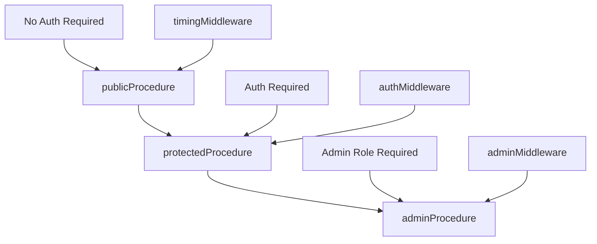
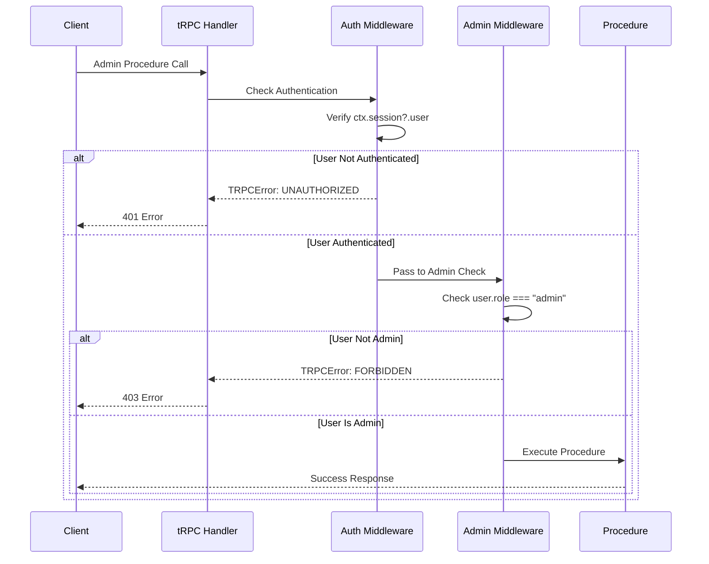
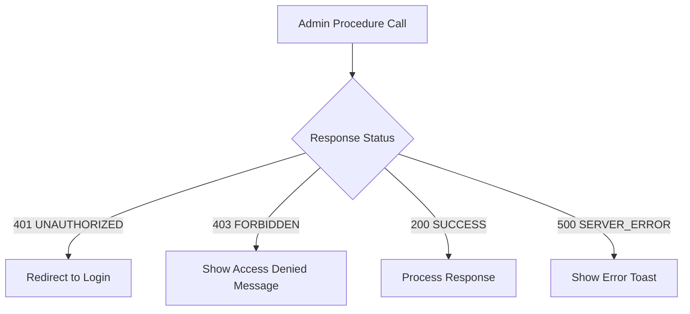

# tRPC Admin Procedure Missing Export Fix

## Overview

The ePatient application has a build error where `adminProcedure` is imported in the impersonation router but doesn't exist as an export in the tRPC module. The `adminProcedure` is currently defined locally within the dashboard router, making it inaccessible to other routers that require admin-level authorization.

## Problem Analysis

### Current Issue
- **Build Error**: `Export adminProcedure doesn't exist in target module`
- **Location**: `src/server/api/routers/impersonation.ts:15`
- **Root Cause**: `adminProcedure` is defined locally in `dashboard.ts` but imported from `~/server/api/trpc`

### Affected Files
1. `src/server/api/routers/impersonation.ts` - Imports non-existent `adminProcedure`
2. `src/server/api/routers/user-management.ts` - Uses manual admin checks instead of `adminProcedure`
3. `src/server/api/trpc.ts` - Missing `adminProcedure` export
4. `src/server/api/routers/dashboard.ts` - Contains local `adminProcedure` definition

### Current Implementation Gap

```mermaid
graph TD
    A[impersonation.ts] -->|imports| B[~/server/api/trpc]
    C[user-management.ts] -->|manual checks| D[ctx.session.user.role !== "admin"]
    E[dashboard.ts] -->|local definition| F[adminProcedure]
    B -->|missing export| G[❌ Build Error]
    F -->|isolated| H[Cannot be reused]
```

## Architecture Design

### Proposed tRPC Procedure Hierarchy



### Admin Authorization Flow



## Implementation Strategy

### 1. Centralize Admin Procedure in tRPC Core

#### Enhanced tRPC Configuration

```typescript
// src/server/api/trpc.ts - Add adminProcedure export

/**
 * Admin-only procedure
 * 
 * Extends protectedProcedure with admin role verification.
 * Only users with role "admin" can access these procedures.
 */
export const adminProcedure = protectedProcedure.use(({ ctx, next }) => {
  if (ctx.session.user.role !== "admin") {
    throw new TRPCError({ 
      code: "FORBIDDEN", 
      message: "Admin access required to perform this action" 
    });
  }
  return next({ ctx });
});
```

### 2. Update Router Imports

#### Impersonation Router Fix
```typescript
// src/server/api/routers/impersonation.ts - Corrected import
import { createTRPCRouter, protectedProcedure, adminProcedure } from "~/server/api/trpc";
```

#### User Management Router Refactor
```typescript
// src/server/api/routers/user-management.ts - Replace manual checks

// Before: Manual admin check
getAllUsers: protectedProcedure
  .query(async ({ ctx, input }) => {
    if (ctx.session.user.role !== "admin") {
      throw new Error("Unauthorized: Admin access required");
    }
    // ... implementation
  }),

// After: Using adminProcedure
getAllUsers: adminProcedure
  .input(z.object({
    limit: z.number().min(1).max(100).default(50),
    offset: z.number().min(0).default(0),
    search: z.string().optional(),
    role: z.enum(["admin", "user"]).optional(),
  }))
  .query(async ({ ctx, input }) => {
    // No manual admin check needed - handled by adminProcedure
    // ... implementation
  }),
```

### 3. Dashboard Router Cleanup

#### Remove Local Definition
```typescript
// src/server/api/routers/dashboard.ts - Remove local adminProcedure

// Delete this local definition:
// const adminProcedure = protectedProcedure.use(({ ctx, next }) => {
//   if (ctx.session.user.role !== "admin") {
//     throw new TRPCError({ 
//       code: "FORBIDDEN", 
//       message: "Admin access required to perform this action" 
//     });
//   }
//   return next({ ctx });
// });

// Import from tRPC core instead:
import { createTRPCRouter, protectedProcedure, adminProcedure } from "~/server/api/trpc";
```

## Updated File Structure

### tRPC Module Exports
```typescript
// src/server/api/trpc.ts - Complete exports
export const createTRPCRouter = t.router;
export const publicProcedure = t.procedure.use(timingMiddleware);
export const protectedProcedure = t.procedure
  .use(timingMiddleware)
  .use(authMiddleware);
export const adminProcedure = protectedProcedure.use(adminMiddleware);
export const createCallerFactory = t.createCallerFactory;
```

### Consistent Router Patterns

| Router | Procedures Used | Admin Operations |
|--------|----------------|------------------|
| **impersonation** | `adminProcedure` | Start/end impersonation, audit logs |
| **user-management** | `adminProcedure` | CRUD operations on users, role updates |
| **dashboard** | `protectedProcedure`, `adminProcedure` | Admin dashboard data, user statistics |
| **post** | `protectedProcedure` | User content operations |

## Error Handling Enhancement

### Standardized Admin Error Responses

```typescript
// Consistent error handling across all admin procedures
const adminMiddleware = ({ ctx, next }) => {
  if (!ctx.session?.user) {
    throw new TRPCError({ 
      code: "UNAUTHORIZED",
      message: "Authentication required" 
    });
  }
  
  if (ctx.session.user.role !== "admin") {
    throw new TRPCError({ 
      code: "FORBIDDEN", 
      message: "Admin access required to perform this action" 
    });
  }
  
  return next({ ctx });
};
```

### Client-Side Error Handling



## Security Considerations

### Role-Based Access Control

| Aspect | Implementation | Security Benefit |
|--------|---------------|------------------|
| **Centralized Authorization** | Single `adminProcedure` definition | Consistent access control |
| **Type Safety** | TypeScript role validation | Compile-time error prevention |
| **Error Standardization** | Unified TRPCError responses | Predictable client handling |
| **Audit Trail** | Admin action logging | Security monitoring |

### Admin Procedure Security Features

1. **Double Authentication**: Both session validation AND role check
2. **Clear Error Messages**: Distinguishes between authentication and authorization failures
3. **Type-Safe Role Checking**: Leverages TypeScript for role validation
4. **Consistent Implementation**: Same security pattern across all admin operations

## Testing Strategy

### 1. Unit Tests for Admin Middleware

```typescript
describe('adminProcedure', () => {
  it('should allow admin users', async () => {
    const mockContext = {
      session: { user: { id: '1', role: 'admin' } },
      db: mockDb
    };
    // Test implementation
  });

  it('should reject non-admin users', async () => {
    const mockContext = {
      session: { user: { id: '2', role: 'user' } },
      db: mockDb
    };
    // Expect FORBIDDEN error
  });

  it('should reject unauthenticated requests', async () => {
    const mockContext = { session: null, db: mockDb };
    // Expect UNAUTHORIZED error
  });
});
```

### 2. Integration Tests for Admin Routers

```typescript
describe('Admin Router Integration', () => {
  test('impersonation router uses adminProcedure', async () => {
    // Test admin access to impersonation endpoints
  });

  test('user-management router uses adminProcedure', async () => {
    // Test admin access to user management endpoints
  });

  test('consistent error responses across routers', async () => {
    // Test error handling consistency
  });
});
```

## Migration Steps

### Phase 1: Core tRPC Enhancement
1. Add `adminProcedure` export to `src/server/api/trpc.ts`
2. Implement admin middleware with proper error handling
3. Update TypeScript types for admin procedures

### Phase 2: Router Updates
1. Update `impersonation.ts` import statement
2. Refactor `user-management.ts` to use `adminProcedure`
3. Clean up local `adminProcedure` definition in `dashboard.ts`
4. Verify all admin procedures use centralized implementation

### Phase 3: Testing & Validation
1. Run build to verify error resolution
2. Test admin functionality across all routers
3. Validate error handling consistency
4. Perform security testing for role-based access

### Phase 4: Documentation & Cleanup
1. Update API documentation
2. Review and optimize admin procedures
3. Ensure consistent naming and patterns
4. Add inline code documentation