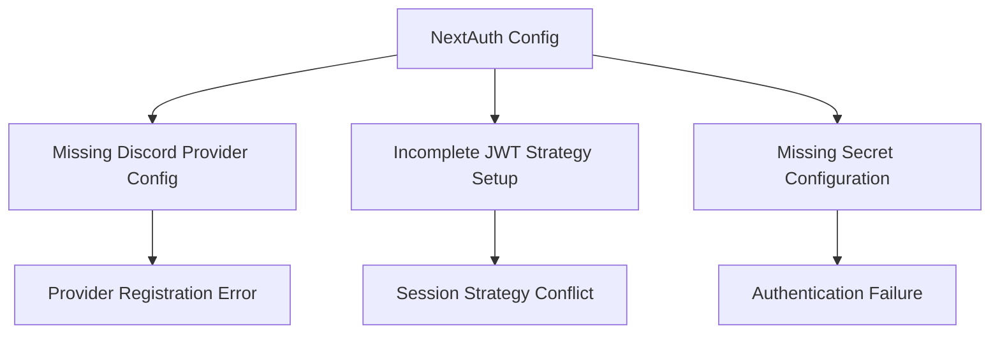

# Next.js ePatient Application Startup Issues Fix

## Overview

The ePatient Next.js application is experiencing multiple startup errors preventing development server initialization. This document provides a comprehensive fix for all identified issues including missing environment variables, authentication configuration problems, dependency conflicts, and file structure inconsistencies.

## Technology Stack Analysis

- **Next.js 15**: Latest version with App Router
- **NextAuth.js 5 Beta**: Authentication with Discord OAuth + Credentials
- **tRPC 11**: End-to-end type safety
- **Drizzle ORM**: SQLite database operations
- **React 19**: Latest React version
- **Tailwind CSS 4**: Styling framework

## Critical Issues Identified

### 1. Missing Environment Configuration

The application requires essential environment variables for authentication and database connectivity:

| Variable | Description | Required |
|----------|-------------|----------|
| `AUTH_SECRET` | NextAuth.js secret key (32+ chars) | ✅ |
| `AUTH_DISCORD_ID` | Discord OAuth application ID | ✅ |
| `AUTH_DISCORD_SECRET` | Discord OAuth secret | ✅ |
| `DATABASE_URL` | SQLite database connection string | ✅ |
| `NEXTAUTH_URL` | Application base URL | ✅ |

### 2. NextAuth.js 5 Beta Configuration Issues



### 3. Database Migration Requirements

The Drizzle ORM schema includes complex table relationships that require proper migration:

- User management tables
- Authentication adapter tables
- Impersonation tracking system
- User activities logging

### 4. TypeScript Configuration Conflicts

- React 19 type compatibility issues
- NextAuth.js type augmentation conflicts
- tRPC inference type mismatches

## Fix Implementation Strategy

### Phase 1: Environment Configuration Setup

Create `.env.local` file with required variables:

```bash
# NextAuth.js Configuration
AUTH_SECRET="your-32-character-minimum-secret-key-here"
NEXTAUTH_URL="http://localhost:3000"
NEXTAUTH_SECRET="your-32-character-minimum-secret-key-here"

# Discord OAuth Configuration
AUTH_DISCORD_ID="your-discord-client-id"
AUTH_DISCORD_SECRET="your-discord-client-secret"

# Database Configuration
DATABASE_URL="file:./sqlite.db"

# Development Environment
NODE_ENV="development"
```

### Phase 2: NextAuth.js Provider Configuration Fix

The Discord provider configuration is incomplete in `src/server/auth/config.ts`:

```typescript
// Current problematic configuration
DiscordProvider,

// Fixed configuration needed
DiscordProvider({
  clientId: env.AUTH_DISCORD_ID,
  clientSecret: env.AUTH_DISCORD_SECRET,
})
```

### Phase 3: Database Migration and Initialization

Execute database setup sequence:

1. Generate migration files
2. Apply schema migrations
3. Seed initial data
4. Verify table structure

### Phase 4: Type Safety Resolution

Fix TypeScript compatibility issues:

- Update React types for version 19
- Resolve NextAuth.js type conflicts
- Ensure tRPC type inference works correctly

### Phase 5: Development Server Startup Sequence

Establish proper startup order:

1. Environment validation
2. Database connection verification
3. Authentication provider initialization
4. tRPC server setup
5. Development server launch

## Specific File Modifications Required

### Authentication Configuration Updates

**File**: `src/server/auth/config.ts`

Issues to fix:
- Incomplete Discord provider configuration
- Missing environment variable validation
- JWT strategy configuration conflicts

### Environment Schema Validation

**File**: `src/env.js`

Current validation schema is correct but requires actual environment values.

### Database Schema Application

**File**: `src/server/db/schema.ts`

Complex schema requires proper migration execution.

## Testing Strategy


