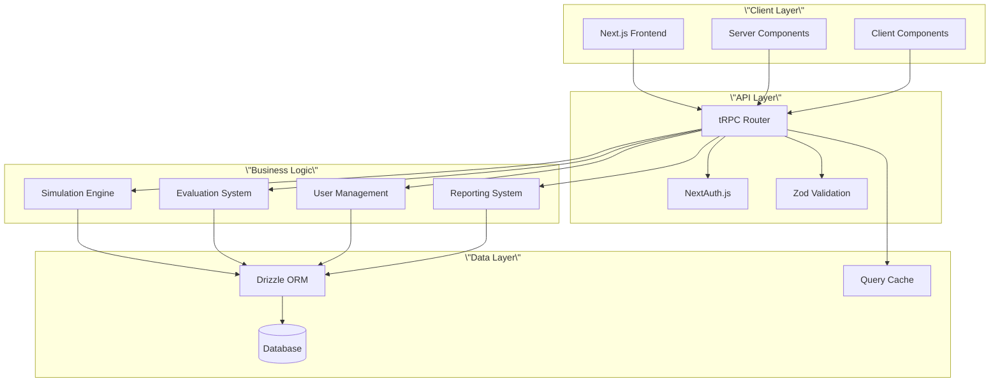

# System Overview 🏗️

## Introduction

The ePatient platform is a comprehensive clinical simulation and learning management system designed to revolutionize medical education through realistic, interactive patient scenarios. Built on modern web technologies, it provides a type-safe, secure, and scalable foundation for medical training.

## Core Mission

**To bridge the gap between theoretical medical knowledge and practical application** by providing immersive, realistic clinical simulations that enable healthcare professionals to develop critical skills safely and effectively.

## Three-Phase Learning Model

The ePatient platform is built around a proven three-phase educational methodology:

### 1. 🔬 Simulate (Simula)
**Immersive Virtual Patient Interactions**
- Interactive clinical scenarios with virtual patients
- Real-time symptom presentation and patient responses
- Comprehensive medical histories and diagnostic data
- Realistic time pressures and decision-making environments
- Multi-modal interaction (text, visual, audio)

### 2. 📊 Evaluate (Valuta) 
**Automated Assessment and Feedback**
- Real-time performance tracking and analysis
- Evidence-based scoring algorithms
- Detailed feedback on clinical decisions
- Comparative analysis against best practices
- Immediate identification of knowledge gaps

### 3. 📚 Learn (Impara)
**Guided Reflection and Improvement**
- Comprehensive performance reports and analytics
- Structured reflection tools and prompts
- Personalized learning recommendations
- Progress tracking over time
- Peer comparison and benchmarking

## Target Users

### Primary Users
- **Medical Students** - Practicing clinical skills in a safe environment
- **Residents** - Refining diagnostic and treatment approaches
- **Healthcare Professionals** - Continuing education and skill maintenance

### Secondary Users
- **Medical Educators** - Creating and managing simulation scenarios
- **Institution Administrators** - Tracking student progress and outcomes
- **System Administrators** - Managing platform infrastructure

## Key Benefits

### For Learners
- **Risk-Free Learning** - Practice without patient safety concerns
- **Immediate Feedback** - Learn from mistakes in real-time
- **Personalized Experience** - Adaptive learning based on performance
- **Flexible Access** - Learn anytime, anywhere
- **Comprehensive Tracking** - Monitor progress and identify improvement areas

### For Educators
- **Standardized Scenarios** - Consistent training experiences
- **Detailed Analytics** - Data-driven insights into student performance
- **Scalable Delivery** - Reach more students with fewer resources
- **Evidence-Based Assessment** - Objective evaluation criteria
- **Curriculum Integration** - Seamless integration with existing programs

### For Institutions
- **Cost Effectiveness** - Reduce need for physical simulation labs
- **Improved Outcomes** - Enhanced student competency and confidence
- **Quality Assurance** - Standardized assessment and certification
- **Regulatory Compliance** - Meet accreditation requirements
- **Data Insights** - Institution-wide performance analytics

## Technical Foundation

### Architecture Principles

1. **Type Safety First** - End-to-end type safety from database to UI
2. **Security by Design** - Built-in authentication, authorization, and data protection
3. **Performance Optimized** - Fast loading, responsive interactions
4. **Scalable Infrastructure** - Cloud-native design for growth
5. **Developer Experience** - Modern tooling and development practices

### Core Technologies

- **Frontend**: Next.js 15 with React 19, Tailwind CSS
- **Backend**: tRPC 11 for type-safe APIs
- **Database**: Drizzle ORM with LibSQL/PostgreSQL
- **Authentication**: NextAuth.js 5 with Discord OAuth
- **Validation**: Zod for runtime type checking
- **State Management**: React Query for server state
- **Deployment**: Google Cloud Platform (Cloud Run, Cloud SQL)

## System Architecture Overview

## Data Flow

### User Authentication Flow
1. User initiates login via Discord OAuth
2. NextAuth.js handles OAuth handshake
3. User data stored/retrieved from database
4. JWT token generated with user role
5. Session established with database validation

### Simulation Interaction Flow
1. User selects simulation scenario
2. Frontend loads scenario data via tRPC
3. User interactions tracked and validated
4. Real-time feedback provided
5. Performance data stored for evaluation

### Evaluation and Learning Flow
1. Simulation completion triggers evaluation
2. Performance metrics calculated
3. Feedback generated based on evidence
4. Learning recommendations provided
5. Progress tracking updated

## Security Model

### Authentication
- **OAuth 2.0** with Discord integration
- **JWT tokens** with database validation
- **Session management** with secure cookies
- **Multi-factor authentication** support (future)

### Authorization
- **Role-based access control** (Admin/User)
- **Resource-level permissions** for sensitive data
- **API endpoint protection** with middleware
- **Database-level security** with row-level policies

### Data Protection
- **End-to-end encryption** for sensitive data
- **HTTPS enforcement** in production
- **Input validation** at all layers
- **SQL injection protection** via ORM
- **XSS protection** via React and validation

## Performance Characteristics

### Response Times (Target)
- **Page Load**: < 2 seconds initial load
- **API Calls**: < 200ms average response
- **Database Queries**: < 100ms average
- **Simulation Interactions**: < 50ms response time

### Scalability
- **Concurrent Users**: 1000+ simultaneous users
- **Database**: Horizontal scaling via read replicas
- **Application**: Stateless design for horizontal scaling
- **CDN**: Global content delivery for static assets

## Integration Points

### External Services
- **Discord OAuth** - User authentication
- **Google Cloud Platform** - Infrastructure and deployment
- **Email Services** - Notifications and communications (future)
- **Learning Management Systems** - Grade passback (future)

### API Endpoints
- **RESTful tRPC APIs** - Type-safe client-server communication
- **WebSocket support** - Real-time updates (future)
- **Webhook endpoints** - External system notifications (future)

## Quality Assurance

### Testing Strategy
- **Unit Tests** - Component and function testing
- **Integration Tests** - API and database testing
- **End-to-End Tests** - Full user workflow testing
- **Performance Tests** - Load and stress testing
- **Security Tests** - Vulnerability scanning

### Monitoring and Observability
- **Application Monitoring** - Performance metrics
- **Error Tracking** - Automated error reporting
- **User Analytics** - Usage patterns and behavior
- **Infrastructure Monitoring** - System health and resources

## Future Roadmap

### Phase 1 (Current)
- ✅ Core platform architecture
- ✅ User authentication and management
- ✅ Basic dashboard functionality
- 🔄 Simulation engine foundation

### Phase 2 (Next 3 months)
- 📝 Advanced simulation scenarios
- 📝 Comprehensive evaluation system
- 📝 Learning analytics dashboard
- 📝 Mobile responsive design

### Phase 3 (Next 6 months)
- 📝 Multi-institutional support
- 📝 Advanced reporting and analytics
- 📝 Integration with external LMS
- 📝 Real-time collaboration features

### Phase 4 (Future)
- 📝 AI-powered scenario generation
- 📝 VR/AR simulation support
- 📝 Advanced analytics and ML
- 📝 Multi-language support

## Conclusion

The ePatient platform represents a modern, comprehensive approach to clinical simulation and medical education. By leveraging cutting-edge web technologies and proven educational methodologies, it provides a robust foundation for transforming how healthcare professionals learn and practice critical skills.

The system's emphasis on type safety, security, and scalability ensures that it can grow and evolve with the changing needs of medical education while maintaining the highest standards of performance and reliability.

---

**Next Steps**: Explore [Technology Stack](technology-stack.md) for detailed technical information or [Development Guide](development-guide.md) to start contributing."